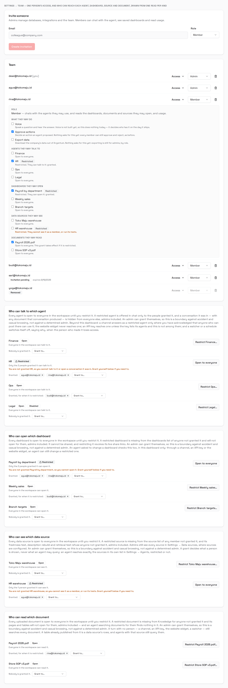
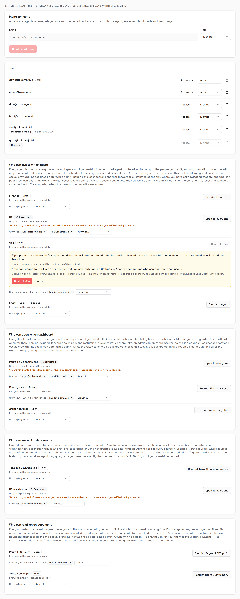
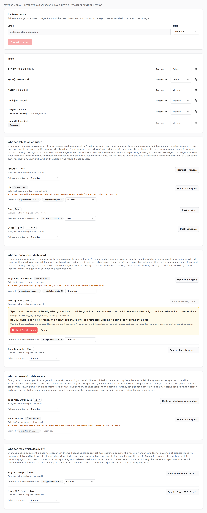
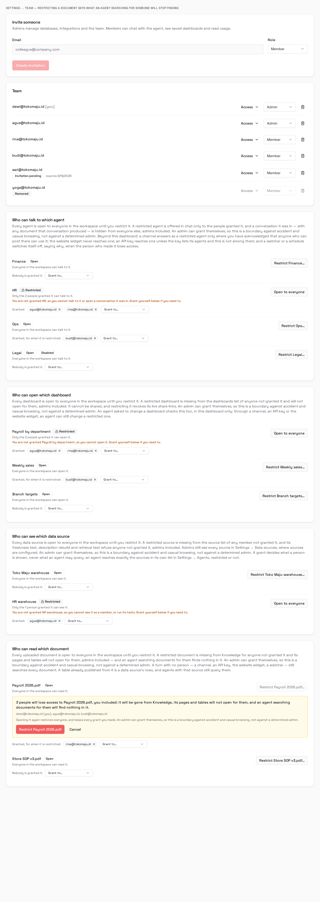

# Access grants — who may do what, per person

The plan is
[`../plan/12-access-grants-roadmap.md`](../plan/12-access-grants-roadmap.md). The
role table this track sits on top of is [`rbac.md`](rbac.md) (`T-04`).
**Nine tickets are built, and the agent boundary holds on the dashboard for
talking and for reading, behind a control an admin can press**: a restricted
agent cannot be talked to (§10), a conversation is hidden from anyone not granted
every agent in it (§11, `T-Z10`, added after `T-Z4` found every conversation
company-readable), and Settings → Team restricts and grants it (§12, `T-Z7`). It
is one door of four. What a restricted agent's conversation *produced* goes with
it for generated documents (§13, `T-Z11`); a share link minted before the
restriction still plays, and pending actions from a hidden conversation are still
listed (§13d). **Dashboards are the second kind with a switch** (§14, `T-Z5`): a
restricted one refuses to open, leaves the dashboards list, cannot be shared, and
takes its live links with it — and since `T-Z12` an agent asked to change one
checks the person's grant too (§15). **The other three doors are decided** (§16,
`T-Z8`): an API key reaches only the agents it lists, the website widget never
reaches a restricted agent, a channel answers as one only where an admin
acknowledged it, and a watcher or schedule whose creator lost the agent switches
itself off and says why. No route asks for a capability (§2); `resourcePolicy` holds nine reads
— three dashboard, three source, three document — and `resourcePending` is empty
since **`T-Z6` gave the last two kinds their switch** (§17): a restricted source
leaves a member's source list and refuses its three reading routes, with no
agent's reach changed, and a restricted document leaves Knowledge, refuses its
pages and tables, and quotes nothing into an answer for a person not granted it.

| Ticket | Status |
| --- | --- |
| `T-Z1` A capability is a named power, and a user is granted it | **built 2026-09-12, `make check` green, unit-gated. Migration `083`. Three gates owed — §7** |
| `T-Z2` A resource can be restricted, and a grant is what opens it | **built 2026-09-12, `make check` green, unit-gated. Migration `084` — typed foreign keys, not the ticket's polymorphic id (§8a). Enforced nowhere until `T-Z4`→`T-Z6` (§8c). Two gates owed — §8f** |
| `T-Z3` A route that serves a restricted resource has to say so | **built 2026-09-12, `make check` green, unit-gated. No migration. Three tables, not the ticket's two (§9b); `resourcePolicy` ships empty. Nothing live owed by this ticket — §9g** |
| `T-Z4` Agents: who may talk to which | **built 2026-09-12, `make check` green, unit-gated. No migration. Enforced at the enqueuer, the room and the roster, not at a route (§10a); the fork "seam" has no person (§10c). The transcript hole — §10d. One live arm owed — §10g** |
| `T-Z5` Dashboards: who may open which | **built 2026-09-12, `make check` green, unit-gated. No migration. The first three `resourcePolicy` entries; the list narrowed for admins too, so the access read carries names (§14c). Restricting revokes live links under a row lock the mint shares (§14a). One edge found, `update_dashboard` (§14d) — closed by `T-Z12` (§15). One live arm owed, and `T-Z3`'s with it — §14g** |
| `T-Z6` The "etc": data sources and documents | **built 2026-09-13, `make check` green, unit-gated. No migration. Two of the ticket's three source surfaces do not exist, and every source route with an id is admin (§17b); `resourcePending` is empty. A document's tables are checked through their document in the handler. Live arms owed — §17g** |
| `T-Z7` Settings → Team: the access matrix | **built 2026-09-12, `make check` green, unit-gated. No migration, and one read route the ticket did not list (§12b). Agents only — no switch for a kind nothing enforces (§12c). The member's disabled control has nothing to disable yet (§12d). One live arm owed — §12f** |
| `T-Z8` The other three doors, decided rather than inherited | **built 2026-09-13, `make check` green, unit-gated. Migration `085`. An embed key names no agent, so the widget refuses at the pick and the turn (§16c); a channel's acknowledgement is stored and checked per turn, because a binding made before a restriction was the bypass (§16c). Found Slack refused as an unknown channel since 2026-08-08, and fixed it (§16c item 7). Live arms owed — §16g** |
| `T-Z9` The negative suite, and the row that says a refusal happened | Not built. Its cross-product now needs a conversation row (§11g) |
| `T-Z10` A conversation is as restricted as the agents in it | **built 2026-09-12, `make check` green, unit-gated. No migration. Added to the roadmap by the owner's decision on §10d. One live arm owed — §11h** |
| `T-Z11` A generated document is as restricted as the conversation that made it | **built 2026-09-12, `make check` green, unit-gated. No migration. Added after `T-Z7` on the owner's go-ahead. Two surfaces found still readable, both the owner's (§13d). One live arm owed — §13f** |
| `T-Z12` An agent asked to change a dashboard checks the person's grant | **built 2026-09-12, `make check` green, unit-gated. No migration. Added after `T-Z5`, which found it (§14d). Refused by name, not as not-found (§15b); §14d's "panel SQL in the result" was wrong (§15c). One live arm owed, and it is the track's only one that needs a model — §15g** |

---

## 1. What was built

A capability is a power with no object — speaking a question, approving an
action, exporting data. An admin grants one to a person; a route can require
one; an admin who was not granted it is refused like anybody else.

| Piece | Where |
| --- | --- |
| The closed vocabulary: `voice`, `approve_actions`, `export_data`, with `Valid()` and a normaliser | `internal/domain/capability.go` |
| The table: `(company_id, user_id, capability, granted_by, granted_at)`, primary key on the first three | `migrations/control/083_user_capabilities.{up,down}.sql` |
| The repository — every statement starts from the `users` row, scoped by company | `internal/adapters/postgres/capability_repo.go` |
| The service: grant, revoke, list, and `Has` behind a ten-second in-process cache | `internal/app/capability_service.go` |
| `RequireCapability`, after `RequireRole` and before the rate limiter | `internal/transport/http/middleware/capabilitypolicy.go`, `cmd/api/router.go` |
| `capabilityPolicy`, the route → capability table — **empty** | `cmd/api/policy.go` |
| Four routes under `/api/users` | `internal/transport/http/handlers/user.go` |
| `Capability` as a union type, `CapabilityGrant` | `packages/api-types/src/domain.ts` (generated) |

| Route | Role | What it does |
| --- | --- | --- |
| `GET /api/users/me/capabilities` | member | The caller's own grants. The user comes from the session, never the path |
| `GET /api/users/:id/capabilities` | admin | Anybody's in the company; `404` for a user of another company |
| `PUT /api/users/:id/capabilities/:capability` | admin | Grant. Idempotent: the second one is a `204`, and the first row's `granted_by` stands |
| `DELETE /api/users/:id/capabilities/:capability` | admin | Revoke. Idempotent: revoking what is not held is a `204` |

A refusal is a `403` whose body names the capability —
`{"error": "an admin has not granted you this", "capability": "voice"}` — so
`T-Z7` can say which grant to ask for rather than rendering a bare "forbidden"
that reads exactly like the role table's. A grant store that cannot be read is a
`503`, not a `403`: the caller should retry, not be told they lack a grant they
may hold.

## 2. The table ships empty, and the ticket could not have meant otherwise

The ticket's day-one vocabulary is `voice`, `approve_actions` and `export_data`.
Its acceptance also says **"every route that exists today behaves identically"**,
and its migration says **"no backfill — nobody has anything on day one"**.

Two of those three capabilities name things routes already do:
`export_data` is `GET /api/company/data/export` and `approve_actions` is
`POST /api/actions/:id/approve` and `/reject`. **Gating any of them on its
capability without a backfill 403s every admin who exports and every member who
approves, on their very next request.** So all three are true only if nothing is
gated yet — which is how it was built. The vocabulary exists so an admin can
prepare grants before a route asks; `voice`'s first route is roadmap 11's
`T-W7`.

This is written down in three places so it cannot be undone by accident:

- beside `capabilityPolicy`, which says why it is empty;
- `TestExistingRoutesAskForNoCapability`, which pins the three tempting routes and
  fails with *"ship the backfill that grants it to whoever does this today"* if
  one is moved behind its capability;
- the test's second half, a sweep of every classified route as an admin against
  a store that has granted nothing, asserting the store is **never read**.

The acceptance lines about a capability-gated route are proven against
synthetic routes in the middleware's own tests, and the real-router version,
`TestCapabilityGatedRoutesRefuseAnAdminWithoutAGrant`, skips with the reason
until `T-W7` adds the first gated route. From then on every new gate is covered
without writing a new test.

**Whoever gates `approve_actions` should know one more thing:** approval is
already refined per action kind by `company_actions.allowed_roles`, inside the
handler. A capability would be a third layer on that route, and the backfill has
to grant it to exactly the people `allowed_roles` admits today — which is a
per-kind set, not a role.

## 3. "A short cache" and "the next request", both true

The ticket asks for capabilities *"read per request behind a short cache"* and,
three lines later, for *"a revoke takes effect on the next request"*. A cache
with a TTL makes the second false for up to the TTL. Both hold, and here is the
exact claim:

- **A grant or revoke clears the cache entry it touched**, so on the replica that
  served the write the next request re-reads.
- **A generation counter closes the one race that would break that on a single
  replica:** a load that read "held", then a revoke landing before that load
  stored its result. The load only stores if no write happened while it was
  out. `TestCapabilityLoadThatRacedARevokeIsNotCached` drives exactly that
  interleaving.
- **On a replica that did not serve the write, the bound is the TTL — ten
  seconds** (`TestCapabilityWriteElsewhereIsSeenWithinTheTTL`). This deployment
  runs **one** API replica (`kubectl get deploy`, 2026-09-12:
  `argentum-api 1/1`), so today the first bullet is the whole story. The day
  there are replicas, either ten seconds is acceptable for a boundary the
  roadmap calls one against accident, or the cache moves to Redis.

Why not the JWT, which the ticket also rules out: an access token lives fifteen
minutes, and the team page already tells an admin that a removed member *"loses
access within 15 minutes"*. A revoke on that clock is not a revoke.

`ListForUser` — the settings page's read — is **uncached**, so a page that just
toggled a grant is never shown the state from before the toggle.

## 4. The tenant check the ticket did not list

`T-Z2` has a cross-company acceptance line; `T-Z1` has none, and it needs one.
`user_capabilities.user_id REFERENCES users(id)` proves the user exists, **not
that they belong to `company_id`** — so a bare `INSERT` with an admin's company
and another company's user id writes a valid row naming a stranger.

Every statement therefore starts from `users WHERE id = $2 AND company_id = $1`.
Grant and revoke do it in one statement: a data-modifying CTE runs whether or
not the outer query reads it, so `SELECT count(*) FROM target` answers "is this
a user of the company" with no window between the check and the write. The list
uses a `LEFT JOIN` from `users`, which yields one all-`NULL` row for a user
holding nothing and no row for a user who is not there — `[]` against `404`,
without a second round trip. A malformed id (SQLSTATE `22P02`) is mapped to
not-found rather than surfacing as a 500 carrying the driver's message.

`TestCapabilityCrossTenantUserIsNotFound`, `TestCapabilityCacheDoesNotCrossCompanies`
and `TestCapabilityRoutesDoNotReachAnotherCompanysUser` prove the behaviour
against fakes that reproduce the join. **The SQL itself has not run** (§7).

## 5. Where the ticket was wrong, or silent

- **`RequireCapability(capabilityPolicy)` cannot be the signature.** A role is on
  the token; a grant is data, so the middleware takes a checker too:
  `RequireCapability(capabilityPolicy, d.capabilitySvc)`.
- **`Repo: BE + FE`, and no FE item in *Do*.** The frontend half of this ticket
  is the generated `Capability` union and `CapabilityGrant` interface. The
  surface an admin uses is `T-Z7`'s, and building a toggle here would have been
  building `T-Z7` early without `T-Z2`'s half of it.
- **The day-one vocabulary and "behaves identically"** — §2.
- **"A short cache" and "the next request"** — §3.
- **No cross-company acceptance** — §4.
- **Decision 12's audit rows are `T-Z9`'s, not this ticket's.** `T-Z1` records
  `granted_by` on the row and writes an `Info` line per grant and revoke with
  `company_id`, the user, the capability and who did it. A revoke leaves no row
  behind, so until `T-Z9` the log line is the only record that one happened.
- **`Migration: 083` was right**, and was still free when claimed.

## 6. Acceptance, quoted back

| Acceptance | Evidence |
| --- | --- |
| A member without the capability gets 403 on a capability-gated route | `TestRequireCapability/a_member_without_the_grant_is_refused` — against a synthetic gated route; no real one exists (§2) |
| An **admin** without the capability also gets 403 | `TestRequireCapability/an_admin_without_the_grant_is_refused_too`. The real-router arm, `TestCapabilityGatedRoutesRefuseAnAdminWithoutAGrant`, **skips** until `T-W7` |
| A revoke takes effect on the next request, with no re-login | `TestCapabilityRevokeTakesEffectOnTheNextRequest` (clock standing still, entry freshly cached) and `TestCapabilityLoadThatRacedARevokeIsNotCached`. Bounded at ten seconds across replicas — §3. **Live arm owed** |
| Granting twice is idempotent, not an error | `TestCapabilityGrantTwiceIsIdempotent`, `TestGrantingTwiceIsIdempotent` (two `204`s, one row, first granter kept). The `ON CONFLICT` has not run against Postgres |
| An unknown capability string is refused at the API boundary, not stored | `TestGrantingAnUnknownCapabilityIsRefusedAndNotStored` (`400`, store never called), `TestCapabilityUnknownIsRefusedBeforeTheStore` |
| Every route that exists today behaves identically | `TestGatedRoutesRejectMembers` and `TestMemberRoutesAdmitMembers` now run with a capability store that has granted nothing to anybody, so a route that had started asking would fail them; `TestExistingRoutesAskForNoCapability` asserts the store is never read |

Beyond the ticket: a grant cannot admit a caller the role table refused, and the
store is not even read for that request
(`TestRequireCapability/a_grant_cannot_admit_a_caller_the_role_table_refused`);
a failing store is a 503, not a pass; a missing checker or a chain without
`Auth` is a 403; `me` cannot be pointed at another user; holding nothing is
`[]`, never `null`.

## 7. Owed

In [`live-gate-backlog.md`](live-gate-backlog.md) §7c, with predictions:

1. `083` up, `down 1`, up against a control-plane Postgres.
2. The repository's three statements against a real Postgres with two
   companies — the arms in §4 that only a database can prove.
3. Two real users and a revoke. The route half can run on the stack today; the
   **middleware** half cannot run anywhere until a route asks for a capability.

No `make eval` is owed: nothing here reaches a prompt or a tool.

---

## 8. `T-Z2` — a resource can be restricted, and a grant is what opens it

An admin sets a resource to `restricted`, and from then only the people holding
a grant on it may reach it — **once something asks** (§8c). Four kinds: `agent`,
`dashboard`, `connection` (`db_connections`) and `document`. The last is
`source_documents`, the uploaded PDFs `search_documents` quotes from, and not the
`documents` table of reports this product generated; the repository has two
tables a reader would call "documents", and the ticket did not say which.

### 8a. The ticket's table could not hold its own foreign key

The ticket specifies `084_resource_grants` as `(company_id, user_id,
resource_kind, resource_id, granted_by, granted_at)` and, in the same *Do* list,
that **"a grant is dropped when its user or its resource is, by foreign key."**
Both cannot be true. A polymorphic `resource_id` references no table, so no
foreign key can cascade from it: deleting the HR agent would have left every
grant on it behind, naming a uuid nothing has — *"a permission nobody can see"*,
which is the ticket's own phrase for the thing it was ruling out.

`084` keeps the ticket's intent and changes its shape:

- one nullable, typed column per kind — `agent_id`, `dashboard_id`,
  `connection_id`, `document_id` — each `REFERENCES` its table `ON DELETE
  CASCADE`;
- `resource_kind` kept, and bound to the columns by two CHECKs: exactly one id
  is set, and it is the one the kind names;
- the ticket's uniqueness as **one partial unique index per kind**, which is also
  the index `authz`'s `EXISTS` probe uses and the conflict target `Grant` names.

A stored generated `resource_id` would have read more like the ticket. It was not
used because generated columns need Postgres 12, and the production database's
version is not readable from this machine — the control-plane database is not in
the cluster namespace `kubectl` can see.

`access_mode` goes on the four tables as `TEXT NOT NULL DEFAULT 'open'` with a
CHECK. Every existing row reads back `open`, which is today's behaviour. The
`ADD COLUMN`s are safe inside a rolling deploy: no repository reads these tables
with `SELECT *` or `RETURNING *` (checked), so an old pod scanning by position
never meets the column.

### 8b. What was built

| Piece | Where |
| --- | --- |
| `access_mode` on four tables; `resource_grants` with its CHECKs and indexes | `migrations/control/084_resource_grants.{up,down}.sql` |
| `ResourceKind`, `AccessMode`, `ResourceGrant`, `ResourceAccessView`, the repository contract | `internal/domain/resource_grant.go` |
| `Evaluate` (the rule), `Decide`, `Visible` | `internal/authz/authz.go` |
| The repository — five statements per kind, identifiers from one compile-time map, one statement per call | `internal/adapters/postgres/resource_grant_repo.go` |
| The admin's service: view, restrict, grant, revoke | `internal/app/resource_access_service.go` |
| Five routes | `internal/transport/http/handlers/access.go`, `cmd/api/policy.go` |
| The vocabulary as union types | `packages/api-types/src/domain.ts` (generated) |

| Route | Role | What it does |
| --- | --- | --- |
| `GET /api/access/:kind/:id` | admin | The resource's mode and every grant on it, in one statement so the two cannot be read at different moments |
| `PUT /api/access/:kind/:id/mode` | admin | `{"access_mode": "open" \| "restricted"}`. Writes no grant and removes none |
| `PUT /api/access/:kind/:id/grants/:userID` | admin | Grant. Idempotent |
| `DELETE /api/access/:kind/:id/grants/:userID` | admin | Revoke. Idempotent |
| `GET /api/users/:id/grants` | admin | The other direction: everything one person may reach |

Every not-found is the same body, `{"error":"not found"}`, whether the resource
is missing, the user is missing, the id is malformed or the object belongs to
another company. Which of those it was is exactly what a caller probing across
tenants would want to learn.

**The rule, all of it:**

| Found in this company | Mode | Granted | Answer |
| --- | --- | --- | --- |
| no | any | any | refused, `not_found` |
| yes | `open` | any | allowed, `open` |
| yes | `restricted` | yes | allowed, `granted` |
| yes | `restricted` | no | refused, `not_granted` |
| yes | anything else | any | refused, `not_granted` — a value the CHECK should have stopped is read as closed |

Nothing else is an input. Not the creator: `created_by` is provenance, not
ownership (`056:50`). Not the role: `authz.Subject` carries one so the tests can
run every cell for an admin and a member and prove the answers identical, and no
line of the decision reads it. Not the door: what a channel, a key or a widget
session does without a user is `T-Z8`'s decision.

### 8c. Nothing enforces it yet — and one dependency list would hide that

**No request path calls `authz`.** `T-Z3` puts it behind every route with a
restrictable id; `T-Z4` puts it at the five seams that select an agent;
`T-Z5` and `T-Z6` do dashboards, sources and documents. Until they land, the
admin routes above record intent and nothing reads it. This ticket's scope
ends at the mechanism, and that was right — but it means the table below the
roadmap's status block has to say *"restricted on paper"* and not let a
successful `PUT` stand in for a boundary.

**`T-Z7` lists `T-Z1` and `T-Z2` as its dependencies, and both are now met.** As
written, the settings page could therefore ship a working open/restricted switch
that restricts nothing — the one failure an access feature must not have,
because an admin believes it. **`T-Z7` should follow `T-Z4`**, or render the
switch only for the kinds whose enforcement has landed. Recorded in the
roadmap's status block.

A grant on an **open** resource is stored and inert. That is on purpose: it is
how an admin prepares a restriction — grant the four people who should keep
access, then flip — without a window in which nobody can reach the thing.

### 8d. Where the ticket was wrong, or silent

1. **A polymorphic id cannot cascade** — §8a.
2. **No routes, and the only consumer is frontend-only.** `T-Z7` is `Repo: FE`
   and depends on this ticket; without routes here it would have had nothing to
   call.
3. **`Decide(ctx, user, kind, id) (Allowed, Reason)` has no error.** The loader
   is a database read that can fail, and a caller that cannot tell "refused"
   from "could not check" will either lock people out on a blip or let them in
   on one. `Decide` returns `(Decision, error)`, and every caller refuses on the
   error.
4. **"document" named two tables** — §8's first paragraph.
5. **The domain structs do not gain `AccessMode`.** Adding it to `Agent`,
   `Dashboard`, `Connection` and `SourceDocument` widens a dozen scans for a
   field nothing reads yet; `T-Z4` adds it where its picker needs it.
6. **The lock-out flip is not refused.** Restricting a resource nobody is
   granted locks out the admin doing it, and the service allows it — decision 4
   says it should. The warning belongs to `T-Z7`, which knows how many people
   are about to lose access.
7. **`Migration: 084` was right**, and `085` is still free for `T-Z8`.

### 8e. Acceptance, quoted back

| Acceptance | Evidence |
| --- | --- |
| An `open` resource is allowed for every member, with no grant row | `TestEvaluateEveryCell`, `TestDecideForEveryKindAndBothRoles` (all four kinds, both roles) |
| A `restricted` resource is refused without a grant and allowed with one | The same two, and `TestResourceAccessLifecycleForEveryKind` through the service and the decision function together |
| An admin without a grant is refused on a `restricted` resource | `TestDecideForEveryKindAndBothRoles`'s admin rows; the lifecycle test also checks that granting *somebody else* does not open it to the admin |
| Flipping `open` → `restricted` with no grants makes it reachable by nobody, including its creator — and the UI warns before the flip | `TestRestrictedWithNoGrantsReachesNobodyIncludingItsCreator`. **The UI half is `T-Z7`'s and is not built** |
| Flipping back to `open` restores access without touching grant rows | `TestResourceAccessLifecycleForEveryKind` — the grant count is unchanged across the re-open, and restricting again finds the grant still opening it; `TestReopeningRestoresAccessWithoutTheGrantMattering` |
| A grant cannot name a resource in another company | `TestResourceGrantCannotCrossCompanies`, `TestAccessDoesNotCrossCompanies`, `TestAnotherCompanysResourceIsNotFound` — against fakes that reproduce the company join. **The SQL has not run** |
| Deleting a user removes their grants; deleting a resource removes its | `ON DELETE CASCADE` on all five foreign keys in `084`. **Not run** — §8f |
| `Visible` over 50 ids issues one query | `TestVisibleOverFiftyIdsLoadsOnce`: one load for fifty distinct ids plus a duplicate and a capitalised copy, answers in input order. `LoadAccess` is one `QueryContext`; that it is one statement *at the database* is owed |

Beyond the ticket: `TestEveryResourceKindHasATable` fails if a kind joins the
vocabulary without a table, which every fake would otherwise hide until
production; an unknown kind or mode never reaches the database; a failing loader
is an error, never an answer.

### 8f. Owed

Two rows in [`live-gate-backlog.md`](live-gate-backlog.md) §7c: `084`'s
round-trip with its CHECKs and cascades, and the repository's statements against
two seeded companies. **No live user-facing arm is owed by this ticket**, because
nothing a user does reaches the decision yet; the first one belongs to `T-Z4`.
No `make eval`.

---

## 9. `T-Z3` — a route that serves a restricted resource has to say so

`T-04` put the role decision in a table so that *"did we remember to gate the new
route?"* is a test rather than a careful reading of a dozen handlers. A resource
check written by hand in each handler would bring that question back one layer
down. This ticket is the table, the middleware that reads it, and the test that
holds every route carrying a restrictable id to a written decision.

### 9a. What was built

| Piece | Where |
| --- | --- |
| `ResourcePolicy` (route → kind and parameter), `ResourceAuthorizer`, `RequireResource` | `internal/transport/http/middleware/resourcepolicy.go` |
| `resourcePolicy` — **empty**; `resourceExempt` — 6 routes, each with its reason as the value; `resourcePending` — 27 routes, each keyed to `T-Z4`, `T-Z5` or `T-Z6` | `cmd/api/policy.go` |
| `authedChain` — the dashboard's middleware as a slice, so its order is a value | `cmd/api/router.go` |
| `authz.New` over `T-Z2`'s repository, shared with the admin's service | `cmd/api/bootstrap.go`, `deps.go` |
| The classifier, the detector, and the tests that plant each defect | `cmd/api/resourcepolicy_test.go` |

### 9b. Three tables, not two

The ticket offers two places for a route: `resourcePolicy`, or *"a short,
commented exemption list"*. The test it asks for forces a decision **today** for
every route whose path carries a restrictable id — 29 the detector can see, plus
the four `/api/access` routes it cannot (§9e, item 6), 33 in all. Six are this
ticket's to decide. The other 27 belong to the three tickets after it, and both
of the ticket's two places are wrong for them:

- **Into the exemption list, with a reason like "T-Z5 decides".** The list stops
  being short, and an exemption stops meaning a decision — which is the one
  property the ticket asked the list to have.
- **Into `resourcePolicy`.** That makes three tickets' decisions here: whether
  editing an agent's persona counts as reaching the agent (`T-Z4`), what
  restricting a dashboard does to its live share links (`T-Z5`), whether an
  admin needs a grant to rotate a restricted source's DSN (`T-Z6`). It also
  pre-empts the roadmap's cut order: `T-Z6` is cut #1 and `T-Z5` cut #2, and
  gating their routes now would leave a cut `T-Z6` half-enforced — the source
  routes closed, the source list and `search_documents` open.

So the third table, `resourcePending`: route → the ticket that owns its
decision. **Nothing in it asks for a grant**, and that is the point of listing
it — it is the precise, countable meaning of *"restricted on paper"*: a
restricted resource is reachable through exactly these 27 routes, plus the seams
`T-Z4` has not wired and the lists `T-Z5`/`T-Z6` have not filtered.

A pending table is a second exemption list waiting to happen unless it has an
end. The test accepts only tickets in `openResourceTickets` (`T-Z4`, `T-Z5`,
`T-Z6`). **Striking a ticket from that set when it lands fails the build for every
row still keyed to it**, and a new route cannot be parked under a ticket that has
already shipped — `TestResourceClassificationCatchesEachDefect` plants one keyed
to `T-Z3` and watches it refused.

The six exemptions share one property: each manages access or takes it away and
none reveals what is in the object. The four `/api/access` routes, share
revocation on a dashboard, and removing an agent from a room. Decision 4 permits
an admin to restrict something nobody holds and lock themselves out; the way back
out must never sit behind the grant it restores.

### 9c. What each answer does at the route

| `authz` says | Response |
| --- | --- |
| allowed | the handler runs |
| **not found** | **the handler runs** |
| not granted | `403 {"error": "this is restricted, and an admin has not granted it to you", "resource_kind": "dashboard"}` |
| the load failed | `503 {"error": "could not check access; try again"}`, logged at `Warn` with `company_id` |
| no identity, no authorizer, or an entry naming a parameter the route lacks | `403 {"error": "forbidden"}`, and the store is not read |

**Not found passes through on purpose.** Every handler behind a listed route
looks its object up scoped to the company, so it finds nothing and answers with
the not-found it answers today — its own status, its own body. Refusing in the
middleware instead would turn a 404 into a 403 on every mistyped URL and hand a
caller probing another company's ids a second, differently shaped answer to
compare against the handler's. `authz.ReasonNotFound`'s own comment asks for
exactly this, and `T-Z2`'s repository already maps a malformed id to not-found
rather than to an error, so a bad id cannot become a 503 here.

The refusal names the kind for the capability refusal's reason: `T-Z7` can say
which grant to ask for, where a bare "forbidden" reads like the role table.

**It is on the real router, not only in a synthetic chain** — proven by a
throwaway test, deleted after the run, that planted one entry
(`GET /api/dashboards/:id`) into the production table: a member and an admin
each got the 403 above, the store was read twice, and the classifier reported
*"GET /api/dashboards/:id is in resourcePolicy and resourcePending — one decision
per route"*. The standing test for that, `TestResourceGatedRoutesRefuseAnAdminWithoutAGrant`,
skips while the table is empty and covers every entry from the first one.

`authz` is **uncached**, unlike capabilities (§3). A decision is one indexed
statement, no route asks it yet, and a cache would be a revoke-latency cost
bought for a load nobody has measured. `T-Z4` puts it on every chat turn; that
is where to measure it.

### 9d. The order is a value, because gin will not show a chain

The acceptance asks for `Auth` → `RequireRole` → `RequireCapability` →
`RequireResource` → rate limiter to be *asserted*. `gin.RouteInfo` exposes a
route's last handler and nothing in front of it — the same fact that made `T-04`
choose a table. So `newRouter`'s five `Use` calls became `authedChain(d)`, a
slice, and `TestAuthedChainOrder` reads each link's runtime name: every link is a
closure its factory returns, so `RequireRole`'s name is inside it, and the
limiter's is `limitBy`. The limiter exists only with a Redis client, so the test
hands it one that is never dialled — go-redis connects on first use.

The same order is also held behaviourally, in the middleware's own table test: a
member refused by the role table, and a member without `voice` on a
capability-gated agent route, each leave the grant store unread.

### 9e. Where the ticket was wrong, or silent

1. **Two tables cannot classify these routes honestly** — 29 visible to the
   test, 27 of them another ticket's (§9b).
2. **"An exemption without a comment fails the test" cannot be tested as
   written.** A Go comment is invisible to a test short of parsing `policy.go`.
   The reason is the map's value instead, and fewer than five words is refused:
   *"fine"* is a comment nobody wrote.
3. **"The middleware order is asserted" needed a refactor** the ticket did not
   list — §9d.
4. **"`TestEveryAuthedRouteIsClassified` gains two arms"** — built as separate
   tests, so a failure names the table it is about, and the classifier is a
   function of `(routes, tables)` rather than of the package variables, which is
   what lets each acceptance line be proven by planting its defect.
5. **Silent: what not-found does** — §9c.
6. **Silent: how a route is recognised as carrying a restrictable id.** A
   parameter directly under the kind's collection (`/api/dashboards/:id`), or one
   whose name says its kind anywhere in the path (`/participants/:agentID`).
   `/api/documents/:id` is generated reports and is deliberately not matched.
   **Two shapes are invisible to it, and one of them matters:**
   `GET /api/knowledge/tables/:tableId` serves a table extracted from a document
   under the table's own id. No `(kind, param)` entry can name the document
   behind it, so **restricting a document will leave its extracted contents one
   URL away unless `T-Z6` resolves table → document**. Written beside the pending
   document rows in `policy.go`, where `T-Z6` will be looking. The other shape,
   `/api/access/:kind/:id`, names its kind at request time; those four routes are
   exempt anyway.
7. **`T-Z4`'s *Do* list names five seams and `GET /api/agents`, and none of the
   six `/api/agents/:id` routes.** They are pending on `T-Z4` here.
8. **`T-Z6`'s *"a restricted connection … 403s by id"*** — every connection route
   with an id is admin today, and the member's surface, `GET /api/connections`,
   has none. For sources the route table closes nothing a member can reach; the
   list filter is the work.
9. **The roadmap's status block said no seam asks `authz` *"until `T-Z3` and
   `T-Z4`"*.** `T-Z3` makes no route ask. Corrected there.
10. **`Migration: none` was right**, the first ticket in two roadmaps for which
    it was.

### 9f. Acceptance, quoted back

| Acceptance | Evidence |
| --- | --- |
| An entry naming a route that does not exist fails the test | `TestResourceClassificationCatchesEachDefect/an_entry_naming_a_route_that_does_not_exist` |
| An entry naming a param the route does not declare fails the test | `…/an_entry_naming_a_param_the_route_does_not_declare`; the runtime branch, `TestRequireResource/a_misdeclared_parameter_refuses_and_asks_nothing` |
| A new route with `:id` on a restrictable resource fails the test until it is classified or exempted — asserted by adding one in the test | `…/a_new_route_with_:id_under_a_restrictable_collection` and `…/a_new_route_naming_a_restrictable_id_anywhere_in_its_path` |
| An exemption without a comment fails the test | `…/an_exemption_without_a_comment` and `…/an_exemption_whose_comment_is_not_a_reason` |
| The middleware order is asserted | `TestAuthedChainOrder`, plus the two never-read cases in `TestRequireResource` |

Beyond the ticket: a kind mis-named in an entry, a row in two tables, a stale
exemption and a pending row left to a shipped ticket each fail
(`TestResourceClassificationCatchesEachDefect`); a kind without a detector row
fails (`TestEveryResourceKindHasADetector`); a detector that stopped matching the
router fails rather than passing vacuously; no route outside the policy reads the
store (`TestRoutesOutsideResourcePolicyReadNoGrant`); decision 4, another
company's id, a failing store and a missing authorizer through the middleware
(`TestRequireResource` and five siblings); and the role sweeps now run against a
store in which everything is restricted, so a route that started asking would
403 them.

### 9g. Owed

**Nothing live is owed by this ticket**, and the reason is the same one `T-Z1`
had: no route asks yet, so there is nothing for two real users to be refused by.
The live arm — grant, reach, revoke, be refused on the next request, and a
mistyped id still answering the handler's 404 — belongs to whichever ticket adds
the first `resourcePolicy` entry, and is filed against it in
[`live-gate-backlog.md`](live-gate-backlog.md) §7c with its prediction. No
`make eval`: nothing here reaches a prompt or a tool.

---

## 10. `T-Z4` — agents: who may talk to which

The backlog's trigger, from July: *"the first tenant who puts genuinely sensitive
data behind an agent — payroll, personnel, unreleased financials."* From this
ticket, an admin who restricts the HR agent and grants it to two people has a
dashboard in which nobody else can ask HR anything — admins included — and no
member is offered it. §10d is what that sentence does not cover.

### 10a. What was built

| Piece | Where |
| --- | --- |
| `WithAgentAccess`; `pickAgent` takes the person; `openingAgent` — a new conversation's default, falling through when it is restricted; `turnTargets` — the check on every agent about to run; `reachableOnly` — `@` roster names | `internal/app/chat_enqueuer.go` |
| A room refuses an agent the person may not talk to | `internal/app/thread_participant_service.go` |
| `GET /api/agents` narrowed for members, `reachable_agent_ids` for everyone; `GET /api/agents/:id` answers a member not found | `internal/transport/http/handlers/agents.go`, `wire.go` |
| 403 naming the agent; 503 for a failed read | `internal/transport/http/handlers/chat.go` |
| The six `/api/agents/:id` rows decided, as exemptions; `T-Z4` struck from the open tickets | `cmd/api/policy.go`, `resourcepolicy_test.go` |
| The picker, the room's add menu and the new-chat caption filter by `reachable_agent_ids` | `apps/dashboard/src/features/chat/use-agents.ts`, `chat-page.tsx` |
| Decision 13's copy, in both places the old sentence was printed | `participant-bar.tsx`, `settings/agents-tab.tsx`, and `domain.Agent`'s comment |

What each door into an agent does now, for a person without a grant — member or
admin, because nothing on this path reads a role:

| The person… | Answer |
| --- | --- |
| picks a restricted agent for a new conversation (`POST /api/chat`, `POST /api/threads`) | `404 no such agent` — the same as unknown, disabled or another company's |
| adds one to a room | `404 not found` |
| sends on a conversation that runs as one — pinned, or unpinned with a restricted default | `403 an admin has restricted this agent and has not granted it to you: HR` |
| `@`-addresses a participant who is one | the same `403`, and the whole message is refused |
| `@`-addresses one that is not in the room | text: the room's default speaker answers |
| opens a new conversation with no pick, and the default is restricted | the first enabled agent they may use, **pinned**; none → `403 no agent in this workspace is open to you; ask an admin for access` |
| — and any grant or default read fails | `503 could not check access to that agent; try again` |

### 10b. Hidden where it is an offer, named where it is already on screen

The 404s and the 403s are one rule. **A picker is a list of things you can do**
(the ticket's words), so an agent a person may not use is not in it — and a pick
of it by id, from a stale tab or a typed uuid, answers exactly what a pick of
nothing answers. The same goes for the room's add menu, the roster route and an
`@` naming an agent outside the room, whose existing refusal
(`ErrAgentNotInRoom`) names the agent and would announce the one the picker hid.

But the agent a conversation already runs as, or one sitting in the room, is on
the person's screen with its answers above the composer. "No such agent" about
that one would be a lie that sends somebody hunting for a bug, so the refusal says
what happened and names it. That is the ticket's *"refuses on the next turn and
says why"*.

### 10c. Where the ticket was wrong, or silent

1. **`forkForAgent` is not a dashboard seam.** The ticket lists it fifth and calls
   it *"the one a route check would miss"*. It is reached from exactly two places,
   the `/v1` and widget arms of `Enqueue` — the two `user_ref` doors, neither of
   which carries an Argentum user (decision 7). On the dashboard a conversation
   never forks for an agent: naming a different one is `ErrAgentChange`, already
   refused. So its test asserts the opposite of the other four
   (`TestADoorWithNoPersonNeverAsks`): a restricted agent **is** forked to on
   `/v1` and the widget, and the grant store is never read. Those doors are
   `T-Z8`'s. The dashboard's actual points of choice are the pick, the opening
   default, the thread's own agent, the default an unpinned thread resolves to per
   turn, and `@` — plus the room's add, which the ticket lists separately.
2. **Five seams, checked at two.** A new conversation is checked before its
   thread is written (`pickAgent`, `openingAgent`). Everything after that is one
   check, `turnTargets`, on the list of agents about to be enqueued — however that
   list was produced. Checking the list rather than each path that builds it is
   what stops a sixth path, added later, from being the one that forgot.
3. **"Falls through to the first agent they may use" has to pin.** An unpinned
   conversation re-resolves its default every turn. Left unpinned, the
   fallen-through conversation would be refused on its own second message — and
   the next item says it must be.
4. **An existing conversation refuses; it never falls through.** The fall-through
   is for *opening* a conversation. One that already ran as the default and whose
   default is now restricted refuses, rather than quietly continuing as another
   agent with the first one's answers in its memory.
5. **`GET /api/agents` is also Settings → Agents.** Same route, same query key.
   Narrowing it for everybody would take a restricted agent off its own admin's
   roster page — the lock-out §9b refuses to gate. So a member is sent the agents
   they may use, and an admin the whole roster **plus** `reachable_agent_ids`,
   which the chat picker filters by. Decision 4 holds: the admin is still refused
   talking to it at every seam. **The line drawn: a grant on an agent gates talking
   to it and being offered it; configuring the roster is the role table's.**
6. **The six `/api/agents/:id` routes**, which the *Do* list did not name, are
   decided by that line and exempt. `GET /api/agents/:id`'s answer depends on the
   role, which a `(kind, param)` entry cannot express, so it is filtered in the
   handler. **`T-Z4` therefore adds no `resourcePolicy` entry**, and `T-Z3`'s
   live arm moves to `T-Z5`.
7. **One behaviour changes for a deployment with nothing restricted:** a default
   lookup that fails used to leave the payload empty and the worker to resolve the
   default; with a grant to check, that default would run unchecked, so it is a
   `503`. Every other turn is identical and costs one extra read (§10f).
8. **Decision 13's copy could not be decision 4's sentence alone.** Three more
   things are true and a customer would assume the opposite of each: grants bind
   the dashboard only (the cut order says Settings must say so *"in those words"*
   while `T-Z8` is unbuilt); there is no control to restrict with yet (`T-Z7`);
   and conversations stay company-readable (§10d). The copy says all three.
9. **Scheduled tasks and watchers** build their worker payloads directly and never
   enter `Enqueue`, so nothing here touches them — decision 11, `T-Z8`.
10. **`Migration: none` was right.**

### 10d. The hole: every member can read every conversation

**Restricting an agent stops people talking to it. It does not stop them reading
what it told somebody else.**

- `GET /api/threads` is `ThreadRepository.ListByCompany` — every conversation in
  the company, not the caller's.
- `GET /api/threads/:id` and `GET /api/threads/:id/messages` check only that the
  thread is the caller's company's.

So when one of the two people granted HR asks it about payroll, the other forty
can open that conversation from the thread list and read the answer. No ticket in
roadmap 12 covers this: a conversation is not a restrictable kind, `T-Z5` and
`T-Z6` are dashboards, sources and documents, and `T-Z9`'s cross-product has no
row for it. It is not new — conversation reads have been company-wide since
`T-04` — but until today no screen implied otherwise.

It is an owner's decision, because each fix changes something tenants rely on:

| Option | What changes | Cost |
| --- | --- | --- |
| **A conversation inherits its agent's restriction on read** | A person who may not talk to a conversation's agent — its own, or any participant's — cannot list or open it. Everything else stays shared | ~1d. `Visible` over the list's agent ids is one read per page; the detail and message routes ask about one thread. A room holding one restricted agent becomes unreadable to the ungranted, including the parts other agents wrote |
| Conversations become private to whoever started them | Dashboard threads carry `user_id` already; the list and reads filter by it | Smaller code, and a product change for every tenant whose team reads each other's conversations today — including admins reviewing them |
| Keep it, and keep saying it | Nothing | The copy already says it; the feature row stays ❌ |

**Recommended: the first.** It is the grant model applied to where the answers
end up, it is invisible to every tenant with nothing restricted, and it does not
take away a shared thread list nobody has complained about. It should be decided
before `T-Z7` puts a restrict switch in front of an admin.

### 10e. Acceptance, quoted back

| Acceptance | Evidence |
| --- | --- |
| A member with no grant cannot open a restricted agent by id, by default resolution, by thread rehydration, by `@`-addressing, or by fork — five tests, one per seam | By id: `TestAPickOfARestrictedAgentIsRefusedAsNotFound`. Default: `TestARestrictedDefaultIsNotThePersonsDefault` (open default unpinned; restricted default falls through, pinned; past a disabled agent; nothing open refused). Rehydration: `TestAConversationWhoseAgentWasRestrictedRefusesAndSaysWhy`, `TestAnUnpinnedConversationRefusesRatherThanSwitchingAgent`. `@`: `TestAddressingARestrictedParticipantIsRefusedByName`, `TestAnAgentThePersonWasNeverShownIsTextNotARefusal`. Fork: **`TestADoorWithNoPersonNeverAsks`, inverted** — §10c, item 1 |
| An existing thread whose agent later became restricted refuses on the next turn and says why; the transcript stays readable | The rehydration tests; `TestChatFailStatusCodes`' new rows (403 naming the agent, 403 for none open, 503 without the database's message). The transcript: its routes are untouched — which is also §10d |
| The picker omits what the caller may not reach, and the count in the UI matches | `TestAMemberIsShownOnlyTheAgentsTheyMayTalkTo`, `TestAnAdminIsShownTheWholeRosterAndToldWhichTheyMayUse`, `TestAMemberAskingForAHiddenAgentByIDGetsNotFound`; `useAgents` derives `selectable`, `addable` and `fallback` from `reachable_agent_ids`. **Not seen in a browser** — §10g |
| A room refuses to add a participant the caller may not talk to | `TestARoomRefusesAnAgentThePersonMayNotTalkTo`, including a restricted agent that is also disabled answering not found rather than "disabled" |
| Every existing single-agent deployment behaves identically — no agent is restricted after `084` | `TestWithNothingRestrictedEveryTurnRunsAsBefore`, and every pre-existing enqueuer, addressing, binding and participant test passing unchanged but for `pickAgent`'s new argument. One deliberate exception — §10c, item 7 |

**Every one of these was proven failing.** With the four checks switched off
together — the pick, `turnTargets`, the `@` roster filter and the room's add — 8
tests and 3 subtests failed, among them the one-read-per-turn assertion; the
switches were reverted and grepped for before the gate ran.

Beyond the ticket: a grant read that fails is a 503 at every seam and never a 403
or a 404 (`TestAnAccessReadThatFailsRefusesAsARetry`); an agent the grant store
cannot find is not called restricted (`TestAnAgentTheGrantStoreCannotFindIsNotCalledRestricted`);
a failed roster read serves no unfiltered list
(`TestAFailedAccessReadDoesNotServeTheUnfilteredRoster`).

### 10f. What it costs

One grant read per dashboard turn, however many agents it addresses — asserted.
One more when a conversation is opened on a pick, and one more (two when the
default is restricted) when it is opened without one. Uncached, for §9c's reason;
this is the path that would first justify a cache, and nothing has measured one
as needed.

### 10g. Owed

One row in [`live-gate-backlog.md`](live-gate-backlog.md) §7c: two real users and
a restricted agent against the stack — every refusal in §10a's table, the admin
refused like the member, a grant and a revoke taking effect on the next message,
the default fall-through against the repository's real ordering, the picker and
the add menu in a browser — plus two arms that document holes rather than prove
the boundary: `/v1` still reaching the agent, and a member reading a granted
colleague's conversation. **No worker and no model key are needed**: every refusal
happens before a run is enqueued. No `make eval` — no prompt or tool changed.

---

## 11. `T-Z10` — a conversation is as restricted as the agents in it

**The owner's decision on §10d, 2026-09-12: the first option.** Restricting an
agent now hides what it said, not only who may ask it.

### 11a. The rule, and every place it is asked

**A person may read a conversation when they may talk to every agent that is or
was in it.** A conversation with no agent recorded runs as the company default
and is judged by it. An agent that no longer exists restricts nothing. Nothing
else is an input — not the author of the conversation, not the role.

| Route | For a conversation the person may not read |
| --- | --- |
| `GET /api/threads` | omitted |
| `GET /api/threads/:id`, `/messages`, `DELETE /api/threads/:id` | `404 not found`; the delete destroys nothing |
| `GET`/`POST /api/threads/:id/participants`, `DELETE …/:agentID` | `404 not found`, before "participants are not configured" |
| `GET /api/threads/:id/stream` | `404 thread not found`, **before the upgrade** |
| `GET /api/usage/threads` | omitted — each row carries the conversation's title, which is its first question |
| `GET /api/usage/threads/:id`, `/events` | `404 not found` |
| `POST /api/chat` with that `thread_id` | `404 no such conversation`, nothing written |
| — and when the check cannot be made | `503`, on every one of them; never the unfiltered list |

| Piece | Where |
| --- | --- |
| Which agents each conversation holds or held, for a page, in one statement | `ThreadRepo.AgentsByThread`, `internal/adapters/postgres/thread_agents.go` |
| The rule: `Readable` for a page, `MayRead` for one; nil-safe | `internal/app/conversation_access.go` |
| The send refusal | `ChatEnqueuer.WithConversationAccess` |
| The routes | `handlers/chat.go`, `handlers/usage.go`, `internal/transport/ws/handler.go`, `cmd/api/router.go` |
| The copy — "conversations stay visible" replaced | `participant-bar.tsx`, `settings/agents-tab.tsx` |

### 11b. "In it" is three sources, because each one misses a case

- **The conversation's own agent** misses a room.
- **The room** misses an agent that answered and was then removed. Its answers
  are still in the transcript; leaving the room is not unsaying them.
- **The agents that wrote a message** (`messages.agent_id`, 077) miss a
  conversation opened on an agent that has not answered yet, and every message
  written before 077.

All three, in one `LEFT JOIN LATERAL … UNION` per conversation. §10d's own
description of this option — *"its own, or any participant's"* — **missed the
third**, and a removed participant would have been exactly the hole this ticket
closes, reopened by one click on "remove".

An agent that no longer exists restricts nothing, and needed care: messages keep
their `agent_id` after the agent is deleted (077 has no foreign key, on purpose),
and `authz.Visible` cannot tell a deleted agent from a restricted one — both come
back not-admitted. Every agent the grant read did not admit is asked about once
more with `Decide`, and a `not_found` there counts as open.

### 11c. Why a send is refused too

`T-Z4`'s check is on the agents a turn *runs* as. A conversation that runs as
Finance while holding HR's earlier answers passes it — and the turn replays those
answers into the model's memory, so *"what did HR say above?"* reads them back to
somebody the thread list hides them from. So an existing conversation must be
readable to be written into, and the refusal is the same not-found.

### 11d. What it costs

For a page of conversations: one agents statement, one grant read over the union
of every agent on the page, the company default once if any conversation needs
it, and one decision per agent the grant read did not admit. Asserted on eight
conversations: one agents load, three grant reads, one default lookup. Not one
round trip per conversation.

The statement's messages arm walks each conversation's messages through 002's
`(thread_id, created_at)` index; 077 gave `agent_id` no index of its own, on
purpose. **A page of a hundred long conversations is where that would first
show**, and it is owed an `EXPLAIN ANALYZE` rather than an index nobody has shown
is needed (§11h).

The thread list is filtered after it is read, so it can come back shorter than
its hundred. It has never paged; a sidebar a few conversations short is the cost
of not pushing grants into the listing query.

### 11e. Still readable — on purpose, or not yet

| Surface | Why it is not covered |
| --- | --- |
| `/v1` threads, the widget's conversations, the channels | No Argentum user. `T-Z8` |
| **Generated documents** — `GET /api/documents`, their pages and carousels | **Closed by `T-Z11` (§13)**, through the document's `thread_id`. This row said *"the largest remaining gap"* until then |
| Native dashboards an agent created | `T-Z5` restricts a dashboard in its own right; nothing inherits from the conversation that made it |
| Scheduled-task run history (`/api/scheduled-tasks/:id/runs…`) | A run's conversation is hidden from the thread list by this rule; the run rows are not checked |
| The admin's company-wide reviews — audit log, export, feedback list | Admin by the role table and built for reviewing everything. Decision 4 would say an admin without HR's grant should not read HR's SQL there; that is a decision about what those screens are for, not made here |
| Message feedback | Ratings only, no content |

### 11f. Where the ticket, and §10d, were wrong or silent

1. **§10d's rule missed the agents that wrote in a conversation** — §11b.
2. **§10d did not list the usage routes or the live stream.** The usage list's
   rows carry titles; the stream would have shown the next answer arrive to a
   person holding a hidden conversation's id. The ticket, written the same day
   after reading the routes, does list them.
3. **Silent: sending** — §11c.
4. **Silent: the order of refusals on the room routes.** Readability is checked
   before "participants are not configured", so a hidden conversation is not
   found whatever a deployment has wired.
5. **Silent: an unwired check.** `*app.ConversationAccess` is nil-safe and reads
   everything when nil, so the router hands it over without an `OrNil` helper —
   the one reader in `router.go` where a typed nil is the right behaviour rather
   than a trap.
6. **`Migration: none` was right.**

### 11g. Acceptance, quoted back

| Acceptance | Evidence |
| --- | --- |
| A conversation whose own agent, room or history includes a restricted agent is absent from the list and 404s on every route by id, for a member and an admin without the grant | `TestAConversationIsAsRestrictedAsTheAgentsInIt` (own, room, removed-but-answered, unattributed-on-a-restricted-default, and a deleted agent that restricts nothing); `TestEveryAgentInTheConversationMustBeOpenToThePerson`; `TestTheThreadListOmitsAConversationThePersonMayNotRead`; `TestEveryRouteNamingAHiddenConversationAnswersNotFound` — six routes, as an admin; `TestTheStreamOfAHiddenConversationIsNotFound`; `TestPerConversationUsageOfAHiddenConversationIsNotFound`, `TestTheUsageListIsNarrowedToReadableConversations` |
| A grant makes it reappear; another person's grant does not | `TestAConversationIsAsRestrictedAsTheAgentsInIt` |
| With nothing restricted, every conversation is listed and readable exactly as before | `TestWithNothingRestrictedEveryConversationIsReadable`, `TestWithNoConversationAccessEveryThreadIsListed`, `TestNoPersonOrNoWiringReadsEverything`; the `cmd/api` role sweeps pass with the reader unwired |
| Sending into a hidden conversation is refused before anything is written, including when the turn would run as an open agent | `TestSendingIntoAConversationThePersonMayNotReadIsRefused` — runs as Finance, holds HR |
| The live stream refuses before the upgrade | `TestTheStreamOfAHiddenConversationIsNotFound`, `TestAStreamCheckThatFailsRefusesRetryably` |
| A page of conversations costs a fixed number of loads, asserted | `TestAPageOfConversationsIsReadInAFewLoadsNotOnePerConversation` |
| Out of scope, written down with a reason | §11e |

Beyond it: a check that fails serves nothing (`TestAConversationCheckThatFailsServesNothing`,
`TestAConversationReadThatFailsIsAnErrorNotAnAnswer`); another company's
conversation is not readable; a capitalised id is the same conversation.

**Proven failing.** With five checks switched off — the rule's own guard, the
per-id route check, the list filter, the send refusal and the stream — 12 tests
and 9 subtests failed across `app`, `handlers` and `ws`, one of them by reaching
the usage service the refusal exists to keep it from. The usage *list*'s filter
is proven only through its helper, `keepUsageRows`: the route needs a usage
service no test here builds. Reverted, and grepped for before the gate.

`T-Z9`'s cross-product has no conversation row; it needs one.

### 11h. Owed

One row in [`live-gate-backlog.md`](live-gate-backlog.md) §7c: the statement has
never run — its `LATERAL` references the outer row inside a `WHERE`-only `SELECT`,
which is valid Postgres and is also exactly the kind of line a fake cannot check —
plus two users walking every route in §11a, and an `EXPLAIN ANALYZE` of a page of
long conversations. No worker, no model key, no `make eval`.

---

## 12. `T-Z7` — Settings → Team: the access matrix

Until this ticket every refusal in §10 and §11 was reachable only by `curl`. Now
an admin opens Settings → Team, restricts HR behind a warning that says who is
about to lose it, and grants it to two people — from HR's card or from each
person's row — and sees, in amber, that they themselves are now refused it.

| One person's access, above who can talk to each agent — one read | Restricting warns, names who loses access, and waits |
| --- | --- |
|  |  |

### 12a. What was built

| Piece | Where |
| --- | --- |
| `GET /api/access/:kind` — every resource of a kind with its mode and grants, from one statement, open and ungranted ones included | `ResourceGrantRepo.ListViews`, `ResourceAccessService.List`, `handlers/access.go`; admin in `apiPolicy`, exempt in `resourceExempt` with its reason |
| The rules: who reaches a resource (no role), who loses access on a flip, the warning's three shapes, a person's row built from the same views, which kinds get a switch, what each capability does today | `apps/dashboard/src/features/settings/access.ts` |
| One query per kind and its three mutations; a change also refetches the roster and the conversation list | `use-access.ts` |
| The resource side: each agent's mode, decision 4's sentence, its granted people with revoke, *Grant to…*, and the inline confirmation | `agent-access-card.tsx` |
| The person side: role, capabilities as toggles, agents as checkboxes | `person-access-panel.tsx`, opened from each row of `team-tab.tsx` |
| *"Restricting an agent is not yet available from this page"* replaced by where it is | `agents-tab.tsx` |
| Two harness scenes, and a scene filter so a run re-shoots only what it names | `harness/` |

### 12b. One query, two renders — and why that took a route

The acceptance says *"the resource-side view and the user-side view cannot
disagree — one query, two renders"*, and the ticket says *Repo: FE*. Those did
not fit together. `domain.Agent` carries no `access_mode`, so the reads that
existed were `GET /api/access/agent/:id` — one per agent — and
`GET /api/users/:id/grants` — one per person. Drawn from those, the card and the
panel are different requests that a grant can land between, and the admin sees
Rina on HR's card and HR unticked on Rina's row.

So the list is one statement: `View`'s `LEFT JOIN`, over every row of the kind's
table in the company, ordered by id and grouped in one pass. Both components call
`useResourceAccess("agent")`, and `accessFor` — the person side — takes nothing
the card does not also hold. The per-person grants route is not called by this
screen, and the round-trip test asserts it.

### 12c. A switch only where a restriction bites

`ENFORCED_KINDS` is `["agent"]`. The API stores a restriction on a dashboard,
source or document today, and nothing would refuse a single request because of
it: `resourcePolicy` is empty and `resourcePending` lists their routes (§9b). A
switch there is a control that does nothing and says it did — which is what
§8c's status note warned `T-Z7`'s dependency list would allow. The person panel
says in a sentence that those kinds cannot be restricted yet. **`T-Z5` and `T-Z6`
each add their kind to the list in the commit that enforces it**, pinned by a test
that fails until they do.

Capabilities are the other way round, on purpose. All three are offered as
toggles, because granting ahead is the reason the vocabulary exists before its
routes (`domain.AllCapabilities`' comment) — but `capabilityPolicy` is empty, so
each toggle carries what granting it does **today**: *"Voice is not built yet, so
this does nothing today"*; approving is still every member's, exporting still
every admin's. `CAPABILITY_COPY` is a `Record<Capability, …>`, so a capability
added in Go fails `tsc` until somebody writes its sentence, and **`T-W7` rewrites
`voice`'s beside its policy entry**.

### 12d. Where the ticket was wrong, or silent

1. **`Repo: FE`** — §12b.
2. **"A member who lacks a capability sees the control, disabled, with a sentence
   saying who to ask."** No such control exists. No route asks for a capability,
   and Settings → Team is admin-only, so there is nothing a member could be shown
   disabled — and a disabled voice button for a feature that is not built would be
   the misstatement this track keeps refusing. The rule the ticket asked to be
   *"written down in the component"* is, in `person-access-panel.tsx`'s comment:
   a capability is disabled with a sentence, a resource is hidden. The control, and
   the screenshot of it, belong to `T-W7`, whose voice button is the first thing a
   capability will gate.
3. **`Deps: T-Z1, T-Z2` omitted `T-Z4`**, as §8c said. Built after `T-Z4` and
   `T-Z10`, with the switch limited to the kind they enforce.
4. **Silent on who "loses access".** People who can sign in and hold no grant —
   admins, and the person pressing the button. Not a pending invitation (no access
   to lose yet) and not a removed person (none left). And *"nobody is granted"* is
   the lock-out `T-Z2` warned about, so it has its own sentence rather than
   reading as *"0 people"*, which would sound harmless.
5. **Silent on what a grant changes off this screen.** Granting yourself HR puts it
   in your chat picker (`reachable_agent_ids`), and any change moves conversations
   in or out of the thread list (`T-Z10`). Both queries are refetched with the
   matrix.
6. **Silent on the confirm's form.** Inline, not `window.confirm`: the warning
   lists people, and a native dialog can neither lay out a list nor be photographed.
7. **A grant on a kind with no switch is invisible here.** One made through the API
   on a dashboard does nothing today and is not shown; it will be when `T-Z5` adds
   the kind.
8. **`Migration: none` was right.**

### 12e. Acceptance, quoted back

| Acceptance | Evidence |
| --- | --- |
| Granting and revoking round-trip without a reload | `team-tab.test.tsx`, *"shows a grant made on a person on the agent's side without a reload, and a revoke there back on the person"* — against a stub that remembers what it was told, so a screen that never refetched would fail it |
| The resource-side view and the user-side view cannot disagree — one query, two renders | The route: `TestAccessListAnswersEveryResourceOfTheKind` (the list agrees with `View` about the same agent; an ungranted agent is `[]`, not `null`), `TestResourceAccessListIsOneCompanysKind`, `TestAccessListOfAKindWithNothingIsAnEmptyList`. The renders: `access.test.ts`, *"no cell can disagree with the grant list it came from"*; and the round-trip test asserts the per-person route is never read |
| The flip to `restricted` warns, names how many users lose access, and requires a confirm | *"warns before restricting, names how many lose access, and changes nothing until confirmed"* — 2 of 5 people counted, the caller named, Cancel writes nothing; *"says nobody — the admin included…"*; `restrictWarning`'s three shapes; the second screenshot above |
| An admin can see that they themselves lack a grant | *"shows an admin that they themselves are refused a restricted agent they are not granted"* — the card's amber line and the panel's row; `reaches` refuses an ungranted admin with no role input; the first screenshot above |
| `pnpm --filter dashboard lint` and `build` clean, plus a harness screenshot of the matrix and of a member's disabled control | `pnpm lint` exit 0, 77 vitest tests; `build` inside `make check`. The matrix and the restrict warning are photographed. **The member's disabled control is not — there is no such control to photograph** (§12d, item 2) |

**Proven failing.** Four defects planted together — no refetch after a change,
pending and removed people counted, every person reaching a restricted agent, and
*Restrict* writing without the confirmation — failed **8 of the 15** new
dashboard tests across both files. The originals were restored and compared byte
for byte (`cmp`) before the gate ran.

### 12f. Owed

One row in [`live-gate-backlog.md`](live-gate-backlog.md) §7c: `ListViews` has
never run against Postgres, and nobody has used the screen in a real browser
against the real API or looked at it narrower than the harness's 1280 px — the
verification checklist's mobile line is unrun. **Prediction: the data arms pass and
anything wrong is layout.** No worker, no model key, no `make eval`: no prompt or
tool changed.

---

## 13. `T-Z11` — a generated document is as restricted as the conversation that made it

Written into the roadmap and built the same evening, on the owner's go-ahead,
because §12's switch had made §11e's *"largest remaining gap"* one click away: an
admin who restricts HR from Settings → Team would reasonably believe HR's payroll
report went with it, and it stayed on the documents page, download link included,
for every member. No migration.

### 13a. What was built

| Route | For a document produced in a conversation the person may not read |
| --- | --- |
| `GET /api/documents` | omitted, with its download link — one readability check for the page |
| `GET /api/documents/:id/pages/:page`, `GET /api/documents/:id/carousel` | `404 {"error":"document not found"}` — the body an id that never existed gets, checked before the page number is read |
| `GET /api/documents/:id/shares` | `{"shares":[]}` — what a document nobody shared gets, although a live link exists |
| `POST /api/documents/:id/shares` | `404 {"error":"document not found"}`, nothing minted |
| `DELETE /api/documents/:id/shares/:shareID` | **not asked** — revoking can only close a door |
| — when the check cannot be made | `503`, on every one of them; never the unfiltered list |

| Piece | Where |
| --- | --- |
| `WithConversationAccess`; `visibleDocuments` for a page, `documentVisible` for one | `internal/transport/http/handlers/documents.go` |
| `WithConversationAccess`; `visible` in front of listing and minting links, not revoking | `internal/transport/http/handlers/report_shares.go` |
| Both wired with `T-Z10`'s possibly-nil reader | `cmd/api/router.go` |
| The copy — a conversation's documents go with it | `agent-access-card.tsx`, `access.ts`'s restrict warning, `agents-tab.tsx`, `participant-bar.tsx`; both `T-Z7` screenshots re-shot |

### 13b. The rule needed no new question

A generated document's `thread_id` is the whole input. `ConversationAccess`
already answers *may this person read these conversations*, so a document is
visible exactly when its conversation is readable — no new statement, no new
decision, and a page costs one `T-Z10` check however many of its documents came
from the same conversation.

Two cases the rule could have got wrong, and does not. A document with no
conversation — `POST /v1/reports/render`'s, `thread_id` null since 027 — has
nothing to inherit a restriction from and is shown to everyone. And `T-Z10` had to
decide what a *deleted agent* restricts, because messages outlive their agents;
documents have no such case, because 007 cascades a conversation's deletion into
its documents. No document is ever judged by a conversation that no longer exists.

### 13c. Where the ticket was wrong, or silent

The ticket was written an hour before the build, by the same hand, so these are
places where reading the routes corrected a plan rather than where an old plan
had drifted.

1. **"404s on … listing its shares" contradicted `T-Z10`'s own rule.** The link
   list never looks the document up: `ListForDocument` is
   `WHERE company_id = $1 AND document_id = $2`, so an id nobody shared answers
   `{"shares":[]}`. A `404` for a hidden document would be the one answer telling a
   person the id is real. It answers the empty list; minting stays create's `404`.
2. **Silent on where the share check runs.** `ReportShareService` answers a
   company's question, so the handler reads the document. A document that lookup
   cannot find passes through untouched, and the route answers a missing one
   exactly as it did before.
3. **Silent on the order inside the slides route.** The check comes before the page
   number: otherwise a hidden PDF's `pages/1` answers *"no such page"*, which
   confirms the document exists.
4. **`Migration: none` was right.**

### 13d. Still readable — found while building

| Surface | Why it is not covered |
| --- | --- |
| **A share link minted before the restriction** | Still plays at `/share/:token` for whoever holds it — a bearer door with no person, decision 10's shape. `T-Z5` will revoke a *dashboard's* links when that dashboard is restricted, but a document is not restricted itself; its agent is. Revoking every link of every conversation an agent was ever in, on one press of *Restrict*, is a product decision, not a line in this ticket. **The owner's call.** The natural shape is `T-Z5`'s: revoke on restrict, and name the count in `T-Z7`'s confirmation |
| **Pending actions** — `GET /api/actions/pending`, `GET /api/actions/:id` | Not in §11e, and found here: an action carries its conversation's `thread_id` and a proposal written in it — a caption, an email body — and is listed to every member. Hiding it is easy; *who may approve an action proposed in a conversation they cannot read* is a question about approval as well as visibility, and `company_actions.allowed_roles` already answers part of it. **The owner's call** |
| `/v1/documents` | No Argentum user — `T-Z8` |
| Native dashboards an agent created | `T-Z5` restricts a dashboard in its own right; 056 keeps a `thread_id`, and nothing inherits through it |
| Scheduled-task run history | Unchanged from §11e |

### 13e. Acceptance, quoted back

| Acceptance | Evidence |
| --- | --- |
| A document from a conversation the person may not read is absent from the list and 404s on its pages, its caption, and minting its shares — for a member and for an admin without the grant | `TestTheDocumentListOmitsDocumentsFromHiddenConversations` (no hidden filename anywhere in the body); `TestADocumentFromAHiddenConversationIsNotFoundByID` — three routes, each byte-identical to an unknown id's answer, including a hidden PDF's `pages/1`; `TestTheLinksOfAHiddenDocumentAreAnsweredAsForADocumentWithNone`. The caller in every one is an admin, and no route reads the role. Listing its links answers the empty list — §13c, item 1 |
| A document with no conversation, and every document when nothing is restricted, reads exactly as before | `TestWithNothingHiddenEveryDocumentIsListed` — unwired, nothing hidden, and the typed-nil rule `cmd/api` hands over when none was built. The render door's document is in every list and is never asked about |
| Revoking a share on a hidden document still works | The share test's last arm, and round two of the proof below |
| A page of documents costs one readability check, asserted | The list test: `Readable` called once, over `[th-hidden th-open]`, for four documents; no per-document `MayRead` |
| A check that fails serves nothing | `TestADocumentCheckThatFailsServesNothing` — the list, the caption, the slides and the link list each `503` with the check's sentence, and no filename, share id or database message in the body |
| Out of scope, written down with a reason | §13d |

**Proven failing, in two rounds.** With the page filter, the by-id check and the
share check switched off together, **4 of the 5** new tests failed — the fifth is
the one asserting nothing changes when nothing is hidden. With only revoke put
behind the check, the share test failed. Both files were restored, compared byte
for byte and grepped before the gate.

### 13f. Owed

One row in [`live-gate-backlog.md`](live-gate-backlog.md) §7c: the routes as two
people against real rows. A `documents` row is enough for every arm but the
slides, which want object storage; **no model turn is needed** to produce one. Plus
the arm that documents the hole — the link minted before the restriction still
playing. **Prediction: every arm as §13a lists.** No worker, no model key, no
`make eval`.

---

## 14. `T-Z5` — dashboards: who may open which

The second kind with a switch. An admin restricts *Payroll by department* from
Settings → Team, behind a warning that names who loses it and counts the live
share links it will revoke; from then only the people granted it can open it —
admins included — it is missing from everyone else's dashboards list, and it
cannot be shared. No migration: `084` gave `dashboards` its `access_mode` and
`resource_grants` its `dashboard_id`, and nothing had read either until now.

| One person's access now has a dashboards half, and the card below it names the dashboard the admin is refused | Restricting a dashboard counts the live links it will revoke |
| --- | --- |
|  |  |

### 14a. What was built

| Route | For a restricted dashboard, and a person not granted it — member or admin |
| --- | --- |
| `GET /api/dashboards` | omitted — one `Visible` for the page |
| `GET /api/dashboards/:id`, `/data` | `403 {"error":"this is restricted, and an admin has not granted it to you","resource_kind":"dashboard"}` — the first two `resourcePolicy` entries |
| `GET /api/dashboards/:id/shares` | the same `403` — the third entry |
| `POST /api/dashboards/:id/shares` | `409`, **whoever asks, granted or not**, with the reason: a link opens it to anyone holding the URL and a grant cannot follow it there |
| `DELETE /api/dashboards/:id/shares/:shareID`, `DELETE /api/dashboards/:id` | **not asked** — `resourceExempt`, each with its reason |
| `/share/dashboard/:token` | answered as a revoked link, `404 This link is not available.` |
| `PUT /api/access/dashboard/:id/mode` `restricted` | revokes every live link in the same transaction, and answers `200 {"access_mode":"restricted","revoked_shares":N}` where it was a `204` |
| — any check that cannot be made | `503`; the list is never served unfiltered |

| Piece | Where |
| --- | --- |
| Three `resourcePolicy` entries, two exemptions, `T-Z5` struck from the open tickets | `cmd/api/policy.go`, `resourcepolicy_test.go` |
| `WithAccess` and `openable` — the list | `handlers/native_dashboards.go`, wired with `dashboardAccessOrNil` in `router.go` |
| A mint refused on a restricted dashboard, twice: in the service, and where the row is written under `FOR SHARE` | `app/dashboard_share_service.go`, `postgres/dashboard_share_repo.go` |
| A link that does not open one | `DashboardShareService.Open` |
| The flip and the revoke in one transaction, flip first; `closeOnRestrict` per kind | `postgres/resource_grant_repo.go` |
| `Name` on `ResourceAccessView`; `AccessModeChange`; `AccessMode` on `Dashboard`, blanked by `PublicCopy`; `ErrDashboardRestricted` | `internal/domain`, generated into `packages/api-types` |
| `ENFORCED_KINDS` gains `dashboard`; the kind's copy, its warning and the link count | `settings/access.ts` |
| One card for either kind — `AgentAccessCard` became `ResourceAccessCard` — and a dashboards half in the person's panel | `resource-access-card.tsx`, `person-access-panel.tsx`, `team-tab.tsx`, `use-access.ts` |
| A dashboard that answers `403` says it is restricted rather than *"could not be loaded"* — in the chat transcript's embed too | `dashboards/dashboard-view.tsx` |
| One harness scene, and both `T-Z7` scenes re-shot | `harness/` |

### 14b. Refused by name here, hidden there

`T-Z4`'s rule was that a picker hides what a person may not use, and a pick of it
by id answers what a pick of nothing answers. `T-Z10` and `T-Z11` followed it:
conversations and documents are hidden and not found. **This ticket's acceptance
says `403`, and it is kept**, for `T-Z4`'s own other half — *named where it is
already on screen*. A dashboard is reached by a URL: a bookmark, the link a chat
reply put in front of somebody, the embed drawn in that reply. "No such
dashboard" about a link a colleague just sent would send them hunting for a bug;
the `403` names the kind, and the view now says *restricted, ask an admin*.

The **list** has no URL to have been handed, so it hides — the picker's rule,
where the picker's reason holds.

What a `403` gives away is that the id is a dashboard of this company, to a person
of this company who already holds the id. The not-found pass-through (§9c) still
means another company's id, or a mistyped one, gets the handler's own `404`.

### 14c. Where the ticket was wrong, or silent

1. **"The list filters through `Visible`" left nowhere to read a name from.** An
   admin is narrowed like a member (decision 4 — unlike the agent roster, this list
   is not also a settings page). So a dashboard the admin restricted and is not
   granted disappears from the only list of dashboards there was, and Settings →
   Team, which drew agents' names from the roster, could show that dashboard only
   as a uuid — the lock-out §9b refuses to gate, made unreadable instead.
   **`ResourceAccessView` gained `Name`** — an agent's name, a dashboard's title, a
   source's label (or its engine when unlabelled), a document's filename — from the
   same statement as the mode. It is a label, not contents, on an admin-only route.
2. **"Revokes the share" had a window the ticket could not see.** Checking the mode
   in Go at mint time and revoking links at restrict time leaves a race: a mint
   reads `open`, the admin restricts and every live link is revoked, the mint writes
   one more. Both writes are now transactions on the dashboard's row lock — the
   flip `UPDATE`s the row first and revokes in a later statement; the mint reads
   the mode `FOR SHARE` and inserts under it. Whichever takes the lock first, the
   other sees its result (each statement in `READ COMMITTED` gets a fresh snapshot).
   **None of that SQL has run** (§14g).
3. **"Says so in the confirmation" needed a count, and the mode route said
   nothing.** The confirmation reads the dashboard's links when it opens and counts
   those that would still open — exactly what the revoke's `WHERE` takes — and the
   mode route now answers `200` with `revoked_shares`, which the toast reports. That
   is a contract change on `PUT /api/access/:kind/:id/mode`, `204` → `200`; the only
   caller is this dashboard.
4. **Silent: a link that exists anyway.** The revoke makes a live link on a
   restricted dashboard impossible to *create* — except by the previous release's
   binary, which checks nothing, during the rolling deploy that ships this one.
   `Open` refuses a dashboard that is not `open` and answers it as revoked. It asks
   the mode, never a grant: the visitor is nobody.
5. **Silent: which of the five routes.** The read, `/data` and the link list ask
   (the list's pinned filter values are the data's own dimensions). The mint does
   not ask — it is refused on every restricted dashboard whoever asks, so a grant
   could only admit what `open` already admits. Delete does not ask — `T-Z4`'s
   roster line: admin by role, and nothing inside it revealed.
6. **"Says so in the confirmation" presumed a confirmation.** The dashboard app
   has no share UI — `T-D13`'s links are minted through the API — so the
   confirmation is Settings → Team's restrict warning, which is where the count is.
7. **`@argentum/api-types` has no usable `DashboardShare`.** The generator emits
   the name as a union of the two refresh-limit constants declared beneath the
   struct, and the struct never arrives. It is on `HEAD` already, not caused here;
   `access.ts` declares the two fields it reads, with that reason beside them. Worth
   a look by whoever next touches `generate.mjs`.
8. **`Repo: BE + FE` and 1.0 day undercounted the frontend** by one card made
   generic and a panel half; the matrix was built for agents only (§12c).
9. **`Migration: none` was right.**

### 14d. Still reachable — found while building

| Surface | Why it is not covered |
| --- | --- |
| **`update_dashboard`** | The tool lists a company's recent dashboards by title and id when asked without one, and edits any of them by id — and its result carries the saved spec, panel SQL included, back to the model. So a person not granted Payroll can ask an agent *"which dashboards are there?"* and then *"change Payroll"*. The worker has the person on the turn (`tenantctx.WithUserID`, `chat_runner.go:713`), so the fix is a `Visible` over the ask list and a `Decide` in `resolve`, answering a refused id as not found; a `/v1` or channel turn has no person and is `T-Z8`'s. **~0.5 day, not in this ticket's *Do*, and recommended next.** The card says it meanwhile: *"An agent asked to change a dashboard does not check this yet."* **Closed by `T-Z12` (§15), which found two things in this cell wrong: the result never carried the spec — what leaked was panel titles and filter names through a bad edit's errors, and the write — and a refused id is named, not answered as not found (§15b, §15c)** |
| A dashboard a restricted agent's conversation created | Unchanged from §11e: restricting HR restricts HR's conversations and their documents, not the dashboards they made. `T-Z11`'s rule does not transfer: `dashboards.thread_id` is `SET NULL` provenance (056), so a dashboard outlives its conversation and would have nothing to be judged by. An admin restricts it in its own right |
| Links minted before this ship on a dashboard restricted before it | None can exist: until this ticket nothing restricted a dashboard that anybody read. The rolling-deploy case is §14c item 4 |

### 14e. Acceptance, quoted back

| Acceptance | Evidence |
| --- | --- |
| A restricted dashboard 403s on read and on `/data` without a grant | `TestADashboardGrantOpensItsReadDataAndLinks` — the real router: a member and an admin without the grant `403` naming the kind; the granted member and an open dashboard reach the handler; an unknown id is not refused. `TestResourceGatedRoutesRefuseAnAdminWithoutAGrant` stops skipping and covers all three entries |
| The list omits it | `TestTheDashboardListOmitsWhatThePersonMayNotOpen` (member and admin; one question for the page, in order; no hidden title in the body), `TestWithNothingRestrictedEveryDashboardIsListed`, `TestADashboardListCheckThatFailsServesNothing` |
| Minting a share on a restricted dashboard is refused, and the error names the reason | `TestARestrictedDashboardCannotBeShared` (including a mode nobody decided, and before a bad pinned filter is complained about); `TestAShareRestrictedBetweenTheReadAndTheWriteIsRefused`; the `409` sentence in `shareFail`. **The row lock is not proven** — §14g |
| Restricting a dashboard that already has a live share revokes the share and says so in the confirmation | The count: `team-tab.test.tsx`, *"counts the live links it will revoke"* — two of four, one revoked and one expired left out, fetched only when Restrict is pressed; `access.test.ts`'s `liveShareCount` and `shareRevocationNotice`. The revoke: `closeOnRestrict` pinned by `TestEveryResourceKindIsNamedAndOnlyADashboardClosesDoorsOnRestrict`; a link that survives anyway, `TestALinkDoesNotOpenARestrictedDashboard`. **That `SetAccessMode` revokes in Postgres is owed** — §14g |
| `created_by` confers nothing | The list test's hidden dashboard was created by the person reading the list; `authz` has no creator input (§8b) |

Beyond it: a gated route exempted as well fails classification (a new planted
case); the admin's matrix names a restricted dashboard from the access read and
never from the narrowed list (*"lists a restricted dashboard the admin is refused
by the name the access list carries"*, which also grants from the person's side
and sees it on the dashboard's).

**Proven failing.** With the three policy entries, the list filter, the mint check
and `closeOnRestrict` off together, **6 tests failed across all four packages** —
the handler package by panicking, which hid two of its tests; the index was
guarded, and with the list filter alone off 2 of its 3 fail (the third asserts
nothing changes when nothing is restricted). With `Open`'s mode check off, the link
test failed by reaching the unwired resolver. Frontend: with `ENFORCED_KINDS`, the
dashboard warning, the link count and the access-read names off, **4 of 21** tests
in the two files failed. Every file restored and `cmp`'d before the gate.

### 14f. What it costs

One grant read per page of the dashboards list; one per open and one per `/data`,
uncached for §9c's reason — a dashboard with a dozen panels makes one access read
and a dozen warehouse queries, so it is not the read to cache first. Restricting
is two statements in a transaction; minting is one more statement and a shared
row lock held for the length of an insert. The confirmation's link count is one
request, made when Restrict is pressed.

### 14g. Owed

One row in [`live-gate-backlog.md`](live-gate-backlog.md) §7c, and `T-Z3`'s arm
there is now runnable against these routes. The SQL that matters most has never
run: the transaction in `SetAccessMode` and the `FOR SHARE` in `Insert`, whose
whole point is an interleaving no unit test here can produce — two sessions, one
restrict and one mint, each paused inside its transaction. **Prediction: every arm
as §14a lists, and neither interleaving leaves a live link on a restricted
dashboard.** If something fails it will be `ListViews`'s new name expression for
connections, the only one that is not a bare column. No worker, no model key, no
`make eval`: no prompt or tool changed.

---

## 15. `T-Z12` — an agent asked to change a dashboard checks the person's grant

The edge §14d found. `T-Z5` closed a restricted dashboard on every dashboard route
and left `update_dashboard` open, so a person refused *Payroll* on the dashboards
page could ask an agent *"which dashboards are there?"*, then *"change Payroll"*.
Now the tool asks `internal/authz` for the person on the turn before it names a
dashboard or edits one. No migration, no route, no prompt line and no change to
the tool's description.

### 15a. What was built

| The tool is asked… | For a restricted dashboard, and a person not granted it — member or admin |
| --- | --- |
| with no `dashboard_id`, in a conversation that built no dashboard | the `needs_dashboard_id` ask **omits it** — one `Visible` over the company's dashboards, and a hidden one takes none of the five places. Nothing openable → the empty workspace's answer, byte for byte |
| with its `dashboard_id` | **refused by name**: `{"error":"this dashboard is restricted, and an admin has not granted it to the person you are talking with","restricted":true,"row_count":0,"message":"Nothing was changed. Tell the user…"}` — a result, not a Go error, and nothing written |
| with no id, in the conversation that built it | the same refusal — **not** the next-newest dashboard that conversation built |
| — the check cannot be made | a Go error, *"could not check whether this person may open the dashboard, so nothing was changed; try again"*; the storage error goes to the log, not to the model |
| on a turn with no person — a channel, `/v1`, the widget, a watcher | nothing asked; unchanged. `T-Z8`'s |

| Piece | Where |
| --- | --- |
| `DashboardAccess` (declared at the consumer), `WithAccess`, and `person` / `refusal` / `openable` / `accessCheckFailed` beside `resolve` | `internal/tools/update_dashboard.go` |
| `RegistryDeps.DashboardAccess`, handed to the tool | `internal/tools/registry.go` |
| The worker's authoriser — `authz.New` over `ResourceGrantRepo`, the store the API's routes read | `internal/bootstrap/stack.go` |
| Eight tests | `internal/tools/update_dashboard_access_test.go` |
| The dashboard card's caveat now says where the check stops, not that it is missing; both scenes re-shot | `settings/resource-access-card.tsx`, [`assets/team-access-matrix.png`](assets/team-access-matrix.png) |

The API's name-only registry build and `cmd/mcp` pass no authoriser. Neither runs
the tool for a person, and MCP does not expose it at all.

### 15b. Named here, hidden there — and not "as not found"

§14d proposed *"answering a refused id as not found"*. **Not kept**, for §14b's
own reason and one of this tool's. §14b kept a `403` on a dashboard's routes
because a dashboard is reached by a link already on somebody's screen, and this
tool reaches a single dashboard only that way too: by an id somebody already
holds — a reply, a link, the dashboard view's *Ask for a change* — or as the
dashboard the conversation itself built. And *"no such dashboard"* sends a model
straight to `create_dashboard` to build it again, which is the failure `T-D22`
exists to end. The refusal says it is restricted, tells the model to send the user
to an admin, and tells it not to build a replacement or edit a different dashboard
instead.

What it gives away is that the id is a restricted dashboard of this company, to a
person who already holds the id — exactly the route's `403`. It carries no id and
no title back. The **ask list** hides, for the dashboards page's reason: it has no
URL anybody was handed.

### 15c. Where §14d was wrong, or silent

1. **"Its result carries the saved spec, panel SQL included" was wrong.** The
   result is the id, the URL, the panel count, the row count and per-panel
   warnings; the spec never goes back. What *did* leak was smaller and still
   real: the ask list's titles and ids; **panel titles and filter names through a
   bad edit's error** (*"no panel called "Headcount"; this dashboard has "Salary by
   department" (index 1)…"*); a dry run's SQL error text and window names in the
   warnings; and the write itself — a panel's SQL replaced under the people who
   *are* granted it. So the check runs in `resolve`, before a single edit is read,
   and a test sends exactly such a bad edit.
2. **"Answering a refused id as not found"** — §15b.
3. **Silent: the conversation's own dashboard.** `resolve` takes the newest
   dashboard the conversation built. Filtering the list first would have quietly
   edited the *next*-newest one from the same conversation — right in the result,
   wrong on the grid. It is refused instead.
4. **Silent: a refusal counted as an edit.** A result with no `error` key is a
   success to `agentbudget`, so `T-Q13`'s evidence check would have taken a
   refusal as proof that a reply saying *"done"* was true. The refusal carries
   `error`, and a test runs it through a real `Tracker`.
5. **Silent: scheduled tasks.** "A `/v1` or channel turn has no person" is true,
   but a scheduled task's payload carries its creator's `UserID`
   (`scheduled_task_service.go`), so its turns ask as that person. Stricter than
   decision 11 needs, and in the direction it wants; the fire-time re-check and
   the notice are still `T-Z8`'s. A watcher carries no person.
6. **Silent: the copy.** The card said the check did not exist; it now says where
   it stops — *"in this dashboard only: through a channel, an API key or the
   website widget, an agent can still change a restricted one."* No test pinned
   the old sentence, and none pins the new one.
7. **`Migration: none`, and no `make eval`, were right.** No prompt line, no tool
   description and no template changed; every eval dashboard is open, so the tool
   answers byte-identically there. **Prediction for the next paired eval: no
   movement from this ticket.**

### 15d. Still reachable

| Surface | Why it is not covered |
| --- | --- |
| A turn with no person — a channel, `/v1`, the widget, a watcher | Decision 7; what each door does is `T-Z8`'s. The card says so |
| A restriction that lands between the check and the write | One edit goes through, the same shape as a route read that races a restrict. No lock is taken: holding one across a dry run that queries the warehouse is a worse trade than one edit by someone who could open the dashboard a moment earlier |
| `create_dashboard` | Not a read of anything restricted: it builds a new dashboard from the person's own question, over sources `agent_sources` already governs |

### 15e. Acceptance, quoted back

| Acceptance | Evidence |
| --- | --- |
| By id and by default, a person not granted a restricted dashboard edits nothing, and the answer carries no id, title, panel or filter of it | `TestAPersonNotGrantedADashboardCannotEditItByID` — with an edit naming a panel Payroll does not have, so the refusal must come before the edit is read; `TestTheConversationsOwnRestrictedDashboardIsRefusedNotSwapped` — an older, open dashboard from the same conversation is not edited instead. Both assert one `Decide`, for the turn's company and person |
| The refusal counts as a failed call | `TestARefusalIsAFailedCallNotAnEdit` — through `agentbudget.Tracker.Observe`; the granted control counts as succeeded |
| The ask list omits what the person may not open, in one load; with nothing openable it is the empty workspace's answer | `TestTheAskListOmitsWhatThePersonMayNotOpen` (five of six offered, the hidden one's title nowhere, one `Visible` over all six), `TestWhenEveryDashboardIsHiddenTheAskIsTheEmptyWorkspaces` (string-equal) |
| A granted person edits it; a turn with no person is unchanged and asks nothing | `TestAGrantedPersonEditsARestrictedDashboard`, `TestATurnWithNoPersonAsksNothing` (by id and the unfiltered ask; zero questions) |
| A check that fails edits and lists nothing, and does not hand the storage error to the model | `TestAnAccessCheckThatFailsChangesAndListsNothing` — by id, the ask and the default |

**Proven failing.** With `person` never asking, **7 of the 8** failed (the eighth
is the no-person test, which asserts exactly that). With the refusal's `error` key
renamed, **3** failed. With the conversation's default falling through to an
older dashboard, **2** failed. The file was restored and `cmp`'d before the gate.

### 15f. What it costs

One grant read per `update_dashboard` call made by a person: a `Decide` when the
tool has a dashboard, a `Visible` when it has to ask. The ask's read names every
dashboard in the company in one statement (`LoadAccess` is one statement however
many ids, §8), rather than paging until five are open. Nothing on a turn with no
person.

### 15g. Owed

One row in [`live-gate-backlog.md`](live-gate-backlog.md) §7c: a real turn as a
person not granted a restricted dashboard. **Unlike every other roadmap 12 arm, it
needs the worker and a model key**, because what it has to prove is what the
*model* does with the refusal: that it tells the user, and does not rebuild the
dashboard or edit another. **Prediction: the tool behaves as §15a lists every
time, and the reply sends the user to an admin; if something differs it will be
the model calling `create_dashboard` after the refusal in spite of the message.**

---

## 16. `T-Z8` — the other three doors, decided rather than inherited

Roadmap 12's §2 in one line: three of four ways into an agent carry no Argentum
user, and *"a door nobody decided about is a door that is open"*. Until this
ticket a restricted HR agent refused a member on the dashboard and answered the
same question from a Slack channel, an API key or a website widget. Now each door
has a rule of its own, stated on the screen that sets it. Migration `085`.

### 16a. What each door does now

| Door | A restricted agent | When it is refused |
| --- | --- | --- |
| Dashboard | `T-Z4`, unchanged | `404`/`403` as §10a |
| `/v1`, a key with no agent list | **reached**, and no grant is read — decision 9: a key is not a person | — |
| `/v1`, a key with a list | reached **only if it is on the list**, restricted or not | a pick outside it → `404 agent_not_found`, as unknown; a conversation, or a call with no `agent_id` whose default is not on it → `403 agent_not_allowed`, before any thread is opened; `GET /v1/agents` lists only the key's agents |
| Widget | **never** (decision 10) | a pick → `404`, as unknown; a conversation running as one → `403 "this assistant is not available here right now"`; the picker (`GET /api/embed/config`) omits it; a restricted default opens on the first open agent, pinned; none open → the same `403` |
| A channel bound to it, acknowledged | answers | — |
| A channel bound to it, not acknowledged — a binding made before the restriction | silent | `200` and `AgentNotClearedMessage` spoken back, on WhatsApp, Discord, Lark and Slack alike |
| A channel not bound, whose default is restricted | silent | the same sentence — refused, not swapped for another agent |
| A metric watcher or a schedule running as it, created by someone not granted it, removed, or deleted | **switched off at its next fire**, `disabled_reason` on the row | a schedule's run fails with the sentence; a watcher records an event naming the reason; the list says *"Turned off: …"*; switching it back on clears the reason, and the next fire asks again |
| — any check that cannot be made | refused, never admitted | widget `503`; channel `500` (the platform retries); binding `503`; a schedule's run fails and the task stays on; a watcher tick is retried |

| Piece | Where |
| --- | --- |
| `085_door_access`: `api_keys.agent_ids UUID[]`, `agent_channel_bindings.restricted_ack_{at,by}`, `disabled_reason` on `watchers` and `scheduled_tasks` | `migrations/control/085_door_access.{up,down}.sql` |
| `door` — who a turn's agent is checked against, per door — read by `pickAgent`, `openingAgent` and `turnTargets`; the Slack arm; `ErrAgentNotClearedHere`, `ErrAgentNotAllowed`, `SpokenRefusal` | `internal/app/chat_enqueuer.go` |
| `CreatorAccess`, asked by both fire paths | `internal/app/creator_access.go`, `watcher_service.go`, `scheduled_task_service.go` |
| The acknowledgement: required, stored, audited; `Acknowledge` for an existing binding | `internal/app/agent_binding_service.go`, `postgres/agent_binding_repo.go`, `PUT /api/agent-bindings/:id/acknowledgement` |
| A key's list, validated against the roster and carried on the context | `apikey_service.go`, `api_key_repo.go`, `middleware/apikey.go`, `domain.KeyAllowsAgent` |
| `/v1/chat` and `/v1/reports` pass it; `/v1/agents` narrows by it; `agent_not_allowed` | `handlers/v1_chat.go`, `v1_reports.go`, `v1_agents.go`, `openapi/v1.yaml` |
| The widget's picker asks as nobody; its refusals read to a visitor | `handlers/embed_chat.go` |
| The four chat handlers speak the refusal | `webhook.go`, `lark_webhook.go`, `slack_webhook.go`, `cmd/discord/main.go` (which now takes `WithAgentAccess` too) |
| The worker wires `CreatorAccess` into both services | `internal/bootstrap/stack.go` |
| Settings: the key form's agent list; the binding form's acknowledgement, silenced rows and *Acknowledge*; the restrict warning counts the channels it will silence; the card says each door's rule; the embed tab says the widget's; watcher and task rows say why they were turned off | `api-keys-tab.tsx`, `agents-tab.tsx`, `resource-access-card.tsx`, `access.ts`, `embed-tab.tsx`, `watcher-row.tsx`, `task-row.tsx` |

### 16b. One value per door, not a user id with exceptions

`T-Z4`'s three checks read a user id and asked nothing without one — decision 7
written into a signature. That could say "decided" for one door. `door` says it
for all four: whether authz decides and for whom (a person, or nobody who holds no
grant), the one agent a channel's acknowledgement clears, and a key's list. Each
arm of `Enqueue` builds its own, and `turnTargets` still checks the list of agents
about to run however it was produced, so a fifth door added later has to build a
`door` to compile.

Nobody is `authz.Subject{CompanyID}` with no user. `LoadAccess` already holds that
an empty user holds no grants, so *"open agents only"* needed no new rule in
`internal/authz` — decision 1 held.

### 16c. Where the ticket was wrong, or silent

1. **"Binding a restricted agent to an embed key is refused at save time" has
   nothing to refuse.** An embed key names no agent (`051`): the visitor's
   browser picks one from `GET /api/embed/config`, sends it as `agent_id`, or
   sends none and gets the default. So decision 10 is enforced at every way a
   widget turn reaches an agent — the pick, the conversation, the default, the
   picker — and the acceptance's *"under every path that can create one"* is
   quoted back against those (§16e). A restricted default opens a visitor on the
   first open agent rather than refusing them, `T-Z4`'s rule for a person, and
   only a conversation that ran as that default is moved.
2. **An acknowledgement on the form covers only a binding made after the
   restriction.** Bind HR while it is open, then restrict it, and the form never
   asked. So the acknowledgement is **stored on the binding** (`085`) and checked
   on every turn: restricting an agent silences each binding to it that nobody
   acknowledged, the restrict warning counts them before the press, and
   `PUT /api/agent-bindings/:id/acknowledgement` clears one. Silent too: **an
   unbound channel whose default is restricted** has no binding to acknowledge. It
   is refused rather than answered by another agent, because a binding is how an
   admin says who answers in a room.
3. **"Writes an audit row naming the admin" was the first access change to be
   audited at all.** Grants, revokes and mode flips still write only a log line
   (`T-Z9`'s). The row is `agent_binding.acknowledge_restricted`, actor the admin,
   with decision 8's sentence in its arguments. There is no acknowledgement without
   it: on create the binding is written first, and deleted again if the row cannot
   be; on `Acknowledge`, which has no undo, the row is written first.
4. **Watchers and scheduled tasks.** *"Store the creating user"* was already done
   — `watchers.created_by` (`040`, no foreign key) and `scheduled_tasks.user_id`
   (`009`, `SET NULL`). Four things were not:
   - **Neither job has an agent.** Both run as their thread's, which nothing
     pins, so in practice the company default. The check asks about that agent.
   - **"Deleted" is usually deactivated.** Removing a member keeps the row and
     their grant rows, and authz reads grants, not accounts. So membership is its
     own read.
   - **Only a restricted agent is checked.** Read literally, *"a watcher whose
     creator was deleted is disabled"* would switch off every job of everyone who
     ever left, in workspaces with nothing restricted — against decision 3. The
     line is held for restricted agents, where it is the case the grant line
     misses.
   - **"Disable with a notice" had no notice to send.** There is no in-app
     notification system. The notice is `disabled_reason` on the row (`085`),
     shown on the list; a failed run carrying the sentence for a schedule; an event
     carrying the code for a watcher. A freshness watcher is not checked — it posts
     without a model turn, so no agent runs.
5. **`/v1`: three silences.** *Empty means every agent* includes a restricted one,
   and decision 9 means it; the key form says so. What a call with no `agent_id`
   does when the default is not on the list was unwritten — refused before a
   conversation is opened, judged by the default rather than by whichever
   conversation `user_ref` would continue. And `GET /v1/agents` lists only the
   key's agents. The list is `UUID[]` with no foreign key, because a join table
   cascading from agents would shrink to empty — *every agent* — when the one
   agent a key was limited to is deleted.
6. **`Migration: 085` was right**, and it holds four decisions in one migration.
   Roadmap 11's `T-W7` also wanted a number; it claims `086` at build time now.
7. **Found building it: Slack has not answered since 2026-08-08.** `Enqueue`'s
   channel case named WhatsApp, Discord and Lark. The Slack commit (`36c0c22`)
   added Slack to `validate`, `boundAgent`, `resolveChannelThread` and
   `rebindThread`, and not to that case line, so every Slack message fell to
   `unknown channel "slack"` and the webhook answered `500`. No test sent Slack
   through `Enqueue`, and Slack's live gate has never run (live-gate §2a) — the
   feature row's ✅ was written from the unit tests. Proven failing with that exact
   message, then fixed. Settings → Agents also had no Slack copy: it rendered
   `slack` and a field called *Identifier*.
8. **Behaviour that changes with nothing restricted.** A widget or channel turn
   now costs one grant read, and a failed default read refuses it instead of
   leaving the worker to resolve the default unchecked — `T-Z4`'s item 7, on two
   more doors. A channel answers that `500` and its platform retries. Nothing else
   differs, and the pre-existing enqueuer, binding and handler tests pass unchanged
   but for the new signatures.
9. **`update_dashboard` on these doors is unchanged.** A turn with no person
   still asks nothing about a restricted dashboard (§15d), and the dashboard card
   still says so.

### 16d. Still reachable

| Surface | Why it is not covered |
| --- | --- |
| A restricted **dashboard** changed by an agent through a channel, a key or the widget | §15d, unchanged. What *"the channel is the grant"* means for a dashboard is not decisions 8–10 as written |
| A watcher's briefing turn | Carries no person, so `update_dashboard` inside it asks nothing (§15c item 5). Putting the creator on the payload would also move usage attribution, which is not this ticket |
| A key with no agent list | Reaches every agent, restricted ones included — decision 9, and the key form says it in those words |
| An acknowledged channel after the agent is re-opened and restricted again | Stays acknowledged: the acknowledgement is about who can post in the room, which the mode does not change. Removing the binding takes it back |
| A channel message refused on its first turn | Leaves the conversation row the room would continue, and no message. The channel resolves one thread per room and person, so it is one row, not one per attempt |
| A restriction landing between the check and the turn | One turn goes through, as on a route |

### 16e. Acceptance, quoted back

| Acceptance | Evidence |
| --- | --- |
| A key with an allowlist cannot reach an agent outside it; an empty allowlist reaches every agent, exactly as today | `TestAKeyWithAnAgentListReachesNothingOutsideIt` — a pick outside (not found, nothing opened), a restricted pick on the list (runs, **zero** grant reads), a conversation outside (`ErrAgentNotAllowed`, nothing appended), no pick with the default outside (refused, **no thread left**), no pick with the default on it (runs). `TestADoorWithNoPersonNeverAsks` — no list reaches a restricted agent with no grant read. `TestAKeysAgentListIsCheckedAgainstTheRosterAndStoredNormalised`, `TestAnEmptyAgentListAllowsEveryAgentAndAListOnlyItsOwn`, `TestAKeyLimitedToNamedAgentsListsOnlyThose`, `TestATurnOutsideTheKeysAgentsIsA403NamingTheField`. **The array's SQL has not run** — §16g |
| Binding a restricted agent to a channel without the acknowledgement is refused; with it, the audit row names the admin | `TestBindingARestrictedAgentWithoutTheAcknowledgementIsRefused` (400 in the decision's words; nothing written), `TestWithTheAcknowledgementTheAuditRowNamesTheAdmin` (the admin, agent, channel, company and sentence on the row), `TestAnAcknowledgementThatCannotBeRecordedBindsNothing`, `TestAnOpenAgentIsBoundWithoutAskingAndRecordsNoAcknowledgement`, `TestAcknowledgingABindingMadeBeforeTheRestriction` (one row, not two). And that it bites: `TestAChannelReachesARestrictedAgentOnlyWhereAnAdminAcknowledgedIt` — four arms — and `TestAnAcknowledgedBindingReadsNoGrant` |
| Binding a restricted agent to an embed key is refused under every path that can create one | No path binds one (§16c item 1). Every path a widget turn reaches an agent by: `TestTheWidgetNeverReachesARestrictedAgent` (a pick, including a visitor ref that matches a granted person's id; a conversation), `TestAWidgetWithARestrictedDefaultOpensOnTheFirstOpenAgent` (four arms), `TestTheWidgetNeverOffersARestrictedAgent` (asked once, as nobody), `TestAWidgetAccessCheckThatFailsOffersNoAgents`, `TestAWidgetTurnOnARestrictedAgentIsARefusalAVisitorCanRead` |
| A watcher whose creator lost their grant is disabled at the next fire, not silently skipped, and the notice says why | `TestAWatcherWhoseCreatorLostTheAgentIsSwitchedOffAtTheNextFire` (off, reason stored, an event naming it, the metric never evaluated, nothing enqueued), `TestAScheduleWhoseCreatorLostTheAgentIsSwitchedOffAndSaysWhy` (a failed run whose message says why), `TestAJobIsCheckedAgainstTheAgentItRunsAsForItsCreator` (eight cells) |
| A watcher whose creator was **deleted** is disabled too | `TestAScheduleWhoseCreatorWasDeletedIsSwitchedOffToo`; the table's *removed though their grant row survived*, *deleted outright* and *another company's person* |

Beyond it: a check that cannot be made switches nothing off and runs nothing
(`TestACreatorCheckThatCannotBeMadeIsAnErrorNotAReason`,
`TestAScheduleCheckThatFailsRunsNothingAndSwitchesNothingOff`,
`TestAWatcherCheckThatFailsIsRetriedNotSwitchedOff`, `TestAnAccessCheckThatFailsBindsNothing`);
a job on an open agent fires whoever made it (`TestAScheduleOnAnOpenAgentFiresWhoeverCreatedIt`);
the widget with nothing restricted is unchanged (`TestWithNothingRestrictedTheWidgetRunsAsBefore`);
the channel refusal is spoken, the check failure is not (`TestAChannelRefusalIsSpokenNotRetried`);
Slack reaches its binding (`TestASlackMessageReachesItsBinding`). Frontend: the
silenced-binding count, its notice in every shape, and a sentence for every
disabled reason (`access.test.ts`).

**Proven failing, in three rounds.** With every `T-Z8` check off together — the
widget's and the channels' doors, the key's list in the enqueuer and on
`/v1/agents`, the creator check, the binding's restriction check, the list's
roster check and the widget's picker filter — **16 top-level tests failed** across
`app` and `handlers`, and `app` panicked on the schedule arm, which hid the tests
behind it. With only the creator check off, 3 failed before the same panic; with
it off and only the watcher tests run, both failed, the first on all four of its
assertions. Every file was restored and `cmp`'d byte-identical before the gate.
Slack's test failed first with `invalid input: unknown channel "slack"`.

### 16f. What it costs

`/v1`: nothing for a key with no list; nothing for one with a list and a pick; one
default read for a call on a listed key that names no agent. Widget: one grant
read a turn, plus a default read and a decision when a new visitor names nothing;
one grant read per load of the picker. Channel: one grant read a turn, and none on
an acknowledged binding. Binding a restricted agent: one decision and one audit
write. A fire: a thread read, a default read when the thread names no agent, a
decision, and a user read only when the agent is restricted. All uncached, for
§9c's reason.

### 16g. Owed

One row in [`live-gate-backlog.md`](live-gate-backlog.md) §7c, in three sittings
of unequal cost:

- **A database:** `085` up, `down 1`, up; `AgentForChannel`'s acknowledged flag;
  `Acknowledge` keeping the first admin (its `CASE` reads the old row); a key
  created with no list stores `{}` and not `NULL`; `Disable`/`DisableTask` and the
  `CASE` that clears a reason on re-enable.
- **The stack, no model:** a key with a list against `POST /v1/reports` (a `202`
  needs no worker) — the `404`, both `403`s and the narrowed `GET /v1/agents`; the
  widget's config and send; a binding refused without the acknowledgement, created
  with it, its row in `GET /api/audit`, and `Acknowledge`. **Plus the worker**, still
  no model key: a schedule on a restricted default whose creator is not granted —
  its next fire leaves a failed run with the sentence and the task turned off, and
  switching it back on clears the reason.
- **A Slack workspace** (live-gate §2a): the Slack fix itself, and a restricted
  agent bound to a channel — silent until acknowledged, answering after.

**Prediction: every arm as §16a lists. If one fails it will be SQL, not a
decision** — most likely `Acknowledge`'s `UPDATE … FROM agents … RETURNING`, which
names joined columns in a `RETURNING`, or `scanAPIKey` reading `UUID[]` into
`pq.StringArray`. No `make eval`: no prompt, tool or template changed.

---

## 17. `T-Z6` — data sources and documents

The last two kinds get a switch. A restricted **source** leaves the source list of
any member not granted it, and its three reading routes refuse anyone not granted
it — and no agent's reach changes, which is the half of this ticket written to
stop a user grant from passing for a data boundary. A restricted **document**
leaves Knowledge for anyone not granted it, admins included, will not open its
pages or tables, and is quoted into no answer for them. No migration: `084` gave
both tables their `access_mode` and `resource_grants` its columns. `resourcePending`
is empty.

| Restricting a document says what an agent will stop finding | One person's access, now in four kinds |
| --- | --- |
|  |  |

### 17a. What each surface does now

| Surface | For a person not granted the restricted resource |
| --- | --- |
| `GET /api/connections` | a **member**: omitted, one `Visible` for the list. An **admin**: the whole list, asked nothing — §17b item 3 |
| `POST /api/connections/:id/freshness/test`, `/regenerate-description`, `/test-rag` | `403` naming the kind, admins included — the three routes that return what is in a source |
| the other nine `/api/connections/:id…` routes | not asked; `resourceExempt`, each with its reason |
| `run_sql`, `get_schema`, `list_sources`, `create_dashboard`, `query_metric` | **unchanged** — an agent reaches its own `agent_sources`, whoever it answers |
| `GET /api/knowledge/documents` | omitted, admins included — one `Visible` for the page |
| `GET /api/knowledge/documents/:id`, `/tables`, `/pages/:page` | `403` naming the kind |
| `GET` and `PATCH /api/knowledge/tables/:tableId`, `POST …/apply` | `403` naming the kind, asked of **the table's document**, before its body is read or anything is written |
| `POST …/unpublish`, `DELETE /api/knowledge/documents/:id` | not asked — each only takes data away and returns nothing of it |
| `search_documents`, a person on the turn | a restricted `document_id` answers **exactly** what an id that is not a document answers, and nothing is searched; passages from a restricted document are left out and their places filled from a deeper search; with nothing hidden, the result is byte-identical to before |
| `search_documents`, no person on the turn | unchanged — decision 7 |
| — any check that cannot be made | a `503`, or a Go error the model may retry; never the unfiltered list, never a passage |

| Piece | Where |
| --- | --- |
| Six `resourcePolicy` entries, ten exemptions, `resourcePending` emptied, `T-Z6` struck | `cmd/api/policy.go`, `resourcepolicy_test.go` |
| `AbortNotGranted` / `AbortAccessCheckFailed` — RequireResource's two bodies, exported so a handler's refusal is byte-identical to the table's | `middleware/resourcepolicy.go` |
| A member's source list narrowed | `handlers/company.go` (`WithAccess`, `visibleSources`) |
| Knowledge's list narrowed; a table asks about its document | `handlers/knowledge_documents.go`, `handlers/knowledge_tables.go`, `DocumentTableService.DocumentOf` |
| `search_documents` asks for the person on the turn | `internal/tools/search_documents.go`, `RegistryDeps.DocumentAccess`, `internal/bootstrap/stack.go` |
| All four kinds on Settings → Team; the person panel's four sections; each kind's warning and card copy; Knowledge's review page says *restricted* on a `403` | `settings/access.ts`, `resource-access-card.tsx`, `person-access-panel.tsx`, `team-tab.tsx`, `use-access.ts`, `knowledge/document-review.tsx` |

### 17b. Where the ticket was wrong, or silent

1. **"The source list, the schema browser, `T-F1`'s freshness panel" — two of
   the three do not exist.** There is no schema browser and no freshness panel in
   the dashboard. The member surface is `GET /api/connections`, which feeds
   Settings → Data sources' count and the watchers page's source picker — and it
   served every member each source's description, allowlist and freshness SQL.
2. **"403s by id" has no member-facing route**, as §9e item 8 said: every
   connection route with an id is admin. Three of the twelve read what is in a
   source and are gated, admins included, on decision 4 and `T-Z5`'s shares
   precedent. The nine that configure are exempt.
3. **Silent: whose list is narrowed.** Narrowing it for an admin, as the
   dashboards list is, would have been a data-loss bug: the agent form saves the
   full set of ticked sources, so a restricted source missing from the admin's list
   would be untied from each agent they next save. So a member's list is narrowed
   and an admin's is whole — `T-Z4`'s roster line, *configuring is the role
   table's* — and the admin's list still shows a restricted source's description
   (§17c).
4. **The document routes the classifier could see were not the ones carrying the
   most.** A document's extracted tables — rows, totals, a salary grid — are served
   under their own id, which no `(kind, param)` entry can name (§9e item 6). The
   handler resolves a table to its document and asks there, before a `PATCH` body
   is validated or an `apply` writes. `unpublish` does not ask: it only withdraws
   rows.
5. **`search_documents` "filters to what the caller may read" was silent on how.**
   A filter after retrieval returns fewer passages, which is itself a signal that
   something was removed. One before it needs an id list in the search SQL, which is
   an access rule in a repository. So: a named document the person may not read is
   answered as a missing one and not searched; otherwise the first search's
   documents are asked about in one load, and **only if something was hidden** does
   the search run again four times deeper, filtered and cut back to size. With
   nothing restricted, one extra read and an identical result. No description or
   prompt changed, so no `make eval`.
6. **The Team tab.** `ENFORCED_KINDS` widens in this commit, as `T-Z7` pinned it
   to. The person panel's *"Data sources and documents cannot be restricted yet"*
   is gone, and two cards and two panel sections arrived. A source's sentences say
   *"see it as a member"*, because an admin still sees every source where sources
   are configured.
7. **The classification test's planted defects pointed at a pending route**, and
   there are none left. They point at the document read in `resourcePolicy` now,
   and the "shipped ticket" case names `T-Z6`.
8. **Found writing the proof: the admin sweep only checks what `resourcePolicy`
   still holds.** Moving an entry to `resourceExempt` would shrink it without a
   failure. `TestSourceAndDocumentReadsRefuseAnAdminWithoutAGrant` names the six.
9. **`Migration: none` was right.**

### 17c. Still reachable

| Surface | Why it is not covered |
| --- | --- |
| **Metrics on a restricted source** | `GET /api/metrics` lists every metric, `source_id` and `sql_template` included, to members, and `query_metric` evaluates against the metric's own source whatever the agent's list says. A metric is its own registry, and hiding it by its source's grant is a decision this ticket's *Do* list does not name |
| An admin's source list | Shows a restricted source's description, allowlist and freshness SQL — §17b item 3 |
| Tables already published from a restricted document | Rows in the document-warehouse source, queryable by any agent with that source. Restricting that source hides it from members' lists and never from agents — by the rule this ticket exists to keep |
| `search_documents` on a turn with no person | A channel, `/v1`, the widget and a watcher search every document — decision 7, asserted. The widget case sits against decision 10, as it does for dashboards (§15d); closing both would be a small ticket |
| A page of Knowledge's list | Can come back shorter than its limit when something on it is hidden; the dashboard does not page |
| A restriction landing between a check and a read | One read goes through, as on a route |

### 17d. Acceptance, quoted back

| Acceptance | Evidence |
| --- | --- |
| A restricted connection disappears from the source list and 403s by id | `TestAMembersSourceListIsNarrowedAndAnAdminsIsWhole` (a member: one question, no word of the source; an admin: the whole list, nothing asked), `TestASourceListCheckThatFailsServesNothing`, `TestWithNoAccessWiredEverySourceIsListed`. By id: no member route has one (§17b item 2); the three reading routes refuse an admin, `TestSourceAndDocumentReadsRefuseAnAdminWithoutAGrant` through the real router |
| An agent's ability to query that source is **unchanged** | `TestASourceGrantDoesNotNarrowWhatAnAgentMayQuery` — a person refused the source is on the turn, and `ResolveSource` resolves it for the agent scoped to it. **A pin, not a proof:** nothing in this ticket touches resolution, so there is nothing to switch off; it fails the day somebody wires a grant into it. The existing scope tests pass unchanged |
| `search_documents` returns no passage from a document the caller may not read, and the turn does not reveal that it exists | `TestARestrictedDocumentNamedByIDReadsAsOneThatDoesNotExist` (string-equal to an unknown id's answer; nothing searched), `TestPassagesFromADocumentThePersonMayNotReadAreLeftOut` (asked for three, three readable, no word of Payroll), `TestWithNothingHiddenASearchIsExactlyAsBefore`, `TestADocumentCheckThatFailsSearchesNothing` |
| A turn on a channel or `/v1`, where there is no caller, is unaffected | `TestATurnWithNoPersonSearchesEveryDocument` — Payroll's passages returned, nothing asked |

Beyond it: Knowledge's list narrowed for a member and an admin alike, one question
for the page (`TestKnowledgeListsOnlyTheDocumentsThePersonMayRead`), and a failed
check serving nothing (`TestAKnowledgeListCheckThatFailsServesNothing`). A table
refused on read, on `PATCH` before its body is validated, and on `apply`
(`TestATableAsksAboutTheDocumentItCameFrom`). A granted `apply` past the check, an
unknown table's own `404` asking nothing, a failed check as a `503`, and
`unpublish` never asking (`TestATableRouteGrantedPassesUnknownIsItsOwn404AndUnpublishNeverAsks`).
The three document routes' `403`s, named. Frontend: every kind switchable, and
each new kind's warning — including a source's saying agents keep querying it
(`access.test.ts`).

**Proven failing, in two rounds.** With every `T-Z6` check off together — the six
policy entries removed, the member source filter, Knowledge's list filter, the
table check and the tool's reader — **10 top-level tests failed** across `tools`,
`handlers` and `cmd/api`. `handlers` panicked on an unguarded index in the list
test, which hid the table tests behind it, so the index was guarded. With the table
check alone off, both table tests failed (five subtests) and the list tests, whose
check stayed on, passed. Every file was restored and `cmp`'d byte-identical.

### 17e. What it costs

- **Source list:** a member's costs one grant read per load; an admin's costs nothing.
- **Knowledge:** the list costs one read per page, and a document route one.
- **Table routes:** one table-row read and one decision before the route's own work.
- **`search_documents`, for a person:** one read per search. A second search and
  read happen only when something was hidden. A named document costs one decision
  and no search at all.

Everything is uncached, for §9c's reason.

### 17f. Frontend

Settings → Team has a card and a panel section per kind, every name from the access
read (the document list is narrowed for admins too, so it could not supply them).
Restricting a source warns that members will stop seeing it and that agents keep
querying it; restricting a document names what an agent will stop finding. A grant
change refetches a member's source list, or Knowledge's list, page and tables.
Knowledge's review page says *"This document is restricted"* on a `403`, as the
dashboard view does.

### 17g. Owed

One row in [`live-gate-backlog.md`](live-gate-backlog.md) §7c, in two sittings:

- **The stack, no model:**
  - `LoadAccess`/`ListViews` for `connection` and `document` against real rows — the connection name expression's first run
  - a member's and an admin's `GET /api/connections` with one source restricted
  - the three reading routes as an ungranted admin
  - Knowledge's list and review page as two people, in a browser
  - a table by id and its `apply`
- **With the worker and a model key:** a real turn as a member refused *Payroll* who asks *"what does the payroll document say about director salary?"*. The trace's `search_documents` result must carry no Payroll passage, and the reply must not name it.

**Prediction: every arm as §17a lists. If one differs, it will be the model, which
may still answer from a published Payroll table through `run_sql`** — §17c's first
honest gap, arriving in a live turn rather than in a table.
