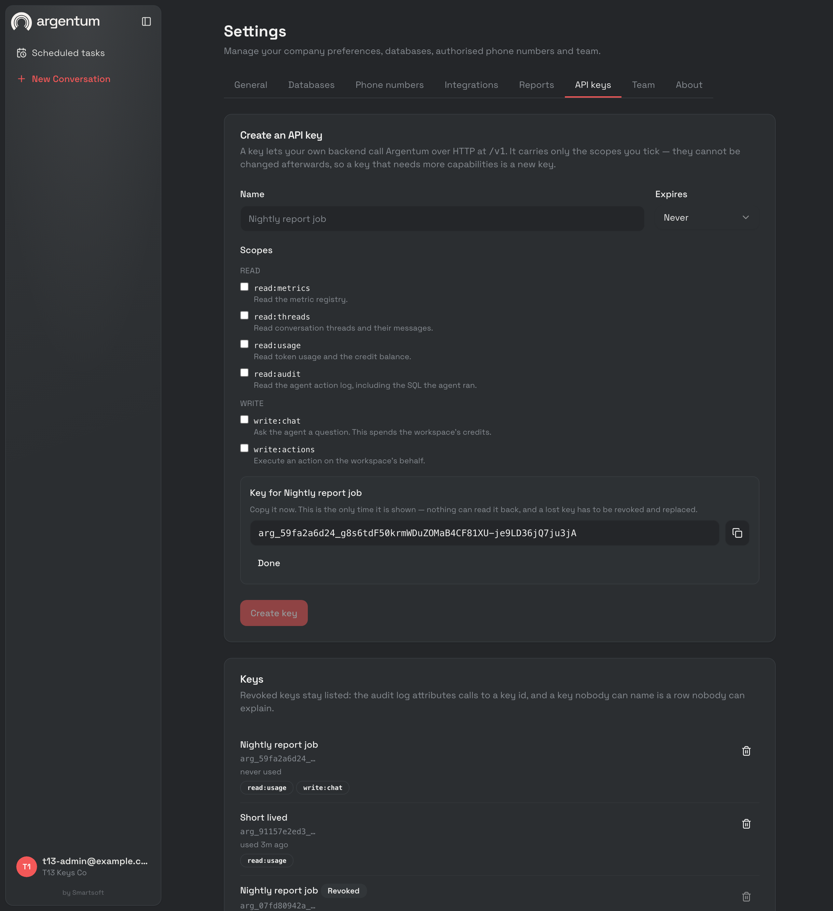

# Scoped API keys — T-13 record

Ticket: [`../plan/01-tickets.md`](../plan/01-tickets.md) `T-13`. Finding closed:
`P-2` — *"Everything requires a human JWT, so nothing can integrate."*

Landed 2026-07-28. Last dependency of `T-A1`; the `/v1` group now exists and
authenticates.

---

## 1. What ships

`api_keys` (migration `024`), a token format, an authentication middleware, a
scope gate, a per-key rate-limit bucket, a dashboard tab, and exactly one
`/v1` route to prove the credential works end to end.

A key is `arg_<prefix>_<secret>`:

| Half | Bytes | Stored as | Why |
| ---- | ----- | --------- | --- |
| `arg` | — | — | A leaked key is recognisable in a log or a secret scanner. That is what makes an automated revoke possible at all. |
| `<prefix>` | 5 random, hex | plaintext, `UNIQUE` | Public. It is what the dashboard lists and what authentication looks the row up by. |
| `<secret>` | 32 random, base64url | SHA-256 only | Never persisted. One response in the system's lifetime carries it. |

### The deviation worth arguing about: SHA-256, not Argon2id

The ticket says *"`key_hash` (Argon2id — reuse `internal/auth`)"*, and
[`../plan/00-sprint-overview.md`](../plan/00-sprint-overview.md) §5 names
Argon2id as one of four layers against a leaked key. **This ships SHA-256, and
the layer it was standing in for is intact.**

Argon2id exists to make guessing expensive against a **low-entropy** input —
a password a human chose. This secret is 256 uniformly random bits. There is
no dictionary to slow an attacker down against, and the search space is the
defence rather than the KDF. `internal/auth/invite.go` already states this
reasoning for invite tokens and already uses SHA-256 for them; this is the
same input under a different name.

What the KDF *would* cost lands in the wrong place. `defaultParams` in
`password.go` is 64 MiB and three passes — roughly 50 ms and 64 MiB **per
authenticated request** on a machine-to-machine API that a nightly job will
hammer, where a login pays it once a fortnight. It is also an amplification
vector: anyone holding a valid prefix could make the server allocate 64 MiB
per wrong-secret guess, on an unauthenticated path.

The threat the column defends against is a dump of `api_keys`, and SHA-256 of
a 256-bit random value is not reversible. Argon2id stays where it belongs, on
`HashPassword`.

### The other three layers of §5's mitigation are unchanged

- **Plaintext shown once** — `POST /api/api-keys` is the only response that
  has ever contained a token. Proven below, including a check that the secret
  never reaches the server log.
- **Per-key rate limits on a separate bucket** — `rl:apikey:<id>`, distinct
  from `rl:company:<id>`.
- **Per-key usage visible to the tenant** — `last_used_at`, in the list.
  `T-A5` is what turns that into real observability.

## 2. Decisions worth carrying forward

- **There is no cache on the authentication read, deliberately.** `T-03`
  caches its credit verdict for 60 s and accepts that a topped-up tenant stays
  refused for a minute. The same trade on a credential means a revoked key
  keeps working for a minute after an admin decided it should not — which is
  the exact moment the key is most likely to be in the wrong hands. The cost
  is one indexed read on a `UNIQUE` column per request.

- **`last_used_at` is throttled instead**, to one write per key per minute per
  process. It answers "is anything still using this key?" before a revoke,
  which is the only question it has to be accurate enough for.

- **Revocation is a tombstone, and revoked keys stay in the list.** The audit
  log attributes rows to a key id; a deleted key turns every one of those rows
  into an unanswerable question. `DELETE /api/api-keys/:id` sets `revoked_at`.

- **There is no `Update` on the repository.** A key's scopes are fixed at
  creation. Editing the capabilities of a credential already deployed in
  someone else's CI config changes what that config can do without anyone
  touching it; the safe operation is mint-and-revoke, and leaving the unsafe
  one out of the interface is how that stays true.

- **A key carries scopes, never a role.** `APIKeyAuth` sets `company_id`,
  `api_key_id` and `api_key_scopes` on the Gin context and deliberately does
  **not** set `role`. `RequireRole` refuses an unrecognised role, so a `/v1`
  group that ever picked up the dashboard's policy middleware fails closed
  instead of admitting a script as a member. A test asserts the absence.

- **Header only.** `middleware.Auth` also accepts the dashboard's token from
  `?at=` and from a cookie, because a browser cannot set a header on a
  WebSocket upgrade. Neither applies to a machine caller, and both are how a
  credential ends up in an access log, a proxy trace or a referer.

- **A repository failure is a 500, not a 401.** `T-03` fails *open* on a
  credits lookup because a billing check is optional. A credential check that
  cannot reach its store must not answer "invalid key" — that tells an
  integrator to rotate a key that is fine.

- **Every rejection is one message.** Malformed, unknown, wrong secret,
  revoked, expired: `invalid_api_key`. The server log records which; the
  caller does not.

- **An unknown prefix still pays for a hash.** Otherwise the difference
  between "no such prefix" and "wrong secret" is measurable, and that is a
  free oracle for enumerating which prefixes exist.

- **A key with no scopes is refused at creation.** It would authenticate and
  then reach nothing, which looks exactly like a bug to whoever deploys it.

- **The scope vocabulary is served, not hardcoded in the dashboard.**
  `GET /api/api-keys/scopes` returns each scope with the sentence shown beside
  its checkbox, so `T-A1`'s two additions (`write:reports`, `read:documents`)
  appear in the UI with no frontend change.

### Two things this ticket touched that belong to `T-A1`

Both were unavoidable, and both are additive rather than provisional:

- **`internal/transport/http/apierr`** — the typed envelope. `T-A1` designs it
  and owns `param`, the request-id middleware and the handler helpers. But the
  first thing a `/v1` route ever answers is an auth failure, and `T-A1`'s
  acceptance says in as many words that a bare `{"error":"…"}` anywhere under
  `/v1` is a defect. Writing one now and replacing it later would have meant
  shipping the exact shape that ticket forbids.
- **`GET /v1/me`** — the smallest possible surface, and deliberately the one
  route `T-A1` cannot change the meaning of: an integrator's first call,
  answering "is my key live and what does it carry?". `T-A1` extends the body
  with the rate limit, the credit balance and the API version. Without it
  T-13's gate — a transcript of a working call and a revoked one — has nothing
  to authenticate against.

`API_V1_RATE_PER_MIN` is likewise the name `T-A1` reserves rather than a
second setting that would have to be reconciled later.

### The defect the live gate found

**`/v1` inherited the dashboard's CORS headers.** `middleware.CORS` is
installed on the engine, above every group, so the new group got
`Access-Control-Allow-Credentials: true` and the permissive header list for
free — and with `CORS_ORIGINS` unset that middleware echoes **any** `Origin`.
A key usable from a web page is a key that shipped in somebody's bundle, which
is the precise conflation `T-A1` forbids and `T-19`'s embed key exists to
avoid.

`CORS` now takes skip prefixes and the router passes `/v1`. A prefix check
rather than moving CORS onto each group: the install is above health,
webhooks and the Metabase proxy too, and the group somebody forgets to
re-add it to is the one that regresses. `TestV1EmitsNoCORSHeaders` asserts
both halves — nothing on `/v1`, unchanged on `/api`.

This is the fourth consecutive ticket where the live half of the gate found
something no unit test was going to.

## 3. Gate

### Static

```
$ go build ./... && go vet ./...
# clean

$ golangci-lint run
0 issues.

$ go test ./... -race | grep -c '^ok'
24
$ go test ./... -race | grep -c FAIL
0

$ pnpm --filter dashboard build   # tsc -b && vite build → clean
$ pnpm --filter dashboard lint    # 0 errors, 6 pre-existing warnings
```

New tests: `internal/auth/apikey_test.go` (format, parse table including a
secret containing `_`, uniqueness over 100 mints, constant-time match),
`internal/app/apikey_service_test.go` (creation validation table, the
plaintext-once property, expiry, an authentication table, a forged
prefix+foreign-secret case, repository failure, revoke lifecycle, derived
status, the `last_used_at` throttle), `internal/transport/http/middleware/apikey_test.go`
(the scope matrix and the rejection table), `cmd/api/v1_test.go` (both
directions of the credential split, CORS, and the policy-table exemptions).

#### The ticket's gate: the table-driven scope test

Every scope in the vocabulary × every scope a key might hold — `6 × 6` — plus
a multi-scope key, a scopeless key, and a `RequireScope` with no `APIKeyAuth`
ahead of it.

```
$ go test ./internal/transport/http/middleware/ -run 'Scope|APIKey' -v
=== RUN   TestRequireScopeMatrix
=== RUN   TestRequireScopeMatrix/key_holds_read:metrics
=== RUN   TestRequireScopeMatrix/key_holds_read:threads
=== RUN   TestRequireScopeMatrix/key_holds_read:usage
=== RUN   TestRequireScopeMatrix/key_holds_read:audit
=== RUN   TestRequireScopeMatrix/key_holds_write:chat
=== RUN   TestRequireScopeMatrix/key_holds_write:actions
--- PASS: TestRequireScopeMatrix (0.00s)
    --- PASS: TestRequireScopeMatrix/key_holds_read:metrics (0.00s)
    --- PASS: TestRequireScopeMatrix/key_holds_read:threads (0.00s)
    --- PASS: TestRequireScopeMatrix/key_holds_read:usage (0.00s)
    --- PASS: TestRequireScopeMatrix/key_holds_read:audit (0.00s)
    --- PASS: TestRequireScopeMatrix/key_holds_write:chat (0.00s)
    --- PASS: TestRequireScopeMatrix/key_holds_write:actions (0.00s)
=== RUN   TestRequireScopeMultiScopeKey
--- PASS: TestRequireScopeMultiScopeKey (0.00s)
=== RUN   TestScopelessKeyReachesNothingScoped
--- PASS: TestScopelessKeyReachesNothingScoped (0.00s)
=== RUN   TestAPIKeyAuthRejections
=== RUN   TestAPIKeyAuthRejections/no_header
=== RUN   TestAPIKeyAuthRejections/empty_bearer
=== RUN   TestAPIKeyAuthRejections/wrong_scheme
=== RUN   TestAPIKeyAuthRejections/a_dashboard_JWT
=== RUN   TestAPIKeyAuthRejections/unknown_key
=== RUN   TestAPIKeyAuthRejections/revoked_or_expired
=== RUN   TestAPIKeyAuthRejections/store_unreachable
--- PASS: TestAPIKeyAuthRejections (0.00s)
    --- PASS: TestAPIKeyAuthRejections/no_header (0.00s)
    --- PASS: TestAPIKeyAuthRejections/empty_bearer (0.00s)
    --- PASS: TestAPIKeyAuthRejections/wrong_scheme (0.00s)
    --- PASS: TestAPIKeyAuthRejections/a_dashboard_JWT (0.00s)
    --- PASS: TestAPIKeyAuthRejections/unknown_key (0.00s)
    --- PASS: TestAPIKeyAuthRejections/revoked_or_expired (0.00s)
    --- PASS: TestAPIKeyAuthRejections/store_unreachable (0.00s)
=== RUN   TestAPIKeyAuthSetsAuditIdentity
--- PASS: TestAPIKeyAuthSetsAuditIdentity (0.00s)
=== RUN   TestRequireScopeWithoutAuthFailsClosed
--- PASS: TestRequireScopeWithoutAuthFailsClosed (0.00s)
=== RUN   TestAPIKeyAuthUnconfigured
--- PASS: TestAPIKeyAuthUnconfigured (0.00s)
=== RUN   TestAPIKeyIsHeaderOnly
--- PASS: TestAPIKeyIsHeaderOnly (0.00s)
PASS
ok   github.com/fauzanebd/argentum/internal/transport/http/middleware  0.393s
```

### Against a live API and a real Postgres

`cmd/api` against the local `argentum_postgres` and `argentum_redis`.
Migration `024` applied on boot: `control DB migrated to version 24`.

```
1. GET /api/api-keys/scopes                     -> 200, six scopes, reads then writes

2. POST /api/api-keys {"name":"Nightly report job",
                       "scopes":["read:usage"],"expires_in_days":0}
                                                -> 201
   {"key":{"id":"a031742f…","key_prefix":"07fd80942a","scopes":["read:usage"],
           "status":"active"},
    "token":"arg_07fd80942a_FJEEOyVZ…"}

3. GET /v1/me   Authorization: Bearer arg_07fd80942a_…
                                                -> 200
   {"company":{"id":"0cbf9b5f…","name":"T13 Keys Co"},
    "key":{"id":"a031742f…","name":"Nightly report job","scopes":["read:usage"]}}

4. GET /v1/me   (no header)                     -> 401 authentication/missing_api_key
5. GET /v1/me   Bearer <dashboard JWT>          -> 401 authentication/invalid_api_key
6. GET /api/api-keys  Bearer arg_…              -> 401 {"error":"invalid token"}

7. GET /api/api-keys  Bearer <JWT>              -> 200
   the row carries key_prefix, scopes, last_used_at, status — and no token field

8. DELETE /api/api-keys/a031742f…               -> 204
   GET /v1/me with the same key                 -> 401   (immediately; no cache)

9. a key with expires_at backdated one hour     -> 200 before, 401 after

10. POST /api/api-keys {"scopes":["read:everything"]}
                                                -> 400 "\"read:everything\" is not a scope"
    POST /api/api-keys {"scopes":[]}            -> 400 "a key needs at least one scope"

11. GET /v1/me   Origin: https://attacker.example
                                                -> 200, no Access-Control-* headers
    GET /api/users/me  same Origin              -> 200, Access-Control-* present

12. 135 requests on one key, API_V1_RATE_PER_MIN=120
                                                -> 122 × 200, 13 × 429
    the 429 body      {"error":{"type":"rate_limit","code":"rate_limit_exceeded",…}}
    Retry-After: 1
    a dashboard call during the burst           -> 200   (separate bucket)
    redis: rl:company:0cbf9b5f…  and  rl:apikey:6e291103…
```

**The plaintext, checked rather than asserted.** After the run, the secret half
of the issued token appears **0 times** in the server log; the prefix appears
once, in the creation log line. What Postgres holds:

```
        name        | key_prefix |     key_hash      |    scopes    | used | revoked
--------------------+------------+-------------------+--------------+------+---------
 Nightly report job | 07fd80942a | e3ab9fe3b9021bf1… | {read:usage} | t    | t
 Short lived        | 91157e2ed3 | 13e5be017a489d3b… | {read:usage} | t    | f
```

### In the browser

Driven with headless Chrome over the DevTools protocol, the same method
[`credit-enforcement.md`](credit-enforcement.md) used.



The screenshot is one pass through the whole tab: the scope vocabulary served
by the API and grouped reads-then-writes, a key created with two scopes, the
copy-once panel with the only copy of the token, and the list below showing
prefix, last-used, scopes and a `Revoked` badge on the key step 8 revoked.
(Every key in that local database was revoked after the run.)

## 4. Acceptance criteria, quoted back

- [x] *Key without the needed scope gets 403* — the `6 × 6` matrix above.
      **Not proven live**, because no `/v1` route takes a scope yet:
      `RequireScope` has no production call site until `T-A1`/`T-A2` add one.
      See §5.
- [x] *Revoked key gets 401 immediately* — live step 8, and "immediately" is
      literal: there is no cache to expire.
- [x] *Expired key gets 401* — live step 9.
- [x] *Audit rows attribute to `api_key` with the key id* — `APIKeyAuth` puts
      `actor_kind=api_key` / `actor_ref=<key id>` on the request context, and
      `queue.ChatRunPayload.APIKeyID` carries it across the process boundary
      into `actorOf`, where it outranks a caller-supplied user reference. Both
      halves are tested. **No live row yet**: writing one needs a turn started
      over HTTP, which is `T-A3`. See §5.
- [x] *Plaintext appears in exactly one response, ever* — live step 7, plus
      the log and database checks above.

## 5. Limits, stated

- **`RequireScope` has no production call site.** It is exercised by 47
  requests across four tests and by nothing in the running binary, because
  `/v1/me` is the only
  `/v1` route and it is deliberately unscoped — a key's own identity is what a
  key is always allowed to read. The first real user is `T-A2`'s
  `write:reports`. Until then, "deny by default" is a property of a review
  rule (*every `/v1` route names its scope*) rather than of a table a test can
  enumerate, which is weaker than what `T-04` has for roles.

- **No audit row has been written by an API key.** The plumbing is complete
  and tested end to end at the unit level; the live proof needs `T-A3`.

- **Nothing consumes `write:chat`, `read:metrics`, `read:threads`,
  `read:audit` or `write:actions` either.** The vocabulary is the ticket's,
  and it is forward-looking by construction: none of the routes those scopes
  gate exist yet. A tenant can mint a key today that grants nothing until the
  matching ticket lands.

- **Rate-limit headers are missing.** `T-A1` adds `RateLimit-Limit` /
  `-Remaining` / `-Reset`; today a 429 carries only `Retry-After`, which is
  what the dashboard limiter already sent.

- **The limiter fails open.** Inherited from `NewRateLimiter`: if Redis is
  unhealthy, requests pass unlimited. That is the right trade for the
  dashboard and a debatable one for a public API, where the limiter is also a
  spend control. `T-03`'s budget check is the backstop, and it is the one that
  matters for money.

- **`last_used_at` is per-process.** Two API instances each write at most once
  a minute, so the column can be up to a minute stale and is not a request
  counter. Per-key request counts are `T-A5`.

- **No pagination on `GET /api/api-keys`.** The list is every key a company has
  ever minted, revoked ones included. That is fine at the tens; it is not a
  cursor, and `T-A1` makes cursor pagination the `/v1` house style — this is an
  `/api` route and does not inherit it.

- **There is no way to rotate a key in place**, by design (§2). An integrator
  rotating a credential mints a new key, deploys it, then revokes the old one.
  Nothing in the UI walks them through that sequence.

- **`created_by` survives the user who minted it** (`ON DELETE SET NULL`), so
  a key whose author was offboarded shows no author. The alternative —
  cascading — would delete a working integration when someone leaves, which is
  strictly worse.

## 6. Found 2026-08-16: two scopes were offered with no description

`GET /api/api-keys/scopes` serves the checkbox list the dashboard renders when a
tenant mints a key, and §2 states the reason it is served rather than hardcoded
in the frontend: *a scope added on the backend appears in the UI without a second
edit, and there is exactly one place where a capability is described to a human.*

**The second half was not true.** `scopeDescription` is a map, a missing key
yields `""`, and the endpoint serves the scope regardless — so `read:data` and
`write:visualizations`, the two scopes `T-14` added to `domain.AllScopes` on
2026-08-04, have been offered with an empty sentence ever since:

```
read:data              writes=false   ""
write:visualizations   writes=true    ""
```

The blank one matters more than the pair suggests. `read:data` is the **widest
read capability a key can carry** — `run_sql` over every table the connection can
see, which is why §3 of [`mcp-server.md`](mcp-server.md) argues at length that it
must not be folded into `read:metrics`. The dashboard was asking an admin to tick
it with nothing beside it.

**Found by a gate that was not looking for it.** The endpoint was called while
minting the `read:data` key that drove the `T-H7`/`T-H10` gates
([`live-gate-backlog.md`](live-gate-backlog.md) §1d).

**Fixed the same day**, with both sentences written and two tests:
`TestEveryScopeHasADescription` over `domain.AllScopes`, and
`TestScopesEndpointDescribesEveryScope` over the response, because the map being
complete is not the claim — the payload being complete is. Both fail on the old
map and name both scopes. Re-read live off the rebuilt binary: ten scopes, ten
sentences.
