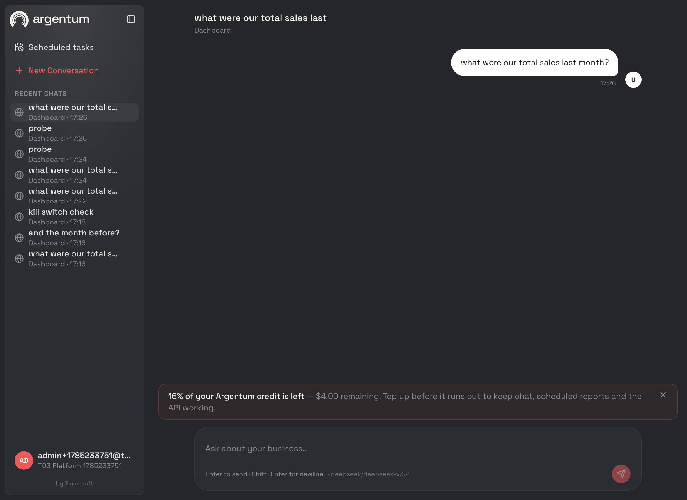
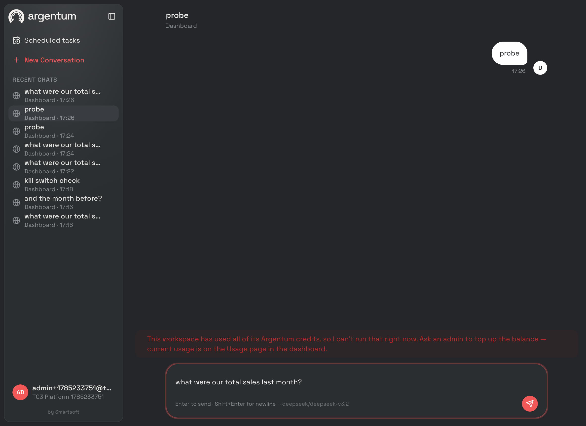

# Credit enforcement — T-03 record

Ticket: [`../plan/01-tickets.md`](../plan/01-tickets.md) `T-03`. Finding closed:
`B-1` — *"`UsageService.append` decrements the balance and ignores the result.
Nothing checks it. A tenant on platform LLM keys can spend without limit."*

Landed 2026-07-28. Last item of phase 1b; `T-A1` is now unblocked.

---

## 1. What the ticket did not say, and had to be decided

**Nothing in Argentum has ever credited a company.** `company_credits` rows are
created by exactly one writer — `CreditsRepo.Decrement`, which upserts
`balance = balance - cost` and therefore mints rows with a **negative**
balance. `monthly_grant_micro_usd` defaults to 0 and no code path has ever set
it. Signup does not touch the table.

So on the day "balance ≤ 0 means refuse" is switched on:

- every tenant that has ever run a turn is below zero, and
- every tenant that has not has no row at all.

Implementing the ticket verbatim is a **global outage**, not a spend ceiling.
Before this run the local control DB had zero rows in `company_credits` and
production would look the same for any tenant that had not been metered.

Two further things fall out of the same gap. A grant is the only possible
denominator for the ticket's own `BudgetWarning` (*"<20% remaining"* — of
what?). And `GET /usage/credits` already renders `monthly_grant_micro_usd` in
the dashboard's overview tab as "of $X monthly grant", against a column that
was always 0.

**Decision: T-03 ships the grant.** `CheckBudget` provisions
`CREDITS_DEFAULT_GRANT_USD` (default `$25`) the first time it sees a company
with no grant, which also forgives pre-enforcement usage exactly once.

**Why in Go and not in a migration.** A backfill would freeze the number into
an applied migration, and an operator changing the env var would then have two
sources of truth that disagree — with the SQL one winning for every company
that existed on the day it ran. It also means this ticket claims no migration
number, after three consecutive tickets found their reserved number already
spent.

The grant is **not** a monthly refresh. The column is named `monthly_grant`
and nothing refills it; a recurring grant needs a period marker the table does
not have, and inventing one here would be billing design smuggled into an
enforcement ticket. What ships is a one-time starting balance.

## 2. The shape

`UsageService.CheckBudget(ctx, companyID) (BudgetState, error)` in
[`internal/app/credits.go`](../../apps/backend/internal/app/credits.go).
`BudgetState` is a struct rather than the bare enum the ticket sketched,
because the dashboard banner has to say how much is left and a second read to
find out would defeat the cache the check exists behind.

Order of resolution, and why it is that order:

1. **Kill switch and empty tenant** → `BudgetOK`. `CreditPolicy.Enforce` lives
   inside the checker, not at each wiring site, so `T-A1` cannot get a
   different answer by wiring itself differently.
2. **Cache hit** → return it. 60s TTL in Redis, keyed `credits:budget:<id>`.
3. **Own primary LLM key** → `BudgetOK`, `BYOLLM: true`, and the balance is
   never read. Consulting a number we never decrement for them would refuse a
   turn on a figure that has no meaning for that company.
4. **Balance** → provision the grant if there is none, then
   `≤ 0 → BudgetExhausted`, `< WarnPct% → BudgetWarning`, else `BudgetOK`.

### Decisions worth carrying forward

- **The check runs before the thread is resolved, not just before the enqueue.**
  A refusal that happened after `ResolveForPhone` / `CreateDashboardThread`
  would leave a thread and an orphan user message per attempt — a tenant at
  zero credits accumulating debris in proportion to how often they retry.
  Verified live: the refused turn added 0 threads and 0 messages.

- **"Has a primary row" was narrowed to "has a primary row carrying a key".**
  The ticket says skip the check when `company_llm_credentials` has a primary
  row. But `llmtenant.Resolver.merge` only swaps the API key when
  `APIKeyEncrypted` is non-empty — a row that overrides only the model or the
  base URL still spends the platform key. Read literally, the ticket lets any
  tenant opt out of billing by pinning a model name. Both halves are pinned in
  the tests and were proven live by dropping the key from a row and watching
  the same company flip from 202 to 402.

- **A repository failure fails open.** A credits lookup that errors returns
  `BudgetOK` with a `Warn`, matching the house rule for optional subsystems.
  Failing closed would turn a billing check into a product outage, and the
  control DB being unreachable already fails the turn one step later for its
  own reasons.

- **A second integration point was needed, for the same reason `T-05` needed
  one.** A cron tick never passes through `ChatEnqueuer` —
  `ScheduledTaskService.HandleFire` enqueues directly. An unattended schedule
  on an exhausted tenant is precisely the unbounded spend the ticket exists to
  stop, because nobody is watching it to notice. The check sits after
  `AppendRun` and before `AppendUserMessage`: the refusal is visible in the
  task's run history (a schedule that silently stops firing is
  indistinguishable from one that broke) and no prompt is appended that
  nothing will answer.

- **One refusal sentence, not four.** `app.CreditsExhaustedMessage` is shared
  by the 402 body, the WhatsApp reply, the Discord reply and the Lark reply. A
  WhatsApp user and a dashboard user hitting the same wall should be told the
  same thing, and per-channel wordings drift.

- **The chat channels answer 200, not 500.** WhatsApp and Lark retry a
  non-2xx, and retrying a turn the tenant cannot pay for delivers the same
  sentence several times. The refusal is spoken, then the webhook acknowledges.

- **The API process grew a Lark client.** Every Lark reply until now was
  written by the worker after the agent ran; a refusal happens before there is
  anything to enqueue, so the only process that can speak it is the API.
  `LarkWebhookHandler.WithReplier` is nil when Lark is disabled.

- **402, not 403 or 400.** The request was well-formed and the caller can fix
  it, which is what Payment Required means. `T-A1`'s error envelope reuses the
  status for the same condition.

### One frontend defect the gate caught

The warning banner did not render on the send that produces it. `/chat` and
`/chat/$threadId` are **two routes rendering the same component**, so the send
that returns a warning also navigates — unmounting one route and mounting the
other, resetting every `useState` in the file. The first send of a session is
exactly the case that loses its banner, and it is the case a near-empty
account is most likely to be in.

The warning now lives in the TanStack Query cache, which sits above the
router. Found only because the screenshot came back without a banner the API
had demonstrably returned.

## 3. Gate

### Static

```
$ go build ./... && go vet ./...
# clean

$ golangci-lint run
0 issues.

$ go test ./... -race
ok  github.com/fauzanebd/argentum/cmd/api
ok  github.com/fauzanebd/argentum/internal/app
ok  github.com/fauzanebd/argentum/internal/agentbudget
… 0 FAIL
```

New tests: `internal/app/credits_test.go` (verdict table incl. the
exactly-at-threshold boundary, one-time provisioning, the four BYO cases, five
fail-open paths, cache behaviour, `Normalize`, `remainingPct` clamping),
`internal/app/chat_enqueuer_budget_test.go`, `internal/app/scheduled_budget_test.go`.

The enqueuer and scheduled-fire tests build their subject with a **nil**
thread service and a **nil** enqueuer deliberately. That is the assertion: if
the gate ever stops short-circuiting, the next line dereferences a nil and the
test fails loudly, instead of passing quietly while a thread, a user message
and a queued agent turn are created for a tenant who cannot pay for them.

```
$ pnpm --filter dashboard build   # tsc -b && vite build → clean
$ pnpm --filter dashboard lint    # 0 errors, 6 pre-existing warnings
```

### Against a live API and a real Postgres

`cmd/api` against the local `argentum_postgres` (schema v23) and
`argentum_redis`, `CREDITS_ENFORCEMENT_ENABLED=true`,
`CREDITS_DEFAULT_GRANT_USD=25`, `CREDITS_WARNING_THRESHOLD_PCT=20`.

**Company A — platform keys.**

```
1. first send, no credits row has ever existed
   POST /api/chat                       -> HTTP 202
   company_credits                      -> balance 25000000, grant 25000000   (provisioned)

2. balance set to 0
   POST /api/chat                       -> HTTP 402
   {"error":"This workspace has used all of its Argentum credits, so I can't
     run that right now. Ask an admin to top up the balance — current usage is
     on the Usage page in the dashboard."}
   usage_events  0 -> 0
   threads       1 -> 1
   messages      1 -> 1

3. balance set to 4000000 (16% of the grant)
   POST /api/chat                       -> HTTP 202
   "budget_warning": {"verdict":"warning","balance_micro_usd":4000000,
                      "grant_micro_usd":25000000,"remaining_pct":16,
                      "byo_llm":false}
```

Step 2 is the ticket's gate verbatim: **402, and zero new `usage_events`
rows** — plus zero new threads and zero new messages, which the ticket did not
ask for and which the "check before resolving the thread" decision is what
buys.

**Company B — its own primary key, $50 overdrawn.**

```
4. primary row with api_key_encrypted set
   POST /api/chat                       -> HTTP 202     (never blocked)

5. same row, api_key_encrypted = NULL, same balance
   POST /api/chat                       -> HTTP 402
```

Step 5 is the narrowing in §2 shown against a live server: a model-only
override does not buy an exemption.

**Kill switch.**

```
6. CREDITS_ENFORCEMENT_ENABLED=false, company A at zero balance
   POST /api/chat                       -> HTTP 202
   company_credits                      -> unchanged (0 / 25000000)
```

### In the browser

Driven with headless Chrome over the DevTools protocol — the same method
[`report-branding.md`](report-branding.md) used, and for the same reason.

| The warning, on a send that also created the thread | The refusal, as the user reads it |
| --- | --- |
|  |  |

The banner reads *"16% of your Argentum credit is left — $4.00 remaining"* and
is the first send of that session, so it also demonstrates the route-remount
fix. Clicking its dismiss control removes it (`[role="status"]` → `NO BANNER`
in the DOM readout after the click). The refusal keeps the typed message in
the composer, so a user who tops up does not have to retype it.

## 4. Acceptance criteria, quoted back

- [x] *Tenant at zero balance gets 402 with an actionable message, no LLM call
      made* — step 2 above; zero `usage_events`, and the refusal names the fix
      and where to look.
- [x] *Tenant with own LLM credentials is never blocked* — step 4, at $50
      overdrawn.
- [x] *Warning banner appears below the threshold* — step 3 and the screenshot.
- [x] *Kill switch restores today's behaviour* — step 6.

## 5. Limits, stated

- **The 60s cache window cuts both ways.** A tenant can overspend by up to one
  TTL of turns after crossing zero, and a tenant whose balance was just topped
  up stays refused for up to a minute. There is no invalidation on write
  because there is no write path yet — see the next item.

- **There is no way to top up.** No endpoint, no admin UI, no billing
  integration. The only way to add credit today is SQL against
  `company_credits`, which is what this gate did. The refusal message tells a
  user to "ask an admin to top up the balance" and the admin's only tool is a
  database client. That is a real product gap, not an oversight of this
  ticket, and it should be a Sprint 2 item alongside whatever `T-13`'s keys
  end up billing.

- **The grant never refreshes.** `monthly_grant_micro_usd` is a starting
  balance here despite its name. A tenant who spends $25 is refused until
  someone intervenes.

- **`RecordLLM` still decrements past zero.** Enforcement is at the gate, not
  in the ledger: a turn that was allowed at 1¢ remaining and then cost 50¢
  drives the balance negative, and the *next* turn is refused. Bounding a turn
  mid-flight is `T-16`'s budget, not this one — the two are complementary and
  neither is a spend cap on a single expensive question.

- **No test covers the Redis implementation of `BudgetCache`**, only the
  in-memory fake and the live run. `RedisBudgetCache` is 30 lines whose only
  logic is "degrade to a miss", exercised end-to-end above.

- **The metering-vs-enforcement split is now two reads of the same table per
  turn** in the worst case (the check, then `Decrement`). The check is cached;
  the decrement is not, and does not need to be.
