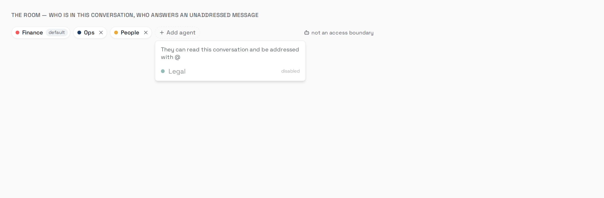
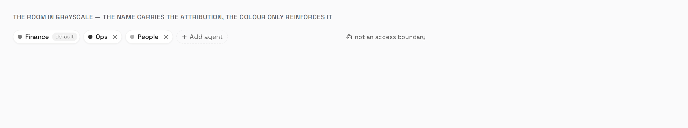

# Multi-agent conversations — what is built, and what it found

The plan is
[`../plan/09-multi-agent-conversations-roadmap.md`](../plan/09-multi-agent-conversations-roadmap.md)
(`T-N1`→`T-N10`, ~18.5d); the reference it was checked against is
[`../research/06-hermes-multi-agent.md`](../research/06-hermes-multi-agent.md).
**Five of the original ten are built** (`T-N1`→`T-N5`), and so is `T-N11`, filed
and built since. This file records what landed, what it changed that the ticket did not
anticipate, and what is owed.

| Ticket | Status |
| --- | --- |
| `T-N1` Every assistant message says which agent wrote it | **built 2026-09-11, unit-gated. Migration `077` written, not applied — §4** |
| `T-N2` A conversation can hold more than one agent | **built 2026-09-11, unit-gated. Migration `078` written, not applied — §4** |
| `T-N3` Addressing — `@agent` decides who answers | **built 2026-09-11, unit-gated. One acceptance item struck as unachievable — §5** |
| `T-N4` The dashboard room | **built 2026-09-11. Visual gate run; three findings — §6** |
| `T-N5` A peer agent's words are untrusted input | **built 2026-09-13, unit-gated. `make eval` owed; one finding outside the ticket — §8** |
| `T-N6`→`T-N10` | Not built, not scheduled |
| `T-N11` A room's history is a peer's words too | **filed 2026-09-13 from §8b; built 2026-09-14, unit-gated. `make eval` and the room arm owed; the ticket was short two leaks — §9** |

**As of `T-N3` a room routes.** One user message addressing two agents becomes
two `chat:run` turns. There is still no UI — that is `T-N4` — so a room can only
be assembled and addressed with `curl`.

---

## 1. The gap it closed

`031_thread_agent.up.sql` gave `agent_actions` an `agent_id` (`:24`) and
`usage_events` an `agent_id` and an index (`:30-34`). It gave `messages`
nothing. So since 2026-07-30 this product has been able to answer *which agent
ran this query* and *what did the Finance agent cost us* — and not *which agent
said that*, which is the only one of the three a customer reads.

In a thread holding one agent the gap is invisible: `conversation_threads.agent_id`
is the answer. It stops being invisible the moment a conversation can hold two,
which is `T-N2`.

**Two readers were affected, not one.** The transcript a person reads, and the
transcript `ChatRunner.hydrateMemory` (`chat_runner.go:2156`) replays into the
*next* turn's context. The second is the one that would have bitten first: three
personas flattened into one undifferentiated `assistant` voice is history the
model reasons over and gets wrong.

## 2. What was built

| Piece | Where |
| --- | --- |
| `messages.agent_id`, nullable, no FK, no index | `migrations/control/077_message_agent.up.sql` |
| Backfill of assistant rows from the thread's agent | same file |
| `domain.Message.AgentID` + `AgentName` | `internal/domain/message.go:19` |
| The roster join folded into the shared FROM clause | `internal/adapters/postgres/message_repo.go` — `messageColumns` + `messageFrom` |
| The agent read off the context, not a parameter | `internal/app/thread_service.go` — `AppendAssistantMessage` |
| One publish decorator stamping every event | `internal/app/chat_runner.go` — `ChatRunner.publish` |
| `ChatEvent.AgentID` / `AgentName` | `internal/app/event_bus.go:40` |
| Author label on assistant bubbles, multi-agent threads only | `apps/dashboard/src/features/chat/chat-page.tsx` |

### Three decisions worth the words

**The agent is read from `agentscope.FromContext`, not passed as a parameter.**
The ticket's *Do* said to pass `agentRow.ID` into `completeWith`. It turned out
not to be necessary: `agentscope.Scope` already carries `AgentID` and `Name` on
the context (`internal/agentscope/scope.go`), installed at
`chat_runner.go:783`, and it is *already* the value the audit decorator and the
usage recorder read from four packages down. Reading the same value in
`AppendAssistantMessage` makes the three rows a turn writes agree **by
construction** rather than by three call sites remembering to pass the same
thing. No signature changed.

**Twelve publish sites became one.** `ChatEvent` is built in twelve places in
`chat_runner.go`. Stamping the agent at each is twelve places to forget, and the
thirteenth publisher would have forgotten. `ChatRunner.publish` is the
decorator — the same argument `T-05` made for wrapping the tool registry rather
than each tool — and every site now goes through it. `r.bus.Publish` appears
exactly once in the file, inside the decorator.

**A `LEFT JOIN`, not a second column list.** `AgentName` is not persisted, so
every read joins `agents`. The join went into the shared `messageFrom` constant
rather than into the two or three queries that "need" it, because a second
agent-aware column list beside the existing one is two lists that drift and the
stale one is whichever the next reader does not notice. `LEFT` and not inner:
`agent_id` has no foreign key by design, so it can name a deleted agent, and an
inner join would make deleting an agent delete its messages from every
transcript — the exact outcome the missing FK exists to prevent.

## 3. What the build found

**The small-talk short-circuit completed before the agent was resolved.**
`ChatRunner.Run` resolved the agent at what was line 782 and short-circuited
greetings at what was line 748 — so a greeting went down `completeWith` with no
scope installed, and would have recorded no agent. The resolution moved above
the short-circuit. The cost is one indexed lookup on the cheapest path; the
short-circuit's own comment said it exists to skip *model* calls, and it now
says so precisely. **A greeting is still a thing an agent said**, and in a room
of three it is a thing one of three agents said.

**`agentscope.Scope.Name` said "carried for logs only. Nothing branches on it."**
It is now on every `ChatEvent` and therefore on a screen. Nothing branches on it
still, but a caller constructing a `Scope` by hand is now producing a label
somebody reads. The comment was updated rather than quietly falsified.

## 4. `T-N2`, and the design decision it forced

`conversation_threads.agent_id` says which agent a conversation *is*; membership
is a different question with a different cardinality. `thread_participants` is
the table, `ThreadParticipantService` owns the rules, and three routes hang off
the existing `ChatHandler`.

### The backfill that was written and then deleted

The ticket's *Do* specifies a backfill: one participant row per existing thread,
naming its `agent_id`. It was written that way, and then removed, because it
makes `thread_participants` the only answer to *who is in this conversation* —
and **threads are created by six paths**: the dashboard's `POST /api/threads`
and the WhatsApp, Discord, Lark, Slack and API enqueue paths. Every one of them
would have had to remember to write a row.

That is the exact shape of the defect
[`../plan/07-agentic-skills-roadmap.md`](../plan/07-agentic-skills-roadmap.md)
records against `T-K1`: a binding table written by one path and read by another,
invisible to every unit test, wrong for five days.

**So the default speaker is an implicit member with no row.**
`conversation_threads.agent_id` is already written by all six paths;
`ThreadParticipantService.List` returns the union of it and the rows, and the
table holds *the others*. A thread nobody has added an agent to is a room of one
with nothing in the new table — which is every thread that exists today, without
a backfill having touched any of them. `078` is purely additive: one table, one
index, no data write.

The cost is assembly in the service rather than one query, plus two checks that
would otherwise have come free from the unique index:

- **adding the default speaker** is `ErrAlreadyExists`, checked explicitly —
  there is no row for the index to collide with, and without the check the room
  would list one agent twice;
- **the cap counts the implicit seat**, or a room capped at four would hold five.

Both are tested.

### The rules, each with a test

| Rule | Answer |
| --- | --- |
| Another company's thread | `404`, never `403` — `RosterReader.GetByID`'s existence-oracle argument |
| Another company's agent, or one that never existed | `404`, indistinguishable |
| A **disabled** agent | `409` — disabling is how an admin stops an agent answering, and a room that could re-enlist one would make disabling a suggestion |
| The default speaker, removed | `409`, naming the fix: make another agent the default first |
| The cap | `409`, and the message names the limit |
| `THREAD_MAX_PARTICIPANTS` unset | `domain.MaxThreadParticipants` (4), applied in the constructor. Config defaults to `0` deliberately — repeating the number would be a second default able to disagree with the first |

Checks run cheapest-first, and the tenant check runs before all of them, so no
refusal below that line can leak whether an id exists.

### Two things chosen against

**Participants are not on the listing route.** `GET /api/threads` returns no
participants and issues no extra query; a sidebar needs a title, and joining a
second table per row to render one is a cost paid on every page load. Only the
detail read populates them, and a failure there is dropped rather than failing
the read — `ChatRunner.companyContext`'s argument, that context makes an answer
better and is never what makes it possible.

**`POST /api/threads` fails the whole request if a `participant_id` is refused.**
The thread is left behind rather than rolled back: it is a valid empty
conversation with a default speaker, and a compensating delete is a second write
that can also fail. The alternative — opening a conversation with quietly fewer
agents than the user picked — is discovered by addressing one and being told it
is not there.

## 5. `T-N3`, and the acceptance item that was struck

`@Finance what happened?` routes to Finance. Nothing addressed goes to the
thread's default speaker, which is what every message did before this ticket.
`@all` and `@everyone` address the room. Parsing is deterministic — **no router
LLM**, decision 3 — and `ParseAddressing` is a pure function of
`(text, participants)`, so the grammar is fully specified by its own test table.

### The two ways an `@` can fail need different answers

- **A name nobody has is text.** `@notanagent`, an email address, a handle.
  One turn, to the default speaker, message unchanged.
- **A name the company has and this conversation does not is a refusal.**
  `409`, naming the agent, **nothing enqueued**. Without this the user addresses
  a real agent, is silently answered by the default speaker, and finds out by
  reading a reply in the wrong voice — the failure `T-S3` refused to ship.

Telling those apart needs the roster, so `RoomReader` has a second method. It is
read **only** when an `@` matched no participant, which is off the hot path for
every ordinary message and is pinned by a test that counts the calls.

A **disabled** roster agent is text, not a refusal: it is unreachable, and
refusing would tell a user to add an agent they cannot add.

### What the build found, and what was narrowed

Three dependencies became consumer-declared interfaces, each one method wide:
`ChatRunEnqueuer`, `CompanyReader` and `RoomReader`. The first was not tidying.
The ticket's central claim is *one user message, N turns, one `UserMsgID`* —
and with a concrete `*queue.Enqueuer` that claim was checkable only against a
live Redis, **which is why nothing checked it**. It is now five tests, including
the fan-out order, the stripped `@` tokens, and a partial queue failure
reporting how far it got.

`@` tokens are stripped from what the model sees and kept in what is persisted —
`lark.StripMentions`' arrangement, and its reason: leaving them in the prompt
teaches the model that `@` is something it should produce.

Both degraded paths fail open. A participant lookup that errors, or a roster
lookup that errors, resolves the turn to the thread's agent rather than refusing
it — `ChatRunner.companyContext`'s argument, that context makes an answer better
and is never what makes one possible.

### The acceptance item that was struck rather than ticked

> *"A tenant with credit for one turn who addresses three gets one answer and a
> refusal naming the other two."*

**This is not achievable as written and was not quietly dropped.**
`UsageService.CheckBudget` (`credits.go:122`) is a *cached balance read*. The
decrement happens in the worker after a turn runs, and nothing reserves credit
at enqueue — so calling it three times returns the same verdict three times, and
the roadmap's "three `CheckBudget` calls" would have been three identical
answers dressed as enforcement.

Making it true needs a reservation at enqueue time. That is a credits ticket,
not an addressing one, and inventing one here would have put a spend-control
mechanism in the middle of a routing change.

**The exposure, stated plainly:** a tenant near zero who addresses N agents can
overshoot by up to N turns instead of one. It is bounded by
`THREAD_MAX_PARTICIPANTS` (4 by default), and the single-turn path already has
the same shape of overshoot — a turn is checked before it is queued and paid for
after it runs. So this widens an existing gap rather than opening a new one, and
the roadmap's `T-N3` now carries the struck item with this reasoning attached.

## 6. `T-N4`, and three things the screenshots found

The room on screen: a participant bar, `@` autocomplete, one streaming bubble
per agent, and an author on every answer.

### The state change that was the actual work

`liveAssistant` was a single `LiveTurn | null` — the right shape for a thread
that can only have one turn in flight. A room addressing two agents has two,
concurrently, **on one socket and under one job id**, because `T-N3` appends the
user message once and every payload carries its id. So the container became a
map keyed by `agent_id || job_id`, and three consequences followed that the
ticket did not name:

- **`final` no longer ends the turn.** It ends *one agent's* turn. A room
  publishes N `final` events, and the backstop poll and the "we have an answer"
  flag must wait for the last of them, or the other agents are stranded
  mid-answer with nothing polling for them.
- **`error` is the same shape.** A room where Finance errors must still deliver
  Ops's answer, so an error drops one turn and the banner names the agent —
  "Something went wrong" in a room of three does not say whose answer is
  missing.
- **The scroll effect** followed one turn's growth and now follows the combined
  progress of all of them.

### Three findings from actually looking at the screenshots

**1. The harness's Tailwind globs excluded `harness/`.** `tailwind.config.ts`
scanned `./src/**` only, so a utility used *only* in a screenshot scene was
absent from the generated CSS. The grayscale scene came out in **full colour**
and a height class collapsed — both silently, and both look exactly like product
defects rather than harness defects. This has been true since the harness was
written; nobody hit it because every earlier scene happened to use classes the
app also uses. `harness/**/*.{ts,tsx}` is now in the globs, which is the fix for
every future scene as well as these.

**2. `bg-accent` is the brand red in this design system.** `--accent` is
`#F25C5C` (`tokens.generated.css:27`), so the mention menu's active row rendered
as a solid red fill that swallowed the agent's own colour dot. `command.tsx` —
the closest analogue, a highlighted typeahead row — uses `bg-secondary`, and the
menu now does too. `dropdown-menu.tsx` pairs `bg-accent` with
`text-accent-foreground`; a component that borrows one without the other gets an
unreadable row.

**3. `tsc -b` catches what `tsc --noEmit -p` does not.** A use-before-declare in
`chat-page.tsx` passed the incremental check I was running after each edit and
failed the project build. The gate is `pnpm --filter dashboard lint`, which runs
`tsc -b`; nothing else is a check.

### What the grayscale scene is for

Colour is never the attribution — the name is, and the colour reinforces it.
Under a grayscale filter the three agents are still fully distinguishable, which
is the rule `T-R3`'s palette gate set for the report charts, applied to the one
other place this product colours things by category.

Colours come from the tokens' categorical ramp **by roster position, never
hashed from the id**. Two agents colliding on one hue in a room of four is
roughly a one-in-three coin flip on a hash, and the collision would be silent
and permanent for that tenant.

### What `AgentPicker` keeps

The picker still sets which agent a *new* conversation opens on and still
disappears after the first message. Its own comment argued that reinterpreting
history under a different persona is a decision rather than a widget, and that
is untouched: the participant bar adds a **reader**, not a reinterpretation, and
the picker's doc comment now says where the line is so the next reader does not
"fix" the apparent inconsistency.

## 7. What is owed

**Neither migration has been applied anywhere.** `077_message_agent` and
`078_thread_participants` are written with both directions and have had **no
round-trip against a real Postgres**. On
this machine that is not an effort problem — there is a Postgres — it is that
the only control-plane database here is
[**production**](environment-notes.md), serving a live pilot tenant. The arm is
filed in [`live-gate-backlog.md`](live-gate-backlog.md) §3d, the bucket for arms
owed on a permission rather than on effort, with the exact commands.

Until it runs, these acceptance boxes are unticked and stay unticked:

- **`T-N1`** — the round-trip is clean; the backfill sets every historical
  assistant row of an agent-pinned thread and leaves every `user` row `NULL`; a
  real turn writes an `agent_id` matching the `agent_actions.agent_id` of the
  tool calls in the same turn
- **`T-N2`** — the round-trip is clean; the `ON DELETE CASCADE` on `agent_id`
  actually removes participant rows and leaves the threads openable; the unique
  index refuses a duplicate that two concurrent adds would otherwise both win

`T-N2`'s "the backfill gives every agent-pinned thread exactly one participant"
is **not owed — it no longer exists**, and §4 is why: there is no backfill, and
the property it was checking is now structural.

**What *is* proven for `T-N2`**, by thirteen tests over the service: the implicit
default speaker, the union read, a thread with no default speaker, and every one
of the six refusals in §4's table. Plus the ticket's load-bearing negative —
**no turn behaves differently**, which is checkable rather than assertable:
`chat_enqueuer.go` and `internal/queue/` carry zero changes across both tickets.

**What is proven for `T-N3`**: 13 grammar cases over the pure parser (including
the two word-boundary regressions below), 11 over the resolution path, and 5
over the fan-out. The grammar table *is* the specification — Appendix A of the
roadmap and the test are the same list.

**A defect the tests found before the gate did.** The first parser matched a
participant by bare prefix, so an agent named `Ops` answered `@opsummary` and
`@allocation` addressed the whole room — `atTokens` deliberately over-reads to
the end of a plausible name, because otherwise a two-word agent like "Finance
Team" is unaddressable, and a prefix match over an over-read token matches the
wrong word. Both directions are now boundary-checked and both are regression
cases.

**What is proven for `T-N1`**, by tests that fail without the change (all four
verified red before green):

- an assistant message records the agent that wrote it
- a turn whose payload names a **deleted** agent records the agent it *ran as* —
  the default — and not the one the payload asked for
- a greeting records who greeted
- every published event carries the agent, and an unscoped turn's event is
  unchanged
- a user message carries no agent
- an unscoped turn writes no agent rather than failing

**One `T-N4` acceptance item is owed rather than met**: *"A single-agent thread
is pixel-identical to today — proven by a harness screenshot, not by
inspection"*. The harness mounts components, not the routed `ChatPage`, so there
is no before/after pair of the whole screen and producing one means either
mounting the router in the harness or exporting internals for it. What is proven
instead is structural, and saying which is the point: `ParticipantBar` returns
null below two participants with nothing addable, `showAuthors` is false, and
`PendingBubble` receives no author. That is an argument, not a photograph.

**Nobody has typed an `@` into this product.** The three scenes photograph the
room's controls against real components and real fixtures, which is what the
harness is for; none of them is a person using the feature against a running
stack. That arm needs the migrations applied first, and it is the same arm as
the `T-N3` live gate. The three routes are wired and policy-gated at
`RoleMember`, matching the thread routes beside them rather than the admin-only
`/api/agent-bindings`: a channel binding is routing configuration for a
company's shared rooms, whereas these act on one conversation the caller
already has.

**The dashboard's multi-agent branch has never rendered.** `showAuthors` is true
only when a thread's transcript holds two distinct `agent_id`s, which cannot
happen until `T-N2` and `T-N3`. That is deliberate — a flag hard-wired `false`
awaiting a later ticket is a branch nobody can see working, whereas this one
turns itself on the day the room exists. It is also, honestly, **untested in the
true case**, and the screenshot arm for it is owed with `T-N4`.

## 8. `T-N5`, and the path the ticket did not name

**Built 2026-09-13, unit-gated. The paired `make eval` is owed** (live-gate §7d).
No migration — for once the header was right.

`T-N5` is the receiving half of a peer turn: what a turn does when its payload says
another agent wrote the message. Nothing writes such a payload until `T-N6`, so every
test builds one by hand, as the ticket asked.

### 8a. What was built

| Piece | Where |
| --- | --- |
| `taint.KindAgent`, with what it is and what it is not | `internal/taint/taint.go` |
| `Tracker.Carry` (keeps the unnamed read) and `Tracker.Inherit` (copies, never shares) | same file |
| `guardrails.FencePeer`, and `PeerSourcePrefix` = `message from agent` | `internal/guardrails/fence.go` |
| `ChatRunPayload.Peer` → `queue.PeerOrigin{AgentID, Taint}` | `internal/queue/tasks.go`, `internal/queue/peer.go` |
| `receivePeer`: inherit, mark `agent` under the roster name, drop a directive | `internal/app/chat_runner.go` |
| `peerMessage`: the fence, applied where the model's input is composed | same file |
| `peer_agents` on the turn's completion line | same file |
| One bullet in the unconditional `T-H8` guideline | `internal/bootstrap/system_prompt.go` |
| `AgentAction.InputTaint`'s vocabulary comment, and its generated copy | `internal/domain/agent_action.go`, `packages/api-types/src/domain.ts` |

**The acceptance items, quoted back:**
- [x] *`KindAgent` is recorded on a turn that received a nudge (driven by a stub).*
  `TestAPeerTurnInheritsTheAuthorsTaintAndIsMarkedAgent`.
- [x] *A turn whose author was tainted `document` produces a recipient turn that is
  also tainted `document`, and `T-H9`'s approval gate fires on it.*
  `TestAPeerTurnWhoseAuthorReadADocumentGatesTheAction` goes through
  `ActionService.ProposeAction` itself, not a copy of its rule. On a workspace that
  auto-approves, approval is withheld, nothing executes, and the reason names
  `invoice-4471.pdf`. Its negative, `TestAPeerTurnFromAnUntaintedAuthorStillAutoExecutes`,
  shows `agent` alone gates nothing.
- [x] *Peer content arrives fenced and labelled with the author's agent name.*
  `TestAPeerMessageIsFencedUnderItsAuthorsName`, and end to end through `Run` in
  `TestAPeerTurnCannotSetTheDirective`.
- [x] *A nudge body containing the fence sentinel does not escape the fence.*
  `TestAPeerMessageCannotCloseItsFence` covers both markers, and
  `TestAnAgentNameCannotCloseTheFence` covers a hostile name.
- [x] *No path exists by which a nudge sets `Directive` — assert it.* Asserted in
  `Run`: a peer payload carrying a directive reaches the agent factory with an empty
  `SystemAddendum`.
- [x] *A nudge payload carrying scope-shaped fields does not widen the recipient's scope.*
  `TestAPeerPayloadCannotWidenTheRecipientsScope` decodes a payload with scope-shaped
  keys at the top level and inside `peer`. Scope, persona and tools come back equal
  to the recipient's row. `TestThePeerCarrierHoldsNothingThatDecidesATurn` holds the
  shape that keeps it true: `PeerOrigin` is exactly two fields, and `ChatRunPayload`
  may carry no field named like a scope.
- [ ] *`make eval` pass rate at or above baseline; both numbers pasted.* **Owed** — no
  model key here (live-gate §7d).

Also *"the audit row records the kind"*: `TestAuditRowRecordsWhatAPeerHandedTheTurn`
shows `input_taint = "agent,document"` and `document_tainted = true`.

### 8b. The finding: a room already hands one agent's words to another, unfenced

The ticket says the laundering path *"exists the moment `T-N6` ships unless this lands
first"*. **Half of it has existed since `T-N3`,** it shipped in `v1.7.0`, and no
nudge is involved.

- **Every agent in a room shares one conversation memory.** `buildMemory`
  (`bootstrap/stack.go`) builds a single `RedisMemory`. The SDK keys it
  `org:conversation` (`redis_memory.go:158`), and `ChatRunner.Run` sets those to the
  company and the **thread** (`multitenancy.WithOrgID`, `memory.WithConversationID`).
- **Every provider replays that buffer into its request** (`pkg/llm/openai/message_history.go:30`,
  and the same in the anthropic, deepseek and gemini providers).
- **So the next agent reads its colleague's reply as its own.** Ask Finance about a
  supplier PDF, then say `@Ops`. Ops' request carries Finance's reply as an
  **`assistant` message**, as though Ops had written it: no fence, no label, no `agent`
  taint and no `document` taint.
- **`hydrateMemory` is the cold path, and does the same.** It copies `m.Role` straight
  through. It runs only when the buffer is empty, so fixing it alone closes nothing.

**What that costs.** Finance's summary of the PDF, with whatever instruction the PDF
carried, reaches Ops with the trust of Ops' own reasoning. That is worse than decision
5's colleague's-request shape. `T-H9` does not gate Ops.

It is also the flattening `T-N1`'s *Why* named: *"three personas flattened into one
undifferentiated `assistant` voice"*. `T-N1` fixed the record and the transcript, not
the replay. §1 of this file reads as though it had.

**How much of it is new.** Less than it sounds. `T-H9` gates per turn, so a single
agent that read a PDF in one turn and is asked to "send it" in the next is not gated
either — its own summary sits in its history, untainted. What a room adds is a
*different* reader, with different tools and sources: Ops may hold `propose_action`
where Finance did not. That widens an existing gap rather than creating a new class.

**Not fixed here, and why.** Closing it means deciding what a peer's *history* is,
which the ticket did not ask.
- **The fence is mechanical:** a memory decorator that stamps the author on write and,
  on read, turns another agent's `assistant` message into a fenced user-role block.
  But it changes every room turn's context, so it owes its own eval pair.
- **The taint is a decision.** Inheriting from history would gate every room turn after
  anyone read a document — the off switch `T-H9` argues against. Not inheriting keeps
  the cross-turn gap a single agent already has.

Filed as `T-N11` in the roadmap and **recommended before `T-N6`**. Live-gate §7d's third
row is the *before*.

### 8c. Where the ticket was wrong, or silent

- **"Build against a stub" needed a carrier, and `T-N6` had specified one that could not
  work.** `T-N6` gave the payload `NudgeFromAgentID` and had `Run` install the inherited
  taint from it. An id cannot carry a taint: the author's tracker lives in another
  process. `T-N5` defines `Peer *PeerOrigin{AgentID, Taint}`, and `T-N6`'s bullet is
  revised to set it.
- **The author's name is resolved, not carried.** The ticket says the label carries the
  author's name. A name on the payload would be a label the sender types. The worker
  looks it up from `Peer.AgentID`, scoped to the turn's company. A deleted author, or
  another company's agent, is fenced and tainted with no name.
- **"Do not run peer text through the input guardrail classifier" is deliberately not
  done.** The classifier sees the whole composed message (`ProcessInput` over
  `agentMsg`), so the fenced body reaches it.
  - **The markers cannot be the signal.** A skip keyed on finding them would let a person
    bypass the input guardrails by typing one into the chat box.
  - **The payload is the safe signal** (`p.Peer != nil`), and a per-turn guardrail
    exception belongs to the ticket that enqueues peer turns. It moved to `T-N6`.
  - **Until then it fails closed.** A fenced peer question that trips
    `block_prompt_injection` is refused.
- **"The audit row records the kind" needed no change to the decorator.** `InputTaint` is
  `taint.Join`, so `agent` appears as soon as a turn is marked. The *names* — "the
  Finance agent, which had read invoice-4471.pdf" — cannot go on `agent_actions`, which
  has no sources column. They went on the completion line as `peer_agents`, beside
  `document_sources`, which now includes what a peer carried in.
- **`T-H9`'s reason is slightly off for an inherited taint.** It says *"this turn read the
  uploaded document invoice-4471.pdf"*, when the turn was handed the content. An approver
  can still act on it, so it was left alone. Making it exact means carrying *how* a taint
  arrived — a second field, for one sentence.
- **The prompt bullet is unconditional.** The ticket asks for a sentence in the shared
  prompt, and no tool delivers a peer message — it arrives in the user turn — so there is
  nothing to condition it on. Every prompt grows by one bullet: one cache miss at deploy.
  It sits inside an existing guideline, so no guideline number moves.

### 8d. Proven failing

Each mutation was applied, run, and restored, with the file `cmp`'d byte-identical before
the gate:
- **Inheritance removed:** three tests failed, including the `T-H9` gate test.
- **The directive kept:** `TestAPeerTurnCannotSetTheDirective` failed.
- **`peerMessage` returning the raw words:** the same test failed, on its fence assertion.
- **`Carry` dropping the unnamed read:** `TestAnUnnamedReadSurvivesTheCarry` failed.

The scope test did not fail under the directive mutation, and should not have: decoding
already discards a `directive` nested inside `peer`. The directive property is carried by
the `Run` test.

The gate's output is in [`delivery-log.md`](delivery-log.md) Phase 3ba.

### 8e. What is owed

- **The paired `make eval`** for the prompt bullet. Prediction, recorded in live-gate §7d:
  no movement beyond the set's ±2-case band. Both rates go here when it runs.
- **The real nudge from a document-tainted turn**, which needs `T-N6`.
- ~~**The room's history**~~ — built as `T-N11` on 2026-09-14, §9.

## 9. `T-N11`, and what one buffer per thread was carrying

**Built 2026-09-14, unit-gated.** No migration. The paired `make eval` is owed (live-gate
§7d), with a prediction that it cannot move.

The owner took §8b's recommendation:
- a colleague's earlier turns do **not** pass their document taint on;
- the reading turn records `agent`;
- the gap between turns is filed against `T-H9`, in roadmap 03.

### 9a. What the buffer held — read from the SDK, not assumed

§8b named the replies. Reading `agent-sdk-go` v0.2.56 turned up two more things in the same
buffer, both worse:
- **Every tool call and tool result.** Both providers (`pkg/llm/openai/client.go`,
  `pkg/llm/anthropic/client.go`) and the streaming path (`pkg/agent/streaming.go`) write
  them with the turn's own context: an empty assistant message carrying the calls, then a
  `tool` message carrying the result. So Ops' request carried Finance's query rows, from a
  source Ops' allowlist may not reach. **That is a scope leak, not only a trust one.**
- **Every composed prompt.** `agent.Run` and `RunStream` store their input as the user
  message. That input is `agentMsg`: the source catalog, metrics, actions, cookbook and
  prior-work blocks for *that* agent.

And one path outside the buffer. **The prior-work block** (`T-Q6`) was built from digest
rows written with no `agent_id`. It told Ops *"work already done earlier in THIS
conversation — reuse it"*, and listed Finance's SQL and source ids.

**The thread summary also mixes every agent** (`thread_service.go`). It is left alone: it
is one or two sentences, told to leave numbers out, and it names no source.

### 9b. What was built

| Piece | Where |
| --- | --- |
| `peermemory.Memory`: stamps each message on write, rewrites the read for the agent reading | `internal/peermemory/peermemory.go` |
| Both branches of the agent memory — Redis and in-process — behind it | `bootstrap/stack.go`, `buildMemory` |
| Replayed rows stamped from `messages.agent_id` | `app/chat_runner.go`, `hydrateMemory` |
| The person's words recorded beside the composed prompt | `chat_runner.go`, `peermemory.WithQuestion` before the agent runs |
| Digest rows written under their agent, and prior work filtered by it | `chat_runner.go`, `rememberToolWork` and `priorWork` |

**The rule, for a turn running as agent C.** The package comment carries the reasons.

| In the buffer | What C reads |
| --- | --- |
| C's own messages, a person's, anything unstamped, anything written by an unscoped turn | as written |
| A colleague's reply | a user-role message, fenced under the colleague's name; the turn records `agent` |
| A colleague's tool call or tool result | nothing |
| A colleague's composed prompt | the person's words it recorded — or nothing, if it recorded none |
| One question, written once by each of two agents' turns | the question, once |

A reader with no agent — the eval harness — reads the buffer unrewritten.

### 9c. The acceptance items, quoted back

- [x] *B's provider request carries A's reply fenced under A's name in a user-role message,
  and B's own earlier replies as `assistant`.*
  `TestAColleaguesTurnReachesTheModelFencedOnAWarmBuffer` drives `Run` with a stub model
  that reads `GenerateOptions.Memory` the way `message_history.go` does.
  `TestTheReadersOwnTurnsKeepTheirToolPairs` covers B's own turns.
- [x] *A single-agent thread's provider request is byte-identical to today's.*
  `TestASingleAgentReadsItsHistoryExactlyAsWritten`: the view returns the buffer
  `reflect.DeepEqual`.
- [x] *B's turn records `agent` with A's name.* Asserted in the package tests and the
  runner tests.
- [x] *Proven on both paths.*
  - Warm: `TestTheViewHoldsOverRealRedisMemory` puts `miniredis` behind the SDK's real
    `RedisMemory`, so the stamp survives its JSON encoding. The `Run` test covers it too.
  - Cold: `TestHydrationAttributesEachReplyToTheAgentThatWroteIt`.
- [ ] *`make eval` before and after.* **Owed** (live-gate §7d). **Prediction: identical.**
  Every golden case is one agent, and the eval harness runs unscoped. The view is identity
  on both, as proven above, so any delta is the set's noise band.
- [ ] *§7d's third arm re-run as the after.* **Owed** — and it never had a *before* either.
  §7d now runs both in one sitting.

**Beyond the ticket:**
- `TestPriorWorkLeavesOutAColleaguesQueries`
- `TestToolWorkIsWrittenUnderTheAgentThatDidIt`
- `TestTheAgentMemoryIsBehindTheRoomViewOnBothBranches`
- `TestTheWrapperKeepsConversationMemory`
- `TestAQuestionAddressedToTwoAgentsIsReadOnce`
- `TestUnstampedHistoryIsReadAsBefore`

### 9d. Where the ticket was wrong

The ticket was mine, written a day earlier from a grep rather than from reading the SDK.
- **It named one leak, and there were three,** plus prior work (§9a). Its *Do* would have
  fenced the replies and left a colleague's raw rows and source catalog where they were.
- **"Re-role an `assistant` message" was incomplete.** Most assistant messages in the
  buffer are tool-call carriers with empty content. Re-roling them would have produced
  empty fenced blocks and orphaned tool results — a request both OpenAI and Anthropic
  reject. They are dropped.
- **Its rule for unstamped messages — "as today in a thread of one, unattributed peer text
  in a room" — was not built,** because it needs a participant lookup inside memory. It
  isn't needed while no rooms exist. Production runs `1.6.0`, read from the deployment on
  2026-09-14, and has no rooms, so every unstamped buffer in existence is one agent's.
  **This holds only if `T-N11` ships no later than rooms do.** Deploying `v1.7.0` on its own
  would create unstamped room buffers, and an active conversation's 24-hour Redis TTL is
  refreshed on every write.
- **"Check that `RedisMemory` round-trips `Metadata`" — it does.** It JSON-encodes the whole
  `interfaces.Message`, and a test now holds that.
- **The prior-work limit is applied before the filter,** so a busy room gives an agent fewer
  of its own digests than `PRIOR_WORK_TURNS` allows. The cost is a re-read schema, not a
  wrong answer.

### 9e. Proven failing

Nine mutations. Each file was restored and `cmp`'d before the next.

| Mutation | Tests that failed |
| --- | --- |
| The view returns the buffer unrewritten | 6 package tests, the `Run` test, the hydration test |
| Hydration stamps nothing | the hydration test |
| The prior-work filter off | `TestPriorWorkLeavesOutAColleaguesQueries` |
| A digest row written with no agent | `TestToolWorkIsWrittenUnderTheAgentThatDidIt` |
| `buildMemory`'s in-process branch returned unwrapped | `TestTheAgentMemoryIsBehindTheRoomViewOnBothBranches` |
| An explicit stamp overwritten on write | the explicit-stamp test, the hydration test |
| The question de-duplication never matches | `TestAQuestionAddressedToTwoAgentsIsReadOnce` |
| A colleague's tool results kept | 4 package tests, the `Run` test |
| A colleague's composed prompt kept | 3 package tests, the `Run` test |

**The first de-duplication mutation proved nothing, and was redone.** It deleted the
variable's only read, which does not compile — a build failure is not a failing test. The
redone mutation compiles, and failed as shown.

The gate's output is in [`delivery-log.md`](delivery-log.md) Phase 3bb.

### 9f. What is owed, and what stays open

- **The paired `make eval`.** Prediction: identical.
- **§7d's room arm, as a before-and-after in one sitting.**
- **Deploy `T-N11` no later than rooms.** §9d's rule for unstamped history depends on it.
- **Open: the gap between turns.** It applies to a single agent as much as to a room, and
  is filed against `T-H9` in roadmap 03.
- **Open: consecutive user-role messages.** A question followed by a fenced reply is two
  user messages in a row. OpenAI-compatible endpoints accept that. The Anthropic interface
  already sends tool results as user messages, so the shape is not new there — but it has
  not been seen against a real Anthropic endpoint.

## 10. `T-N8`, and a loop guard with nothing to guard yet

**Built 2026-09-14, unit-gated.** No migration and no prompt change, so no `make eval` is
owed. Nothing asks another agent until `T-N6`, so in production the ceilings have nothing
to refuse yet. What goes live the day this deploys is the counting.

### 10a. What was built

| Piece | Where |
| --- | --- |
| `agentbudget.Conversation`: one ledger per person's message, in Redis, decided by two Lua scripts | `internal/agentbudget/conversation.go` |
| `Ceilings` — 6 agent turns, depth 2, 5 minutes — labelled as arithmetic, not measurement | the same file, `DefaultCeilings` |
| `Open`: a person's fan-out, counted before its first turn is queued | called from `ChatEnqueuer.Enqueue` |
| `Admit`: one ask, for `T-N6`'s nudge and `T-N7`'s hand-off | no caller yet |
| `Verdict.ToolResult` and `Verdict.Notice`: what the asking model reads, and what the room shows | the same file |
| `CONVERSATION_MAX_AGENT_TURNS`, `CONVERSATION_MAX_NUDGE_DEPTH`, `CONVERSATION_WALL_SECS` | `internal/config`, `.env.example` |
| `argentum_conversation_ceiling_hits_total{dimension}` | `internal/metrics` |
| The ledger on both processes that queue a person's turns | `cmd/api/bootstrap.go`, `cmd/discord/main.go` |

**The rules**, in the order the script checks them:

| Asked for | Answer |
| --- | --- |
| A person's message, to any number of agents | queued whole and counted — never refused, even past the ceiling |
| An ask deeper than `MaxNudgeDepth` | refused before Redis is read, so no ledger is created |
| An ask after `Wall` has passed since the first turn | refused |
| The same agent, asked the same question again in this conversation | a repeat: nothing queued, nothing counted, and not a refusal |
| An ask past `MaxAgentTurns` | refused |
| An ask when Redis cannot be reached | refused |

**The ledger** is one hash per company and message: `started`, `turns`, and one
`asked:<agent>:<digest>` field per question asked. Its TTL is `2 × Wall`, set when the hash is
created and never extended. **Depth is not stored.** It rides the asked turn's payload, so a
lost or expired ledger cannot reset it.

### 10b. Three decisions worth the words

- **A person's message is never refused by the loop guard.** The ticket counts the fan-out
  against the ceiling. That is right — an ask must know four turns are already running —
  but it does not say what happens when the fan-out alone is wider than the ceiling.
  Refusing part of an `@all` would be a loop guard overruling a person about their own
  message, after the credit check has agreed to it. So `Open` counts and never refuses, and
  a fan-out that wide simply leaves no asks.
- **`Open` fails open; `Admit` fails closed.** A Redis outage must not stop a person's
  message; the rate limiter and the share-refresh cap fail open for the same reason. An ask
  is a model spending another agent's budget on its own initiative, and admitting it blind
  is the unbounded spend this ticket exists to stop. The asking model gets a result it can
  act on either way.
- **A refusal carries `budget_exhausted`, deliberately.** That is `IsRefusal`'s key, so
  three readers that already exist get it right with no change:
  - the audit decorator records the call as refused (`T-05`);
  - the tool digest remembers it as refused (`T-Q12`);
  - `Observe` keeps it out of the calls that succeeded, so *"I asked Finance"* is an
    unevidenced claim (`T-Q13`).

  One test asserts all three. A **repeat** carries `already_asked` instead: the colleague
  *was* asked, and saying otherwise would have the model apologise for a question already
  on its way.

### 10c. The acceptance items, quoted back

- [ ] *A stubbed agent that always nudges terminates, and the room says why.* **The ledger's
  half is met; the room's half moved to `T-N6`** (§10d).
  `TestARoomThatAlwaysNudgesStops` runs a room of three in which every turn asks both
  colleagues something new. It is run once with each ceiling binding:
  - turns bind: 6 turns run;
  - depth binds: 21 turns run — 3, then 6, then 12, and nothing deeper.

  Each run's `Notice` names the question that went unasked. Nothing writes it into a room
  until `T-N6`.
- [x] *Depth 3 is refused; depth 2 runs.* `TestDepthTwoRunsAndDepthThreeIsRefused`, which also
  checks that a refused hop counts nothing and creates no ledger.
- [x] *The turn counter is shared across two worker replicas — proven with two processes, not
  one.* `TestTwoProcessesShareOneCounter` starts two copies of the test binary, each with its
  own client, against one Redis. Each tries 30 asks against a ceiling of 40. **They were
  admitted 20 and 20** (pids 1267296 and 1267297 on the run under `-race -v`), where two
  counters would have admitted 60. The Redis was `miniredis`; a real one is owed (§10f), and
  so is the arm with two *workers*, which needs `T-N6`.
- [ ] *Exhaustion produces a visible message naming the unasked question.* The sentence is
  built and tested (`Verdict.Notice`). Writing it into the room is `T-N6`'s.
- [x] *The per-turn budget is unchanged.* `budget.go`, `guard.go` and `checkpoint.go` carry
  zero changes: `internal/agentbudget` gained two new files and nothing else. The existing
  budget tests pass unchanged.
- [x] *A tenant at zero credit still gets the credit refusal, not this one.*
  `TestZeroCreditIsTheCreditRefusalAndTouchesNoLedger`: `ErrInsufficientCredits`, nothing
  queued, and no key written to Redis.
- [x] *The conversation key expires.* `TestTheLedgerExpiresAndIsNeverExtended`: 10 minutes at
  creation, 6 after an ask four minutes in (not pushed back out), gone at 10.
- [ ] *A pass ends a chain and renders as a settle.* **Moved to `T-N6`** (§10d).
- [x] *An agent addressed twice with nothing in between is enqueued once* — as a repeat, which
  is the form of the watermark this product can reach (§10d).
  `TestAnAgentAskedTheSameQuestionTwiceIsQueuedOnce` covers case and spacing, a new question,
  and another agent. `TestAMessagesFanOutIsOnTheLedgerBeforeAnyAsk` shows a colleague
  re-asking the person's own question is a repeat. One agent named twice in one message was
  already one turn: `ParseAddressing` has de-duplicated since `T-N3`.
- [x] *The ceilings are readable and overridable per company, not compiled in* — **per
  deployment**, as the ticket's own *Out of scope* says (§10d). Three env vars, zero meaning
  the default.

**Beyond the ticket:**
- `TestAPersonsFanOutIsCountedAndNeverRefused`
- `TestAMessagesFanOutIsOnTheLedgerBeforeAnyAsk` — the ordering: counted before any ask
- `TestAFanOutWiderThanTheBudgetStillReachesEveryoneAddressed`
- `TestALedgerThatCannotBeReachedRefusesAnAskAndNeverAPerson`
- `TestALedgerOutageDoesNotRefuseAPersonsMessage`
- `TestARefusalIsReadAsARefusalByTheReadersThatAlreadyExist`
- `TestTheClockEndsAConversation`
- `TestOnlyACeilingIsCounted`, `TestExpositionCarriesTheConversationCeilings`
- `TestTheDefaultCeilingsAreTheirStatedArithmetic` — pins the numbers *and* the claim that
  five minutes is two per-turn wall clocks, so a change to either makes somebody re-read the
  comment.

### 10d. Where the ticket was wrong

- **Its watermark cannot fire.** *"Do not enqueue an addressed agent whose context has not
  changed since its own last turn."*
  - Hermes' version fires in a *round*, where every member is re-polled whether or not
    anyone spoke to it.
  - Nothing here re-polls. Every turn is queued because a new message arrived for it — the
    person's, or a nudge — so "no new messages it has not seen" is never true when a turn is
    queued.
  - The ticket's own example, *"a user addresses the same agent twice in a row"*, is two
    user messages.

  What is real, and costs a model call for nothing, is an agent asked again what it was
  already asked in this conversation. That is what was built: `Verdict.Repeat`.
- **Half its *Do* has no caller before `T-N6`, and moved there.**
  - **The pass outcome** needs a nudged turn that can pass, and a way for the model to say
    so. A tool or a sentinel is a prompt change with an eval attached, for a turn that does
    not exist yet.
  - **The room notice** needs something to write it. Only an ask is ever refused, and asks
    are made in the worker by the tool `T-N6` adds. `Verdict.Notice` builds the sentence;
    `T-N6` writes it, and designs its marker beside the settle's, which is the distinction
    the ticket wanted built in rather than retrofitted.
  - **The gate drives "the always-nudging stub" through two workers.** There is nothing to
    drive. The ledger's half is proven with two processes (§10c); the workers' half is owed
    with `T-N6`.
- **It asks for per-company ceilings, and puts per-company overrides out of scope.**
  Decision 9 and the acceptance say per company; *Out of scope* says a deployment default
  until a tenant asks. The narrower was built. A settings row would be read where `Admit`
  takes its ceilings.
- **`CONVERSATION_WALL=5m` became `CONVERSATION_WALL_SECS=300`**, beside
  `AGENT_TURN_BUDGET_SECS`. The config has no duration parser, and seconds are the house
  idiom.
- **"`internal/metrics` already has the shape" — in a process nobody scrapes.** Only an ask is
  ever refused, asks run in the worker, and the worker has no exposition endpoint. That is
  `T-17`'s gap, the same one the grounding counters sit in. Until it closes, the series is
  declared on `cmd/api`'s `/metrics` and will only ever read zero there.
- **"Outlives the fan-out by exactly `WALL`" is right, and is not the whole bound.**
  - A turn admitted in the window's last second runs for up to 150s more, and its ask must
    find the ledger in order to be refused by the clock. `2 × Wall` covers that.
  - A queue backlog longer than `Wall` does not: that ask would open a fresh ledger.
  - Depth is what bounds that case, which is why it is kept out of the ledger.
- **"Incremented at enqueue"** — and a queue failure after `Open` leaves turns counted that
  never run. That over-counts, which is the safe direction for a loop guard to be wrong in.

### 10e. Proven failing

Eight mutations, run one at a time. Each file was restored, and its hash matched the
pre-run hash, before the gate.

| Mutation | Tests that failed |
| --- | --- |
| The depth check off | `TestDepthTwoRunsAndDepthThreeIsRefused`, the depth-binds room, `TestOnlyACeilingIsCounted` |
| The turns ceiling off, in `admitLua` | the fan-out test, the turns-binds room, `TestTwoProcessesShareOneCounter`, the readers test, `TestOnlyACeilingIsCounted` |
| The repeat check off | `TestAnAgentAskedTheSameQuestionTwiceIsQueuedOnce`, `TestOnlyACeilingIsCounted` |
| Every ask pushes the expiry back out | `TestTheLedgerExpiresAndIsNeverExtended` |
| The wall clock off | `TestTheClockEndsAConversation` |
| An ask admitted when Redis fails | `TestALedgerThatCannotBeReachedRefusesAnAskAndNeverAPerson` |
| The enqueuer never opens the ledger | `TestAMessagesFanOutIsOnTheLedgerBeforeAnyAsk`, `TestAFanOutWiderThanTheBudgetStillReachesEveryoneAddressed` |
| A ledger outage refuses the person's message | `TestALedgerOutageDoesNotRefuseAPersonsMessage` |

**Not proven by any test: that the ledger is opened before the first turn is queued rather
than after.** The fan-out tests' queue never asks, so it cannot see the order. What holds it
is the call's position — after the user message is appended, whose id it needs, and before
the enqueue loop — and the comment beside it. Moving the call below the loop would pass
every test here. It would fail the first always-nudging room.

The gate's output is in [`delivery-log.md`](delivery-log.md) Phase 3bc.

### 10f. What is owed, and what stays open

- **`T-N6`'s part**, carried in its *Do*:
  - call `Admit`, and write `Notice` into the room;
  - build the pass and its marker;
  - put the depth on `PeerOrigin`;
  - wire the ledger into the worker.
- **The two Lua scripts on a real Redis** (live-gate §7e). Prediction: identical to
  `miniredis`.
- **Two workers and an always-nudging room**, with `T-N6` (§7e).
- **§2c's measurement**, before any of the three numbers stops being a placeholder (§7e).
- **Open: a queue backlog longer than `Wall`** can let an ask open a fresh ledger (§10d).
  Depth still bounds it. If a real backlog ever does this, the fix is a longer TTL, not a
  stored depth.
- **Open: the ceiling metric is unreadable** until the worker exposes metrics (`T-17`).
