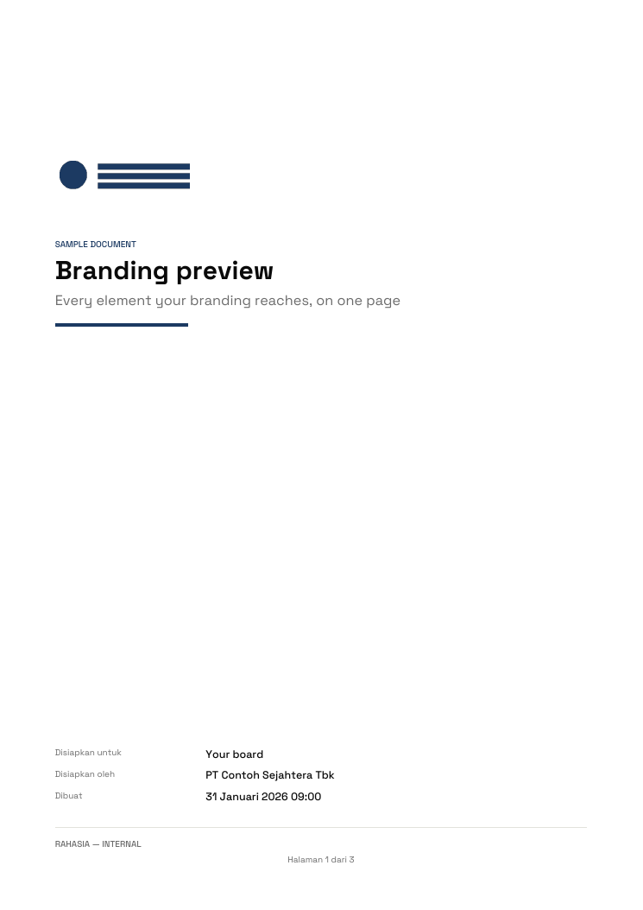
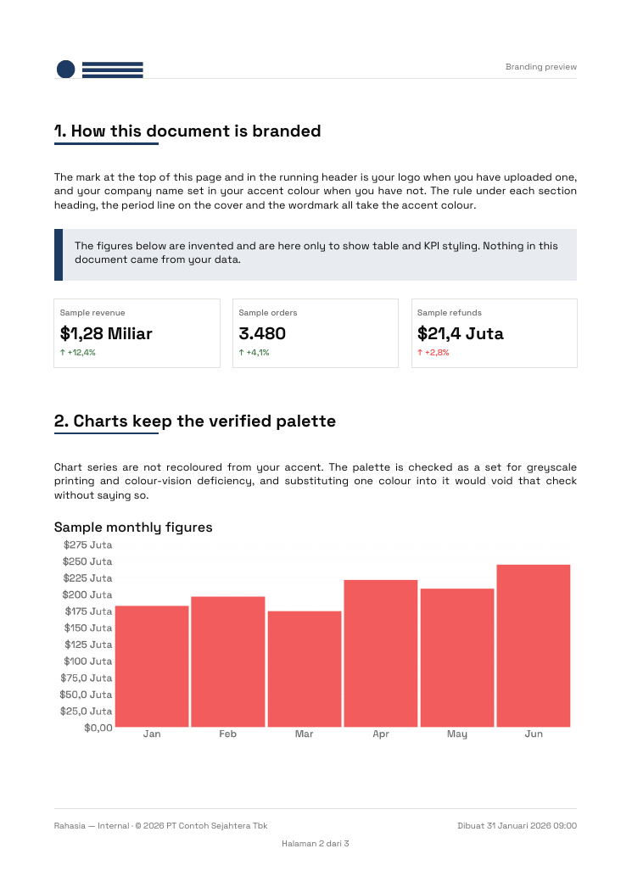
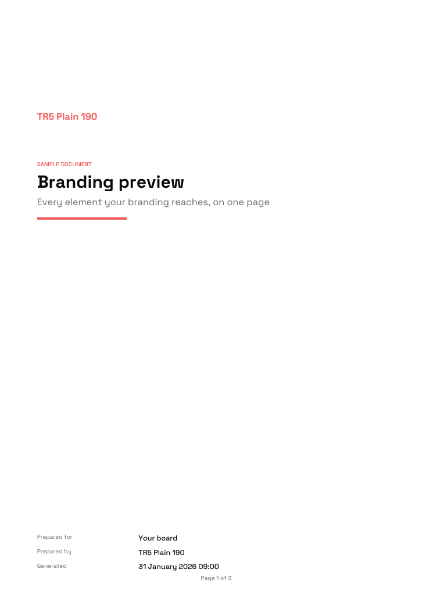
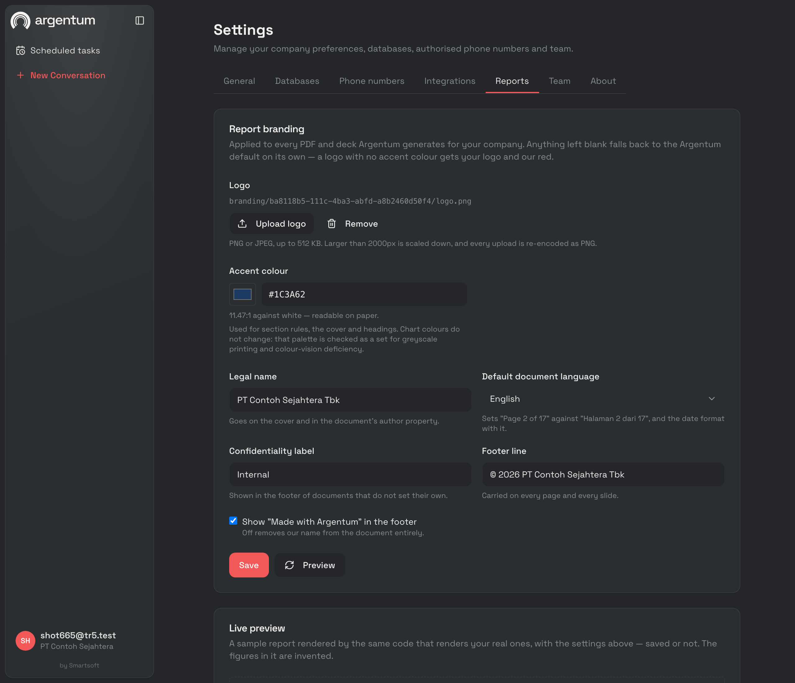
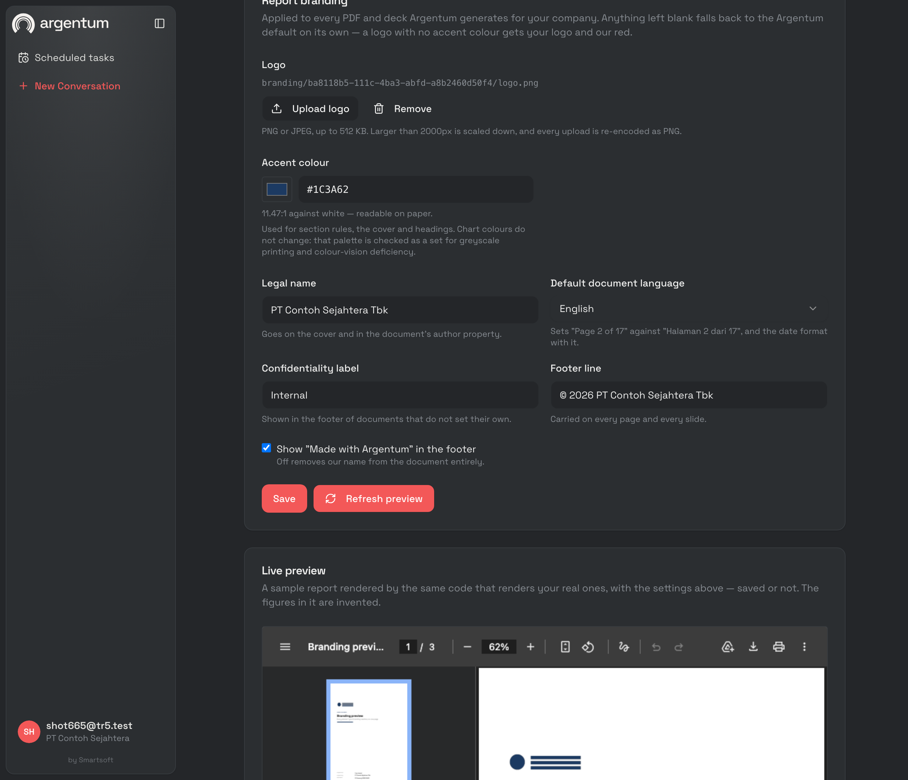
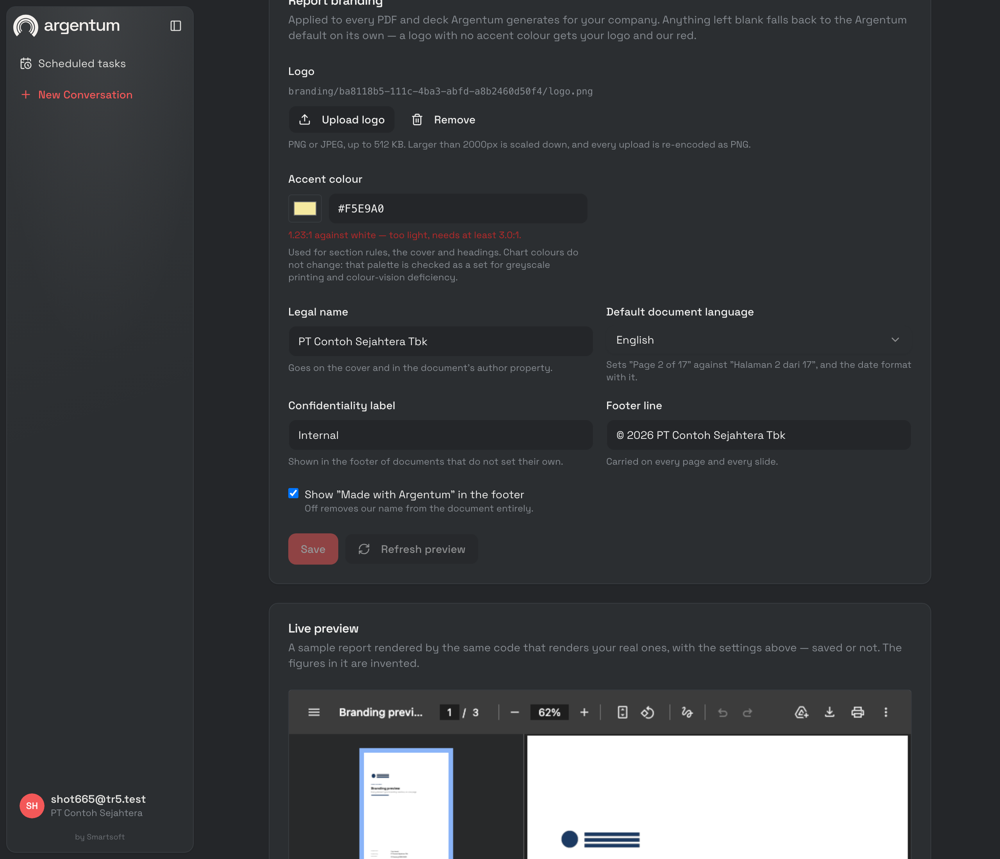

# Tenant report branding — `T-R5` record

Shipped 2026-07-28. A customer's board now receives a document with their mark
on it, not ours.

Argentum's palette stays the default and stays the fallback. What a tenant can
change is the logo, the accent colour, the legal name, the default document
language, the confidentiality label, the footer line, and whether our own credit
appears at all. Every field falls back on its own, so a half-configured tenant
gets a partly branded document rather than a broken one.

```
internal/branding/service.go       read, validate, logo upload, resolve
internal/report/brand/brand.go     the fallback rules, projected onto both renderers
internal/report/theme/contrast.go  hex parsing, WCAG luminance, the readability floor
internal/report/sample/sample.go   the fixed document the preview renders
internal/transport/http/handlers/reports.go   the four routes
apps/dashboard/src/features/settings/reports-tab.tsx   Settings → Reports
migrations/control/022_report_branding.{up,down}.sql
```

## The decisions worth carrying forward

### Chart series are not recoloured, and the UI says so

The obvious reading of "tenant primary colour" is that series 1 becomes it.
That was rejected. `T-R3` verified the eight-colour categorical palette as a
**set** — minimum pairwise separation under simulated deuteranopia and in
greyscale, gated in CI by `make palette`. Dropping one tenant-supplied colour
into that set voids the verification silently: nothing fails, and a printed
report just becomes unreadable for some fraction of its audience.

So the accent reaches rules, headings, the cover and the wordmark, and the
series ramp stays Argentum's. The Reports tab explains this next to the colour
picker rather than leaving a customer to notice their chart did not change.

### The floor is 3:1, and the message carries the measurement

A colour below 3:1 against white is rejected. 3:1 rather than 4.5:1 because of
what the accent is *used for* — 24pt KPI figures, section headings, and rules,
all of them large text or non-text graphics, which is exactly where WCAG puts
that boundary. A 4.5:1 rule would reject brand colours that read perfectly at
the sizes this renderer draws them, and a rule that fails a customer's own brand
guideline is a rule they will ask to have removed.

The message names the measured ratio:

```
invalid input: #F5E9A0 has 1.23:1 contrast against white and needs at least 3.0:1
— it would be unreadable as a heading or a rule on a printed page
```

"Too light" sends someone back to their brand book with nothing to act on;
"1.23:1, needs 3:1" tells them how far off they are. The dashboard computes the
same number live as the picker moves (`src/lib/contrast.ts`), and the server
remains the authority — the browser copy exists so the number moves while you
drag, not to decide anything.

### The deck lightens the accent; it does not reject it

The deck's cover, dividers and closing slide are near-black. A navy validated
against paper can be invisible on them. Rejecting that colour would be fixing
the wrong end — it is *correct* for the PDF, which is the artifact most tenants
care about — so `theme.Readable` mixes it towards white only as far as
legibility requires, and only on those three slide kinds. A colour that already
clears the floor comes back untouched, because an accent that shifts between
formats is worse than one that is slightly dark in one of them.

### The logo goes where the background is paper-coloured

PDF: the cover and the running header, in place of the wordmark. Deck: the
footer strip of the light slides only.

Not the deck's cover, which is the obvious place and the wrong one. A logo is
supplied as one file, almost always dark ink on transparency; on a near-black
cover it is invisible. Asking a tenant for a second light-on-dark variant to
solve a problem only one of the two formats has is a worse trade than putting
the mark where it works and keeping the tenant's name, in their accent, on the
cover.

The deck stores **one** media part referenced from every light slide, not one
per slide: a 40 KB mark on the 200-row export's 50 slides would otherwise be two
megabytes of identical bytes. Determinism survives it — the part and its
relationships are assigned by position, and `TestBrandedDeckIsStillDeterministic`
pins that.

### Uploads are re-encoded, always

PNG or JPEG in, PNG out, 512 KB cap, anything over 2000px on the long edge
scaled down with a Catmull-Rom kernel rather than rejected. Re-encoding is the
point rather than a side effect: it strips EXIF (in a logo, pure leakage), it
normalises JPEG to the PNG both renderers require, and it means the bytes drawn
into a document were produced by Go's encoder from a decoded image — so a
malformed file fails in a handler, not inside a customer's render two days
later. SVG is refused: it is not a raster image, and it is a script-injection
surface in a document renderer.

The key is one per company, `branding/{company_id}/logo.png`, overwritten on
re-upload. Versioning a logo would mean telling the renderer which version to
draw, and nobody has ever wanted the old one.

### The preview and the real document share one resolver

`branding.Service.Resolve` (stored record) and `Preview` (a record the caller
holds but has not saved) are the same function with a different input. A preview
produced by a second code path is a preview that can be right while the document
is wrong, which is the one thing a preview must never be.

The preview endpoint returns **PDF bytes**, and the dashboard points an
`<iframe>` at a blob URL. No PDF.js, no second rendering path, no
approximation-in-CSS that drifts from the renderer.

### Nothing about branding may fail a render

A missing company, an unreadable branding row, a logo the bucket has lost: each
resolves to the Argentum default and reports the problem through a callback the
caller logs. A document that renders unbranded is worth more than an error where
a report was asked for. `TestResolveIsNeverFatal` breaks each dependency in turn.

### Read is admin, unlike the other settings reads

`GET /api/settings` is member-readable; `GET /api/reports/branding` is not. It
returns nothing a member can act on — no report route consults branding on their
behalf — and it feeds a preview that renders a full document per call. Every
write beside it is admin. A read a member cannot act on is a button that answers
403, so the tab is hidden from them entirely.

## Migration

Filed in the ticket as `030_report_branding`, landed as **`022_report_branding`**,
for the reason `021` carries: golang-migrate only applies versions above the
schema's current one, so a number reserved for a ticket that has not landed yet
can never be applied. `021` took `T-05`'s slot and this takes `T-06`'s; both
renumber when they land. The ticket's migration table is updated.

One `jsonb` column rather than seven typed ones. These fields are a presentation
record read as a unit by exactly one consumer, never filtered on or joined
against, and the set will grow as the report track does. `NOT NULL DEFAULT
'{}'::jsonb` so that "no branding" and "empty branding" are the same thing and no
caller has to spell the difference.

## Gate

Run against a live `cmd/api` on the local `argentum_postgres` (which self-applied
`022` on boot — `control DB migrated to version 22`, `dirty = f`) and a real
MinIO. The API was started with `DB_HOST=127.0.0.1` explicitly rather than by
sourcing `apps/backend/.env`, which points at a **remote** server — the mistake
`T-04` recorded and this run did not repeat.

```
=== 2. branding starts empty and defaulted ===
{"branding": {},
 "defaults": {"primary_color": "#F25C5C", "company_name": "TR5 Test 190", "locale": "en"},
 "limits": {"min_contrast": 3, "max_logo_bytes": 524288, "max_logo_edge": 2000}}

=== 3. a low-contrast accent is rejected, with the measured ratio ===
  HTTP 400
{"error":"invalid input: #F5E9A0 has 1.23:1 contrast against white and needs at
least 3.0:1 — it would be unreadable as a heading or a rule on a printed page"}

=== 4. so is a colour that is not a colour, and an unsupported locale ===
{"error":"invalid input: colour must be #RRGGBB, got \"#FFF\""}
{"error":"invalid input: locale must be \"en\" or \"id\", got \"fr\""}

=== 5. logo upload: an SVG is refused, a PNG is accepted ===
{"error":"invalid input: the logo must be a PNG or JPEG image"}
  logo_key: branding/69634b41-6c4d-42e4-a1a9-4615c0cd5928/logo.png

=== 7. preview with no body renders what was saved ===
  HTTP 200  130405 bytes  application/pdf
=== 8. preview with a body renders the unsaved edit (a different accent) ===
  HTTP 200  121332 bytes
=== 8b. and a low-contrast colour is refused by the preview too ===
  HTTP 400

=== 9. a member is refused on every route ===
  ROUTE                                    MEMBER / ADMIN
  GET /reports/branding                    403 / 200
  PUT /reports/branding                    403 / 200
  POST /reports/preview                    403 / 200
  POST /reports/branding/logo              403 / 200

=== 10. a company with no branding row renders the Argentum default ===
  HTTP 200  119732 bytes
```

Test data was removed afterwards (`delete from companies where name like 'TR5 %'
or name = 'PT Contoh Sejahtera'` — 5 rows, cascading).

### Rendered output

| | |
| --- | --- |
|  |  |
| Cover: the tenant's logo, their navy accent on the period line and the rule, Indonesian chrome, their confidentiality label, and no Argentum credit — that tenant switched it off. | Interior: the logo in the running header, accent rules under each heading, the tenant's footer line — and the chart still on the verified palette, which is the trade the record above describes. |



A company with no branding row: its own name as a wordmark in Argentum red,
English chrome, no confidentiality label. Identical to what every document
looked like before this ticket.

### Dashboard







The rejection state: the live readout reads `1.23:1 against white — too light,
needs at least 3.0:1.`, and Save and Refresh preview are both disabled. The
preview pane behind it is the real PDF in an iframe.

**These screenshots close the gap `T-R1` left open.** That ticket recorded that
screenshots could not be captured because Chrome was being intercepted on this
machine. The interception is real but narrower than it looked — a port
collision, not a proxy: something unrelated (a Dart/`package:shelf` server) was
already answering on the port MinIO was first published to, which produced two
false diagnoses in a row here before it was found. Headless Chrome driven over
the DevTools protocol works fine, and is what took these.

## Tests

| Test | What it pins |
| --- | --- |
| `theme.TestContrastRatio`, `TestParseHexColor` | the WCAG maths and the `#RRGGBB`-only parser, against published anchors |
| `theme.TestBrandRedClearsTheFloor` | our own default passes the rule tenants are held to |
| `theme.TestReadableLightensOnlyWhenItMust` | the deck's lift is applied when needed and never otherwise |
| `brand.TestFallbacksArePerField`, `TestProjectionsAgree` | a logo without a colour keeps our red; PDF and PPTX read one set of facts |
| `brand.TestCreditInversionSurvivesTheProjection` | `ShowCredit` → `HideCredit` is not lost in the mapping |
| `branding.TestLowContrastColourIsRejectedWithItsRatio` | the measured number is in the message |
| `branding.TestNonImageUploadsAreRejected` | SVG, HTML, a truncated PNG and an empty body |
| `branding.TestOversizedImageIsScaledDownRatherThanRejected` | the cap moves both dimensions, so a wordmark is not squashed |
| `branding.TestResolveIsNeverFatal` | broken bucket, broken row, broken company lookup, nil service |
| `pdf.TestAccentReachesEveryBrandColouredElement` | counted over maroto's structure tree — a new rule drawn from the raw token fails it |
| `pdf.TestCreditFollowsTheDocumentLocale` | an Indonesian document says `Dibuat dengan Argentum` |
| `pptx.TestLogoIsOnePartOnTheLightSlides` | one media part, referenced from the light slides only |
| `pptx.TestBrandedDeckIsStillDeterministic` | branding does not cost byte-stability |

`go test -race ./...` passes; `golangci-lint run ./...` reports 0 issues;
`pnpm -r build` and `pnpm lint` are clean (the same six pre-existing warnings).

## What this does not do

- **No dark-cover logo variant.** The deck keeps the tenant's name on its dark
  slides. A second upload slot is the obvious extension and is not worth its
  configuration surface until a customer asks.
- **Charts stay on the Argentum palette.** By decision, above.
- **The accent is one colour.** No secondary, no per-chart override.
- **The preview is one fixed sample.** It shows every element branding reaches;
  it does not preview *your* last report.
- **`GET /api/reports/branding` is not cached.** The renderer re-reads the
  record and the logo per document. A logo is capped at 512 KB and a document
  render is already seconds of work, so a cache would be optimising the wrong
  end — but it is the first thing to add if `/v1` (`T-A2`) makes report
  rendering high-frequency.
- **A locale/currency mismatch is rendered, not corrected.** A tenant whose
  company currency is USD and whose document language is `id` gets
  `$1,28 Miliar` — dollars with Indonesian magnitude words. That is what the two
  settings mean together, and guessing which one the customer meant would be
  worse; it is visible in the preview, which is where a customer can fix it.
