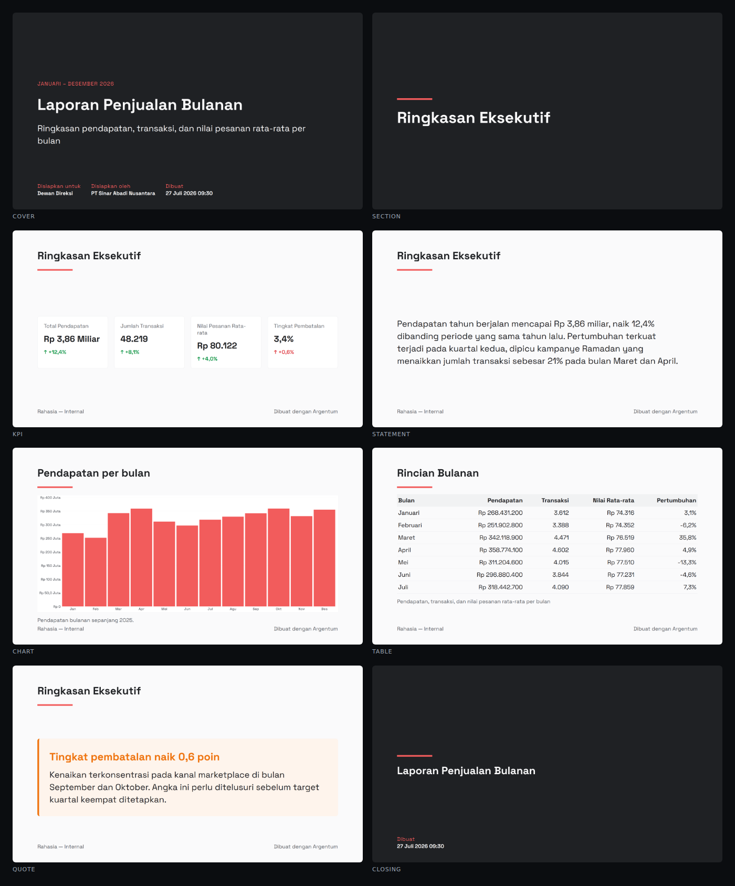

# T-V5 · The motion system and the three-format agreement — coverage

**Status: DELIVERED 2026-08-09.** No migration. The ticket's real deliverable —
the agreement gate — is in `internal/report/agreement`, and it found two things
about its own inputs on the way to passing.

---

## 0. Most of the scene work was already done, and this document says so

`T-V5` was written as *"finish the scene set, polish it, and prove it tells the
truth"*, on the assumption that `T-V2` would ship a renderer and leave the
design to this ticket. `T-V2` shipped more than that. On opening the ticket:

| Asked for | State on arrival |
| --------- | ---------------- |
| The eight scene kinds | **Built.** `cover`, `section`, `statement`, `quote`, `kpi`, `table`, `chart`, `closing` all render |
| One easing curve, two durations | **Built**, in `anim.ts`, with the "a component that invents a third is a review finding" note already written above it |
| The chart reveal — wipe for line and bar, sweep for pie and donut, nothing for sparklines | **Built.** A CSS mask over the Go-rendered PNG; the pixels underneath are never redrawn |
| Brand fidelity with `T-R5`'s contrast floor | **Built.** `videoplan` lifts the tenant's accent through `theme.Readable` against `theme.MinBrandContrast` — the same function and the same floor the PDF uses, so a pale brand colour gets the identical fallback in both |
| A reduced-motion still export | **Built.** `apps/render`'s fixture CLI takes `--stills` and writes one PNG per scene |

So what was actually left is the half nothing had: **the checks**. Three of
them, below. Recording the overlap rather than restating the ticket is the
point — a coverage document that claims credit for work another ticket did is
the same defect as one that under-reports.

## 1. The three-format agreement gate

`internal/report/agreement` is the only package that imports all three
renderers, because what it asserts belongs to the set rather than to any of
them: **a figure reads the same in the PDF, in the deck and in the video.**

That is locked decision 2 stated as a test. Everything up to now has been
*construction* — `T-R2` moved formatting out of the model, `T-R4` extracted
`measure`, `layout` and `labels` so two renderers could not disagree about a
column width or the Indonesian for "Prepared for", `T-V1` projected the same
spec onto a plan whose every string is final. None of it was enforced. A React
component calling `toLocaleString` would have produced a video whose figures
disagree with the PDF attached to the same email, and nothing in the tree would
have noticed.

**Where each format's strings come from, and the one asymmetry.** The PDF's
come from maroto's component tree through a new exported `pdf.Texts`; the
deck's come out of the `.pptx` itself, unzipped and read from the OOXML text
runs — worth doing on the produced bytes because that writer is hand-rolled;
the video's come from the plan, which *is* the video's text in final form.
The asymmetry is that two are read back from what was produced and one from
what will be drawn. §2 is what closes it.

**Direction matters.** Every figure the *video* shows must appear in the PDF
and the deck, not the reverse. A video is a summary and drops rows the document
keeps — `videoplan`'s paging does that deliberately — so a figure the PDF shows
and the video does not is not a disagreement.

### What the gate found about itself, twice, before it passed

Both are worth keeping, because both are the gate being wrong in the direction
that produces false alarms — and a check that cries wolf is a check somebody
deletes.

**Run 1 — `-42` "missing from the PDF".** The pattern searched for figures
*inside* strings, and pulled `-42` out of the order id `SO-2026-42…` in the
video's table. Two things wrong with that, neither a formatting bug: an order
id is not a figure, and the `…` is the video truncating a cell its narrower
column cannot fit — a layout decision each format makes for itself and is
supposed to make differently. The pattern now matches a whole string: a cell is
the unit that carries a number.

**Run 2 — every delta "missing".** The PDF draws a delta as `↓ -14.0%`; the
plan carries `-14.0%` and a `Rising` boolean, and the video draws its own
arrow. The figures agreed exactly; the gate was being literal about where a
format's decoration ends and the number begins. A leading direction glyph is
now trimmed before comparison.

### It can fail

A gate whose failure path never executes is a comment. The comparison is lifted
into `disagreements()` so a test can run it against a corrupted input:
`Rp 3.863.405.700` → `Rp 3,863,405,700`, the same number formatted by somebody
else, which is exactly what a component doing its own `toLocaleString` would
produce. The gate refuses it, and the test asserts that it does.

A second test covers the renderer-chosen words — the ones no spec contains and
each format has to pick. `T-R4` extracted `labels` so the deck and the PDF
could not disagree about "Disiapkan untuk"; this extends it to the third
renderer.

## 2. Two guards on `packages/motion`

`make motion-guards`, in the tokens CI job beside `make palette`. Both are the
same rule: **a component draws what the plan says and chooses nothing.**

**A colour literal is a red build.** The video's components run in a browser
three packages from `tokens.json`, where `color: "#0A0A0A"` is shorter than
reading the value off the plan and looks right on the fixture in front of you.
It is then wrong for every tenant with a brand colour, and wrong *silently* —
the frame renders, the video encodes, and the only symptom is that a customer's
deck is not in their colours.

**Formatting a figure is a red build.** `toLocaleString`, `Intl.NumberFormat`,
`toFixed`, `toLocaleDateString`. This is §1's failure caught one step earlier
and at the place it would be written: the agreement gate compares the plan, and
nothing in it can see a component reformatting a number between the plan and
the pixel. Together the two span spec → plan → pixels.

### What the guard found, and what it changed

Sixteen literals. Fourteen were **copies of tokens** — the palette pasted into
Remotion Studio's default props and into the frame drawn when a plan fails
validation. That is the drift `T-R1` deleted a hand-written `:root` block to
end, growing back in a third place.

Exempting them would have been a file-level allowlist wearing a comment. What
landed instead is a third generator: `tokens.json` →
`packages/motion/src/tokens.generated.ts`, beside the dashboard's CSS
variables and the backend's Go theme, carrying the colours **and**
`DEFAULT_BRAND_COLORS` — the plan's brand block mirrored field for field from
`videoplan.builder.brand()`, so the studio and the failure frame show what an
unbranded tenant would actually get rather than an approximation somebody
typed. The drift gate in CI now diffs it like the other two.

The remaining two are the chart reveal's mask gradients, and they are exempt
with the reason in the source: a mask reads only the alpha channel, so `#000`
there means "opaque" and never reaches a pixel. The marker is
`motion-color-ok: <reason>` and it covers the block below it — written where
the code is, so it is auditable in a diff rather than accumulating in a script
nobody working on the component will open.

## 3. Gate

```
$ go test ./internal/report/agreement/ -v
  TestTheThreeFormatsAgreeOnEveryFigure/monthly_sales    PASS
  TestTheThreeFormatsAgreeOnEveryFigure/kpi_summary      PASS
  TestTheThreeFormatsAgreeOnEveryFigure/export_200       PASS
  TestTheThreeFormatsAgreeOnTheWordsWeChose              PASS
  TestTheGateFailsWhenAFigureIsReformattedInTheVideo     PASS
    → the gate refuses a reformatted figure, as it must:
      [the video shows 3,388 and the PDF does not
       the video shows 3,388 and the deck does not]

$ make motion-guards                              → ok, 4 exempted
$ make motion-guards  (with a #FF00AA in a scene) → 1 finding, exit 1
$ make motion-guards  (with a .toLocaleString)    → 1 finding, exit 1
$ make tokens-check                               → 3 generated files current
$ make lint-go                                    → 0 issues
$ go test ./...                                   → all packages pass
$ pnpm --filter @argentum/motion lint             → clean
$ pnpm --filter @argentum/render lint             → 7 tests pass
```

Both guards were run red before they were run green. A check that has only ever
passed is a check nobody has tested.

## 4. What is not done

- **The contact sheet.** The ticket asks the write-up to carry stills of every
  scene type, `T-R3`'s chart contact sheet as the precedent. The still export
  exists (`--stills` on the fixture CLI) and produces them; assembling and
  attaching the sheet needs the render service running and a place to put a
  PNG, so it joins the video track's other visual items in
  [`live-gate-backlog.md`](live-gate-backlog.md) §1a.
- **The pale-brand frame beside the PDF cover.** Same bucket, same reason. The
  mechanism is shared code — one `theme.Readable` call against one floor — so
  what is owed is the photograph rather than the behaviour.
- **A perceptual still comparison.** The ticket's "same plan rendered twice
  produces the same stills within tolerance" needs a golden-image store and a
  comparator. `T-V1` already proves the *plan* is byte-identical between runs,
  which is where the determinism this project cares about actually lives —
  locked decision 9 says the video itself is not byte-stable. Filed, not built.

## 5. The contact sheet, run 2026-09-11 — and the defect on it

`T-V5`'s two owed visual items sat in §4 above since 2026-08-09 as "needs the
render service running and a place to put the PNGs". Both existed; nobody had
put them together.

    ARGENTUM_PLAN_OUT=/tmp/plans go test ./internal/report/videoplan -run WritePlans
    pnpm --filter @argentum/render render:fixture /tmp/plans/monthly_sales.plan.json /tmp/stills --stills
    pnpm --filter @argentum/render sheet /tmp/stills

The third line is new (`apps/render/harness/sheet.mjs`) and lays the sheet out
in a browser rather than with an image library — the alternative is a
compositing dependency in a service whose selling point is that it has no
database, no object storage and no outbound network, for a picture that goes in
a document.

**The first attempt failed exactly as this repo predicted it would.** Feeding a
`testdata` golden straight to the renderer gives `net::ERR_UNKNOWN_URL_SCHEME`
on `sha256:…`, because the goldens replace chart images with their digest to
stay reviewable. `build_test.go:400` says so, names the symptom, and gives the
two commands above. Worth recording that the note did its job on the second
reader.



One frame per *kind* — thirteen scenes across eight kinds, and a sheet carrying
`section` three times is a sheet whose reader stops reading.

### 5a. The KPI row overflowed the frame, and four cards is the sanctioned cap

The first sheet showed three KPI cards and **a sliver of a fourth**: the label
clipped mid-word, the `%` sheared off by the right edge of the frame.

Not an entrance artifact — `KPIRow`'s entrance is opacity and `translateY`, and
the still is sampled mid-scene. It is flexbox: each card is `flex: 1` with
`whiteSpace: "pre"` inside, a flex item's default `min-width: auto` refuses to
shrink below its content, so four long labels add up wider than the body and
`AbsoluteFill` clips the overflow. **Four cards is not an unusual input — it is
the wide surface's own cap** (`canvas.go:165`).

`minWidth: 0` fixed the frame overflow and moved the clipping inside the card:
the values then ran over their own borders. So the numbers were measured off the
rendered still rather than estimated:

| | |
| --- | --- |
| Body width, wide surface | 1,648px |
| Inner width per card, four across | **318px** |
| Inner width per card, three across | 459px |
| `Rp 3,86 Miliar` at `display` (86px) | **554px of ink** |

The widest value fits neither, so **capping the card count does not save it** —
the number has to get smaller as its card does. `valueSize` steps down the
existing scale: `h2` (47px) at four across puts that value at 303px inside 318;
`h1` (58px) at three puts it at 374 inside 459. Portrait stacks its cards
full-width and keeps `display`.

The label now wraps, alone among this file's `pre` strings: a label is prose and
a second line costs nothing, while `Rp 3,86` above `Miliar` is a number broken
in half.

**What this does not do is fit text.** A value longer than any the builder
produces today would still overflow. That absence is the same one that let four
cards be inherited from the deck, where text *is* measured and fitted — and it
is why `canvas.Wide`'s comment reasons about card width in millimetres for a
renderer that never measures.

### 5b. Still owed

**The pale-brand frame beside the PDF cover.** `theme.Readable` is applied when
the *plan is built* (`build.go:650`), so photographing it needs a plan built from
a pale brand, not a hand-edited JSON — which means a brand override in
`TestWritePlans`, the same again in the PDF fixture writer, and a rasteriser to
turn the PDF cover into a PNG to sit beside it. Three small things rather than
one, none of them hard, none of them done today.
