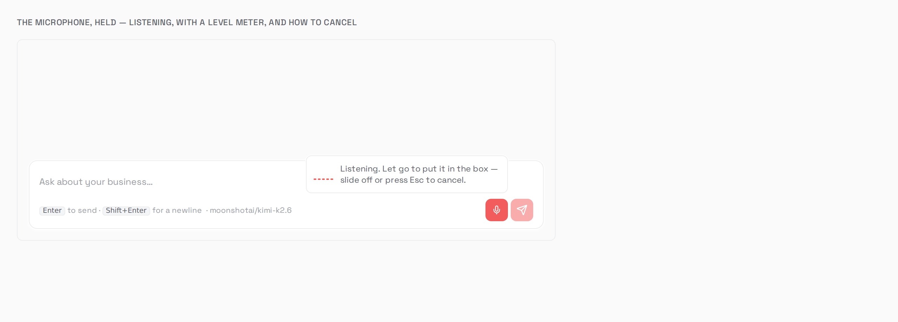
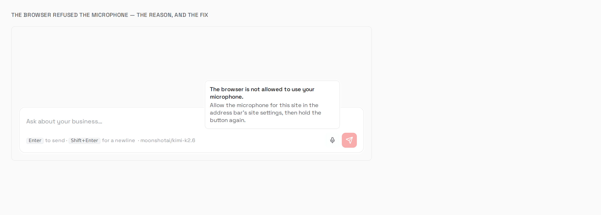
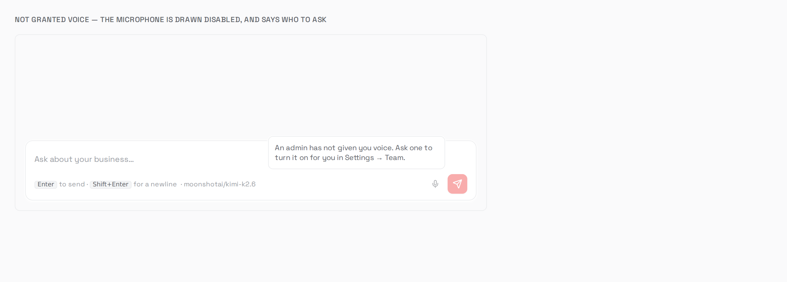
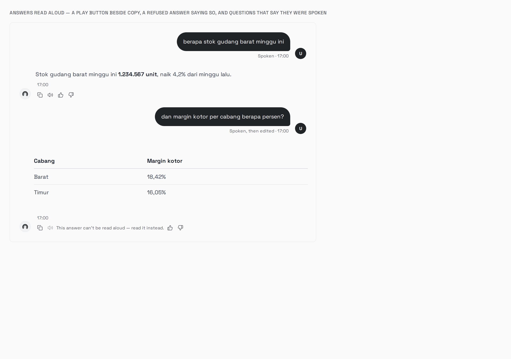

# Voice — a question said out loud (roadmap 11, Track C)

The record for [`../plan/11-voice-and-exact-computation-roadmap.md`](../plan/11-voice-and-exact-computation-roadmap.md)
Track C: `T-W7` (speech in), `T-W8` (speech out), `T-W9` (the microphone and the player). Track A,
exact arithmetic, has its own record in [`exact-computation.md`](exact-computation.md).

**Status, 2026-09-14:** `T-W7` built, `make check` green (74 Go packages `ok`, lint `0 issues`, 88
dashboard tests), unit-gated, and its free arms run live on a scratch stack (§1f). **`T-W8` built the
same day** (§3): `make check` green (76 Go packages `ok`, lint `0 issues`), unit-gated with 16 mutations, `089` and the whole route run live on a scratch stack with
an in-memory S3 and stand-in providers, which also ran `T-W7`'s owed audio half.

**Status, 2026-09-15: `T-W9` built** (§4): the microphone in both composers, the transcript in the box, the
play button on every answer, and the two backend pieces the ticket did not know it needed — the dashboard
learning whether voice is on, and a sent message recording that it was spoken. Migration none, and it held.
Unit-gated with 24 mutations, every one killed, the one new statement run on a scratch Postgres, and the composer
photographed in real Chromium recording from its fake microphone. No speech or model key exists on this
machine, so nothing here has transcribed a real voice or read an answer aloud in one.

---

## 1. `T-W7`, and a transcript that is not a message

**Built 2026-09-14.** Migration `087`. No tool and no prompt change, so no `make eval` is owed.

A person in a conversation records a question. The dashboard sends the recording to
`POST /api/threads/:id/voice` and gets back what was heard:

```json
{"transcript": "berapa stok gudang barat minggu ini", "language": "id", "seconds": 2.75,
 "clip_id": "0a571cf1-…", "expires_at": "2026-09-21T09:57:24Z"}
```

Nothing else happens. No message is written and no turn starts. The transcript goes in the
composer, and the person sends it, edits it or throws it away (roadmap 11, decision 13).

### 1a. What was built

| Piece | Where |
| --- | --- |
| `speech.Transcriber` (`Transcribe`, `Enabled`, `Model`), the nop, and `New` — never an error, one log line saying why voice is off | `internal/speech/speech.go` |
| One client for the `/audio/transcriptions` request Groq and OpenAI both speak: `verbose_json`, temperature 0, the language hint, a filename with the extension the provider decodes by | `internal/speech/compat.go` |
| `speech.Accept`: the declared type **and** the file's first bytes, for WebM, Ogg, MP4, MP3, WAV and FLAC. `speech.NormalizeLanguage` | `internal/speech/speech.go` |
| `voice_clips`: object key, type, size, seconds, transcript, language, model, `expires_at`. `thread_id` and `user_id` are `SET NULL` | `migrations/control/087_voice_clips.{up,down}.sql` |
| `domain.VoiceClip`, `VoiceClipRepository`, `VoiceClipKeyPrefix` | `internal/domain/voice_clip.go` |
| `VoiceClipRepo`: a create that checks the conversation's company inside the insert, the sweep's cross-company delete list, two scoped deletes | `internal/adapters/postgres/voice_clip_repo.go` |
| `app.VoiceService`: limits, the credit check, the language hint, the provider call, metering, keeping the clip | `internal/app/voice_service.go` |
| `app.VoiceClips`: keep, `Sweep`, `EraseCompany` — the half the worker and the erasure need without a transcriber | the same file |
| `UsageEventSpeechTranscription`, `RecordTranscription`, per-model rates per hour of audio | `internal/domain/usage.go`, `internal/app/usage_speech.go` |
| `RetentionService.WithVoiceClips`: an erasure fails unless the clips went too | `internal/app/retention_service.go` |
| `VoiceHandler` and `VoiceTranscriptionResponse` | `internal/transport/http/handlers/voice.go`, `wire.go` |
| The route in `apiPolicy` (member) and **the first entry in `capabilityPolicy`** (`voice`). Registered only when `VoiceService.Enabled()` | `cmd/api/policy.go`, `router.go`, `bootstrap.go` |
| `voice:sweep` on `SPEECH_SWEEP_CRON`, hourly at :17, run whether or not speech is enabled | `internal/queue/tasks.go`, `cmd/worker/main.go`, `voice_sweep.go`, `internal/bootstrap/stack.go` |
| `SPEECH_ENABLED`, `_PROVIDER`, `_API_KEY`, `_BASE_URL`, `_STT_MODEL`, `_TIMEOUT_SECS`, `_MAX_CLIP_SECONDS`, `_RETENTION_DAYS`, `_SWEEP_CRON` | `internal/config/config.go`, `.env.example` |
| Voice's toggle copy says what a grant changes on screen today: nothing, until the microphone | `apps/dashboard/src/features/settings/access.ts` |
| The route documented | `apps/backend/docs/api.md` §Voice |
| `VoiceClip`, `VoiceTranscriptionResponse`, `UsageEventSpeechTranscription` | `packages/api-types` (generated) |

**The order a request is checked in:**

| Check | Refusal |
| --- | --- |
| Speech usable on this deployment | The route is not registered: the router's `404`, before authentication |
| Role (member), then the `voice` capability | `403 {"capability": "voice"}`, before a byte of the body is read |
| The conversation belongs to the caller's company, and the caller may read it (`T-Z10`) | `404`, before the body is read |
| The body at most `MaxClipBytes` | `413`, "a recording must be 60 seconds or shorter" |
| `duration_ms` present, and at most `SPEECH_MAX_CLIP_SECONDS` | `400`; `413` with the same sentence |
| `language`, if given, a two-letter code | `400` |
| The declared type accepted and the bytes that type | `415` |
| Credits | `402`, before the provider |
| The provider | `502`, "…try again, or type your question". Nothing kept, nothing billed |

### 1b. Decisions worth the words

- **Not registering the route is the "voice is off" answer.** A route that existed and refused would
  answer an ungranted person `403 capability: voice` on a deployment where no grant could help. The
  router's `404` says the true thing to everyone.
- **One implementation, two providers.** Research 08 §2a says to pick on Indonesian accuracy, and §6
  says nobody has measured it. So the client speaks the request both candidates accept, and the
  measurement changes `SPEECH_PROVIDER`, not code. OpenRouter accepts the same request, and has been
  the default since 2026-09-15 (§5).
- **The byte cap is the limit that bounds a bill.** See §1d on duration. It is 384 kbit/s times the
  seconds limit, plus 64 KiB for the container. That is above what a browser writes for a voice, and
  under the 25 MB both providers refuse at, which is also why `SPEECH_MAX_CLIP_SECONDS` stops at 500.
- **Billed on the provider's measured length** — or on the model's minimum, when the provider bills a
  short clip as longer (Groq bills at least 10 seconds, §1g, 2026-09-15). `verbose_json` returns `duration`, which no client
  wrote. The declared length is used only when the provider reports none, and the Info line says
  `measured: false` when that happens. A clip measured longer than the limit it was declared under is
  already paid for, so it is logged rather than refused.
- **A transcript is returned even when it could not be kept.** If the upload fails, the row is kept
  with no audio. If the row fails, the audio is taken back out. Either way the person gets what they
  said: decision 15's rule at a smaller scale.
- **Audio before row in `keep`; audio before row in the sweep; rows before prefix in the erasure.**
  Each order leaves nothing the product cannot find again. A row whose audio would not delete stays
  for the next tick. An erasure that removed the rows and failed on the prefix is recorded as failed,
  and running it again retries the prefix.
- **The credit check.** The ticket is silent on it. A tenant refused a turn is refused the transcript
  that would start one, rather than charged for a question they cannot then ask.
- **Nothing said is logged, at any level.** The log carries bytes, seconds, type, language, model,
  whether audio was kept, and the provider's own error sentence. Never the transcript or the audio.
- **The sweep runs whether or not speech is enabled.** A deployment that switched voice off still owes
  the deletion of last week's recordings.

### 1c. The acceptance items, quoted back

- [x] *A deployment with `SPEECH_ENABLED=false` boots, logs once, and the route 404s.*
  `TestVoiceRouteIsAbsentWithoutAProvider`, for a person holding the grant and one who does not;
  `TestNewIsTheNopWhenNotUsable` for the one log line's three causes. Live: the route in the router's
  table only with a provider configured (§1f).
- [x] *A user without the `voice` capability gets 403 before any audio is read.*
  `TestVoiceRefusesAnUngrantedPersonBeforeReadingTheRecording` counts the body's bytes read (zero) and
  the provider's calls (zero), for a member and an admin. `TestCapabilityGatedRoutesRefuseAnAdminWithoutAGrant`,
  which had skipped since `T-Z1`, now runs. Live: §1f arms 1 and 3.
- [x] *A clip over the cap is refused at the route and never reaches the provider.*
  `TestVoiceOverEitherCapNeverReachesTheService`, both caps. Live: `too_long` and `too_big`, provider
  +0. **Met differently from written** — the cap the route can enforce is bytes, not duration (§1d).
- [x] *A transcript is returned and **no message is created** — asserted by counting the thread's
  messages before and after.* Structurally: `VoiceService` and `VoiceHandler` hold no message
  repository and no enqueuer. **Counted live:** 1 message before, 1 after (§1f arm 2).
- [x] *A provider failure returns an error the UI can show and leaves no orphan clip.*
  `TestVoiceProviderFailureKeepsNothingAndBillsNothing`, `TestVoiceProviderFailureSaysWhatToDoAndNotWhatTheProviderSaid`,
  and the second half nobody listed, `TestVoiceRowFailureTakesTheAudioBackOut`. Live: `502`, clips
  2 → 2, usage 2 → 2.
- [x] *No audio and no transcript appears in any log line at `Info`.*
  `TestVoiceNothingSaidReachesTheLog`, at every level, across five paths. Live: zero lines of the API
  log carry the transcript.
- [~] *A clip past `expires_at` is deleted by the sweep, and its message survives.*
  `TestVoiceSweepRemovesTheAudioBeforeTheRow`, and `Due` on a real Postgres (§1f). **The worker's tick
  has not run** (§1g). "Its message survives" holds trivially: nothing links a clip to a message
  (§1d).
- [~] *`T-H6` erasure removes a user's clips and their objects.* **Built for a company**, because
  `T-H6` erases companies (§1d). `TestEraseCompanyDataTakesTheVoiceClipsWithIt`,
  `TestEraseCompanyDataFailsWhenTheRecordingsWouldNotDelete`, `TestVoiceEraseCompanyRemovesTheRowsAndThePrefix`.
  Live: the rows, 2 → 0. **The objects have not been removed live**: the scratch stack has no object
  storage.
- [x] *Language hint defaults to the tenant's, not to English.*
  `TestVoiceLanguageIsTheTenantsAndNeverEnglishByDefault`. Live: an IDR tenant's clip was sent `id`,
  and `en-US` from the person was sent `en`.

### 1d. Where the ticket was wrong, or silent

- **`Migration: 082`.** `T-W2` took `082`; `083`→`086` went since. It is `087`, as roadmap 11's
  status block said to expect.
- **"Duration … capped at the route, before a byte reaches a provider."** A route cannot know how long
  a recording is without decoding it, and the WebM a browser's `MediaRecorder` writes carries no
  duration element to read. Built as three things:
  - a declared length, required and checked, and trusted no further;
  - a byte cap derived from it, which is what actually bounds the bill;
  - billing on the length the provider measured.
- **"`T-H6` erasure removes a user's clips and their objects."** `T-H6` has no per-person erasure. It
  erases a company, and removing a member deactivates them (`TeamService.Remove`) rather than
  deleting the row. So the company's erasure takes every clip and the whole `voice/<company_id>/`
  prefix, and a removed member's clips age out at `SPEECH_RETENTION_DAYS`. A per-person erasure would
  be `T-H6`'s to add, not this ticket's.
- **"The message it became if it became one."** Nothing in `T-W7` can write that column. A transcript
  becomes a message when the person sends it through `POST /api/chat`, which would have to carry the
  clip's id, and that is `T-W9`'s composer. Left out of `087` rather than shipped unwritten, the shape
  of `T-K1`'s binding nobody read ([`skills.md`](skills.md) §5h). Adding it is one nullable `ALTER`.
- **Silent on a deleted conversation.** A clip that cascaded with its conversation would strand its
  audio where nothing could find it. `thread_id` is `SET NULL`, and the sweep deletes a clip whose
  conversation is gone on its next tick.
- **"Defaults to the tenant's."** A company has no language field. The hint is the tenant's branding
  locale, else `id` for a rupiah tenant, else **none** — the provider detects. Not English: a tenant
  that stated nothing has not said it speaks English.
- **"One provider implementation."** Built as the request two providers share, so the choice research
  08 §6 has not measured stays a setting.
- **The config list** had no clock for the sweep, and no base URL or timeout. `SPEECH_SWEEP_CRON`,
  `SPEECH_BASE_URL` and `SPEECH_TIMEOUT_SECS` were added.
- **"The member's disabled control is this ticket's"** — roadmap 11's note from `T-Z7`. It is `T-W9`'s:
  the control is the microphone, and building a button with no recorder behind it would be building
  `T-W9` early, `T-Z1` §5's argument about `T-Z7`. What this ticket owed the screen was the `today`
  sentence, rewritten.
- **Silent on credits and on a deployment with no object storage.** A tenant out of credit gets `402`
  before the provider. Without storage, a clip is its transcript row with no audio.

### 1e. Proven failing

Eleven mutations, one at a time by a script, each restored from a copy afterwards. Each failed its
named test, and none only broke the build:

| Mutation | Killed by |
| --- | --- |
| The route taken out of `capabilityPolicy` | `TestVoiceRefusesAnUngrantedPersonBeforeReadingTheRecording` |
| The conversation read check deleted | `TestVoiceHiddenConversationIsNotFoundBeforeTheRecordingIsRead` |
| Billed on the declared length | `TestVoiceTranscribesKeepsAndBillsOnTheMeasuredLength` |
| Erasure skipping the prefix | `TestVoiceEraseCompanyRemovesTheRowsAndThePrefix` |
| `Accept` without the byte check | `TestAcceptNeedsTheBytesToBeTheDeclaredAudio` |
| `RetentionService` skipping the clips | `TestEraseCompanyDataTakesTheVoiceClipsWithIt` |
| No removal of the audio when the row fails | `TestVoiceRowFailureTakesTheAudioBackOut` |
| The transcript added to the log line | `TestVoiceNothingSaidReachesTheLog` |
| The route registered without a provider | `TestVoiceRouteIsAbsentWithoutAProvider` |
| `DeleteForCompany` with no company predicate | `TestEveryVoiceClipWriteIsTenantScoped` |
| The credit check disabled | `TestVoiceRefusesATenantWithoutCreditsBeforeTheProvider` |

### 1f. Run live on a scratch stack (2026-09-14)

**Not production** — which runs `1.6.0` and has none of this. An embedded Postgres 16 and miniredis on
loopback in `/tmp/tw7-gate`, the working tree's `cmd/api` under `env -i`, and a stand-in provider on
`127.0.0.1:18199` answering Groq's and OpenAI's request shape. The stand-in records the request's
shape and never its audio. No object storage, no worker, no model, no provider key. Everything was
stopped afterwards. The full record, predictions included, is live-gate §7j.

- **`087` up, down, up, and all four statements on real rows in two companies: as predicted.** The
  insert refuses another company's conversation and a malformed id, a deleted conversation's clip
  becomes due with `thread_id` NULL, and the sweep's list carries no transcript.
- **The capability arm `T-Z1` left for this ticket (§7c): as predicted.** A member and an admin
  without the grant got `403 capability: voice`, with the provider not called. Granted, the member got
  `200`. After the revoke, the member's **very next request** got `403`, and after re-granting, `200`.
- **What the provider was sent:** `model`, `response_format: verbose_json`, `temperature: 0`,
  `language: id` for the IDR tenant, and `clip.webm` as `audio/webm` with 6,004 bytes. `en-US` from
  the person arrived as `en`.
- **What was written:** one clip row (the member, the conversation, 2.75 s, `id`, 7 days, no object
  key), one `speech_transcription` usage row at **31 µUSD**, and **no message**, 1 before and 1 after.
- **Refused at the route, provider +0 each:** over the declared length (`413`), a PDF called WebM
  (`415`), `indonesian` as a language (`400`), 3.2 MB (`413`), a conversation on restricted HR
  (`404`), and a conversation that does not exist (`404`).
- **Provider down:** `502` with the sentence, and clips and usage unchanged.
- **The API log:** zero lines carry the transcript. The Info line carries bytes, seconds,
  `measured: true`, `kept_audio: false`, the language and the model. The failure's Warn line carries
  `speech provider answered 503: over capacity`.
- **Erasure:** the company's clips 2 → 0, and the erasure record `completed`.

### 1g. What is owed, and what stays open

In [`live-gate-backlog.md`](live-gate-backlog.md) §7j, with predictions:

1. **A real provider on Indonesian speech**, which is also research 08 §6's unknowns 1 and 2, and
   what decides `SPEECH_PROVIDER`.
2. **`verbose_json` on a real endpoint:** whether `measured` is true.
3. **The audio half**, with object storage: the upload, the sweep's removal and the erasure's prefix.
4. **The worker's tick**, on `SPEECH_SWEEP_CRON`.
5. **`087` at deploy.**

**Open, and not this ticket's to close:**
- ~~**Nothing links a clip to the message it became** (§1d).~~ **Closed by `T-W9`** (§4b): `POST /api/chat`
  carries `voice_clip_ids`, and the message — not the clip — records it.
- ~~**The dashboard cannot tell whether voice is on.**~~ **Closed by `T-W9`** (§4b): `GET
  /api/users/me/capabilities` says, off the same `Enabled` calls that register the routes.
- **A person's erasure.** A removed member's clips outlive them by up to `SPEECH_RETENTION_DAYS`.
  `T-H6` has no per-person erasure to join.
- **The byte rate is a guess about browsers.** 384 kbit/s is above every default this document knows
  of. A browser that records voice above it would see `413` at a length under the limit. The first
  `413` in production with a `duration_ms` under the limit is the signal.
- ~~**Groq bills every clip as at least 10 seconds, and the ledger does not**~~ — found and **fixed
  2026-09-15** (research 08 §2e). `RecordTranscription` recorded the measured length, so §1f's
  2.75-second clip was 31 µUSD in `usage_events` and 112 µUSD on Groq's invoice. `speechMinimumSeconds`
  now bills both Groq Whisper models as at least 10 seconds. `audio_seconds` stays the length heard,
  and `billed_seconds` is added only when the minimum raised it. `whisper-large-v3` gained its own
  rate ($0.111/hour); it had been billed at the $0.36 fallback. `TestRecordTranscriptionBillsTheProvidersMinimumLength`
  failed before the fix (31 and 275 µUSD) and passes after it (112 and 309). **Not live-proven:** the
  invoice side needs a Groq key (live-gate §7j).

---

## 2. The measurement the provider choice rests on (2026-09-14)

Research 08 §6 leaves one criterion standing for `SPEECH_PROVIDER`: how well a provider hears
**Indonesian business speech**, and whether it keeps the **numbers**. Nothing measured it, and this
machine has neither a provider key nor a recording. So what was built is the instrument, ready for
both.

| Piece | Where |
| --- | --- |
| The reading script: twenty questions a pilot admin reads aloud, each stating the numbers it holds | `apps/backend/testdata/eval/speech.yaml` |
| A numeral reader for digits in either separator convention (through `numparse`) and Indonesian number words: *belas*, *puluh*, *ratus*, the magnitudes, *koma*, the *se-* forms | `internal/evalspeech/evalspeech.go` |
| WER over text whose number runs are reduced to their values; numbers compared as multisets of values | the same file |
| The runner — each provider built with `speech.New`, so the request scored is the voice route's — and the Markdown report | `internal/evalspeech/run.go`, `cmd/evalspeech` |
| `make eval-speech CLIPS=/abs/dir` (keys from `GROQ_API_KEY`, `OPENAI_API_KEY`); `make eval-speech-dry` | root `Makefile` |
| Recordings and reports kept out of the tree | `.gitignore` |

**Two scores, apart, because only one is dangerous.** A transcript writing "300 juta" for a spoken
"tiga ratus juta" heard every word, so its WER is 0 and its numbers are right. One writing "tiga puluh
juta" is one word wrong of eight — WER alone reads that as a good transcript — and its number is
wrong by a factor of ten. That is decision 13's case. The report also counts **pairs**:
`revenue-300m`/`revenue-30m` and `sold-14`/`sold-40` differ by one syllable, and a pair counts only
when both halves come back right.

**The script's design.** One question holds no number (`sales-kemang`), so word accuracy can be read
apart. Figures are written both ways — "300 unit" and "tiga ratus juta" — and the reader is asked to
say them naturally. There are decimals with *koma*, a year in words, rupiah with a thousands
separator, and percentages. `TestTheSetStatesWhatItsTextSays` holds each line's stated numbers to
what its text reads as, so the reference cannot drift from the script.

**Proven.**
- Five tests pass: the numeral reader over 22 phrasings, the set against itself, the misheard
  multiplier against a change of form, WER, and the runner over a present, a missing and a non-audio
  recording.
- Three mutations were killed: *puluh* read as ×100, numbers compared by count only, and WER over
  raw rather than normalised numbers.
- `make eval-speech-dry`: 20 clips, every stated number matches its text.
- **End to end, against §1f's stand-in provider** (no key, nothing leaves the machine): twenty
  ffmpeg-made WebM/Opus tones, one per line. All 20 were sent with `language: id` and scored,
  55.0 s of audio. The stand-in answers one fixed sentence, so the report read *numbers right
  0 / 19*, *pairs 0 / 2*, and the number-free control right — the plumbing, not a provider.

**What running it for real needs:** a Groq key (the free tier covers twenty clips) and, ideally, an
OpenAI key for the comparison. And twenty recordings of the script by someone at the pilot, as
`<id>.webm` — a phone's voice memo converted with ffmpeg is enough. **Prediction, carried from
live-gate §7j:** numerals are where both providers err, and in two forms, so a transcript is not
normalised. The pairs row is the one to read first.

**On OpenRouter, the provider since 2026-09-15 (§5).** `OPENROUTER_API_KEY=… make eval-speech CLIPS=…`
scores the default. `EVAL_ARGS='-providers openrouter,openrouter:openai/gpt-4o-transcribe'` scores other
models behind the same key, each under its own label.

---

## 3. `T-W8`, and an answer read aloud

**Built 2026-09-14.** Migration `089`, where the ticket said none. No tool and no prompt change, so no
`make eval`. The reduction is a light-model call behind the route, not the agent's prompt.

A person presses play on an answer. The dashboard asks `GET /api/messages/:id/audio`. The first time,
three things happen, and only the last is the provider's:

1. **The light model reduces the answer** to what a person can hear: no table, no markdown, figures
   rounded. The answer is fenced in the prompt, because it quotes warehouse rows and documents.
2. **The reduction is checked, deterministically.** `speech.Speakable` removes decoration and refuses
   structure, and `guardrails.CheckSpokenFigures` refuses any figure the written answer does not state
   (decision 14). A refusal leaves the written answer standing alone, and is remembered.
3. **The synthesiser reads the checked text,** and the audio is kept under the message's id. Every
   later press is served from it and billed nothing.

### 3a. What was built

| Piece | Where |
| --- | --- |
| `speech.Synthesizer` (`Speak`, `Enabled`, `Model`, `Voice`), its nop, and `NewSynthesizer`: one client for OpenAI's `/audio/speech`, MP3, the answer checked to be MP3 before it is kept | `internal/speech/synth.go` |
| `speech.Speakable`: decoration removed (emphasis, headings, bullets, list numbers, quotes, link targets, bracketed citations), each line a sentence; a table row, a table rule, code, SQL or a URL refused; 1,200 characters at most | `internal/speech/speakable.go` |
| `guardrails.CheckSpokenFigures(written, spoken)` and `SpokenFigureError`, naming both figures | `internal/guardrails/spoken.go` |
| `numparse.ParsePlaces`: `Parse` and the decimal places it read, so precision comes from the same separator rules as the value | `internal/numparse/numparse.go` |
| `spoken_answers`: message, object key, spoken text, refusal, voice, model, characters, expiry. `message_id` is `SET NULL`; one row per message | `migrations/control/089_spoken_answers.{up,down}.sql` |
| `domain.SpokenAnswer`, `SpokenAnswerRepository`, `SpokenAnswerKeyPrefix` (`voice/<company_id>/answers/`) | `internal/domain/spoken_answer.go` |
| `SpokenAnswerRepo`: a save that reads the company through the message's conversation and replaces an earlier row, the sweep's cross-company list, two scoped deletes | `internal/adapters/postgres/spoken_answer_repo.go` |
| `app.SpokenAnswerService`: the cache, the credit check, the reduction, both checks, the synthesis, metering, keeping, and one synthesis per press in flight | `internal/app/spoken_answer_service.go` |
| `VoiceClips.WithSpokenAnswers`: the hourly sweep and the company erasure take spoken answers too | `internal/app/voice_service.go`, `internal/bootstrap/stack.go` |
| `UsageEventSpeechSynthesis`, `RecordSynthesis`, per-model rates per million characters | `internal/domain/usage.go`, `internal/app/usage_speech.go` |
| `SpokenAnswerHandler` | `internal/transport/http/handlers/spoken_answer.go` |
| The route in `apiPolicy` (member) and in `capabilityPolicy` (`voice`). Registered only when the service is `Enabled` | `cmd/api/policy.go`, `router.go`, `bootstrap.go` |
| `SPEECH_TTS_PROVIDER`, `_API_KEY`, `_BASE_URL`, `_MODEL`, `_VOICE`, and `EffectiveSpeechTTSAPIKey` | `internal/config/config.go`, `.env.example` |
| The route documented | `apps/backend/docs/api.md` §Voice |
| `SpokenAnswer`, `UsageEventSpeechSynthesis` | `packages/api-types` (generated) |

**The order a request is checked in:**

| Check | Refusal |
| --- | --- |
| A synthesiser, a light model and object storage on this deployment | The route is not registered: the router's `404` |
| Role (member), then the `voice` capability | `403 {"capability": "voice"}` |
| The message belongs to the caller's company, and the caller may read its conversation (`T-Z10`) | `404`, before anything is spent |
| The message is an agent's answer, not a question, a room line or an empty row | `404` |
| Already spoken: its audio, or its refusal | `200` from the cache, or `422` again. Nothing spent either way |
| Credits | `402`, before either model |
| The reduction, then `Speakable`, then `CheckSpokenFigures` | `422` with the reason, remembered; the reduction's `llm_call` is the only spend |
| The synthesiser | `502`. Nothing kept, the synthesis not billed, the next press tries again |

### 3b. Decisions worth the words

- **The precision rule, which the ticket leaves as "within that number's own stated precision".** A
  spoken figure passes when some written figure *rounds to it* at the precision it was spoken:
  "1.2 million" is to the nearest hundred thousand, and 1,234,567 rounds to it; "2 million" is to the
  nearest million, and it does not. Precision is read off the digits: decimal places, or a whole
  number's trailing zeros, so "300" is to the nearest hundred. A bare year is exact, or "2020" would
  pass for 2024. A spoken figure finer than its written one needs no rule of its own: "3,8634 miliar"
  beside "Rp 3,86 Miliar" fails the rounding by 3.4 million. A clause refusing finer precision was
  built, **survived its mutation** (§3e), and was removed. The only thing it refused that the rounding
  does not was zero-padding, a correct "1,0 juta" for "Rp 1.000.000" among it.
- **It blocks, where `CheckGrounding` only reports.** A refusal costs a play button beside an answer that
  still stands. A false pass is a figure said aloud that the page does not hold, to somebody listening
  because they are not reading.
- **A figure spelled in words is refused, because the check cannot read it.** "dua juta", "tiga
  ratus", "two million", "lima persen" all fail. **The units are not checked**: "salah satu" and "one
  of" are not counts, and refusing every "satu" would refuse half the answers in either language. So
  a count under ten spelled as a word passes unexamined. The prompt asks for digits for that reason.
- **Structure is refused, not rewritten.** A table read aloud has no spoken form that is still the same
  content, and turning one into prose here would be a second reduction nobody checked.
- **A refusal is remembered.** The second press would pay the light model again, most likely to be
  refused again. The cost: a reduction refused once, on one bad draw, stays refused until the row expires.
- **Object storage is required, where `T-W7` does without.** A transcript is useful with nothing kept.
  A spoken answer with nowhere to keep its audio is billed on every press, which is the opposite of the
  acceptance line. So no bucket means no route.
- **Its own provider setting.** `T-W7` defaults to Groq, and Groq cannot speak Indonesian (§3c). The TTS
  key falls back to `SPEECH_API_KEY` only when both settings name the same provider.
- **`tts-1` by default, not the newer `gpt-4o-mini-tts`, for billing.** `tts-1` is $15 per million
  characters, which this process counts exactly. `gpt-4o-mini-tts` bills audio tokens, and
  `/audio/speech` returns no usage, so its row is OpenAI's own estimate of about the same rate.
- **One synthesis per press in flight, per process.** A second press while the first is synthesising
  waits for it, and neither is billed twice. Two replicas, or a press landing in the instant after a save,
  can each synthesise once more. The upsert keeps one row.
- **Detached from the request.** A person who presses play and closes the tab has started a bill. It is
  better finished and cached than paid for and thrown away.
- **The audio's life is a recording's.** Kept for `SPEECH_RETENTION_DAYS` under `voice/<company_id>/answers/`,
  inside the prefix the erasure already removes. Swept by the same tick, and when its message is deleted.

### 3c. Where the ticket was wrong, or silent

- **`Migration: none`.** "Cached by message id" and "bills once" need a lookup that survives a restart
  and a second replica, and the two things beside the audio need a row: the spoken text, which is what
  makes the reduction checkable afterwards, and a refusal, which is what stops a second press paying to
  be refused again. It is `089`. This track's third wrong migration header in three tickets.
- **"Behind the same optionality rules", with one provider setting implied.** Research 08 compares
  speech-to-text providers only. It never asks who can *speak* Indonesian. Read on 2026-09-14: **Groq's speech models (Orpheus) speak English and Saudi Arabic
  only**, take 200 characters and answer WAV. OpenAI's speak the languages Whisper hears, Indonesian
  among them. So `T-W7`'s most likely deployment, Groq transcribing Indonesian, would have no voice out at
  all on a shared setting.
- **"Within that number's own stated precision."** Ambiguous: whose number, and what precision a whole
  number states. Built as §3b's rule, with trailing zeros and bare years decided explicitly.
- **"Every number in the spoken text must round-trip."** Only numbers the check can read. A spelled figure
  is refused rather than skipped, and the gap for units is written down (§3b).
- **Silent on markdown in the model's output.** "A table produces no pipes" is a property of whatever the
  model wrote, and a prompt cannot promise it. `Speakable` is what makes it true.
- **"A synthesiser failure yields … a disabled play button."** The button is `T-W9`'s. This route answers
  `502` with a sentence, keeps nothing, and bills no synthesis.
- **Silent on credits, on a refusal's second press, on a room's lines, on storage and on retention.**
  Decided above.

### 3d. The acceptance items, quoted back

- [x] *A table in the written answer produces no pipes, no dashes and no column headers in the spoken
  text.* `TestSpokenAnswerATableIsNeverReadAloud`: a reduction that recites the table is refused and never
  reaches the synthesiser, and one written in markdown arrives as sentences with no `|`, `*`, `#`,
  bullet or header. `TestSpeakableRefusesStructure` covers a table, a table rule and one stray pipe. **Met
  whatever the model writes**, and no real light model has written one yet (§3g).
- [x] *`1,234,567` may be spoken as "about 1.2 million"; `2 million` is refused and the check names both
  figures.* `TestSpokenFiguresMayRoundWhatTheWrittenAnswerStates`,
  `TestSpokenFigureTheWrittenAnswerDoesNotStateIsRefusedNamingBoth`: `spoken 2 million, nearest written
  1,234,567`.
- [x] *A spoken text stating a figure absent from the written answer is refused.*
  `TestSpokenFiguresRefuseWhatIsNotARounding` (six shapes, including a misread multiplier and a digit
  that was only in code), `TestSpokenFigureSpelledInWordsIsRefused`, and
  `TestSpokenAnswerAFigureTheAnswerDoesNotStateIsRefusedAndRemembered`.
- [~] *A synthesiser failure yields the text answer and a disabled play button, never a failed turn.*
  No turn runs here, so none can fail. `TestSpokenAnswerSynthesiserFailureKeepsNothingAndBillsNothing`,
  and the handler's `502`. **The disabled button is `T-W9`'s.**
- [x] *The same message synthesised twice hits the cache and bills once.*
  `TestSpokenAnswerSynthesisesOnceAndServesTheCacheAfter` and, for two presses at once,
  `TestSpokenAnswerConcurrentPressesSynthesiseOnce`.
- [x] *A user without the capability gets 403.* `TestSpokenAnswerRefusesAnUngrantedPersonBeforeSynthesis`,
  member and admin, synthesiser not reached; `TestCapabilityGatedRoutesRefuseAnAdminWithoutAGrant` now
  walks two routes.

### 3e. Proven failing

Sixteen mutations, applied one at a time by a script, each file restored from a copy afterwards (and
the restoration checked). Fifteen failed their named test, and none only broke the build. **One
survived, and the survival was the finding.**

| Mutation | Killed by |
| --- | --- |
| The audio route's `capabilityPolicy` entry removed | `TestSpokenAnswerRefusesAnUngrantedPersonBeforeSynthesis`, and before the script, for real (below) |
| A spoken figure may be finer than its written one | **Survived.** The clause was redundant with the rounding, so it was removed (§3b) |
| A bare year read to the nearest ten | `TestSpokenFiguresRefuseWhatIsNotARounding/the_wrong_year` |
| A spelled figure not looked for | `TestSpokenFigureSpelledInWordsIsRefused` |
| `ParsePlaces` reporting no decimal places | `TestSpokenFiguresRefuseWhatIsNotARounding` |
| `Speakable` letting a table row through, both checks | `TestSpeakableRefusesStructure` |
| The synthesiser keeping an answer that is not MP3 | `TestSpeakRefusesAnAnswerThatIsNotAudio` |
| A remembered refusal ignored | `TestSpokenAnswerAFigureTheAnswerDoesNotStateIsRefusedAndRemembered` |
| Two presses not sharing one synthesis | `TestSpokenAnswerConcurrentPressesSynthesiseOnce` |
| The reduction run with no tenant in its context | `TestSpokenAnswerReductionIsBilledToTheTenantAndFenced` |
| Enabled without object storage | `TestSpokenAnswerNeedsEveryPartToBeEnabled` |
| The sweep skipping spoken answers | `TestVoiceSweepAndErasureTakeSpokenAnswersToo` |
| The erasure skipping spoken answers | `TestVoiceSweepAndErasureTakeSpokenAnswersToo` |
| Synthesis billed at one rate for every model | `TestRecordSynthesisPricesPerCharacterPerModel` |
| The handler skipping the conversation's access check | `TestSpokenAnswerHiddenOrForeignAnswerIsNotFoundBeforeAnythingIsSpent` |
| The save trusting the caller's company | `TestSpokenAnswerSaveTakesTheCompanyFromTheConversation` |

**The first row happened before it was a mutation.** The build wrote the route into `apiPolicy`, edited
`capabilityPolicy`'s comment to say voice now had two routes, and never added the second entry.
`TestSpokenAnswerRefusesAnUngrantedPersonBeforeSynthesis` failed with a `500`. That was an ungranted
member reaching the handler: an ungated route, which is exactly what the test was written to catch.
`TestCapabilityGatedRoutesRefuseAnAdminWithoutAGrant` could not have caught it, because it walks the
entries that exist.

### 3f. Run live on a scratch stack (2026-09-14)

**Not production.** An embedded Postgres 16 and miniredis on loopback in `/tmp/tw8-gate`, plus two things
`T-W7`'s stack lacked:
- **object storage**, as an in-memory S3 on loopback (`gofakes3`), because MinIO's server download now
  answers `410 Gone`;
- **one stand-in on `127.0.0.1:18299`**, answering the light model's `/chat/completions`, OpenAI's
  `/audio/speech` and Groq's `/audio/transcriptions`.

The working tree's `cmd/api` ran under `env -i`. No worker, no real model, no key. Predictions were written
before the run, and the full table is live-gate §7l. Everything was stopped before `make check`.

- **`089` up, down, up, and every `SpokenAnswerRepo` statement on real rows in two companies: as
  predicted.** The `INSERT … SELECT … JOIN … ON CONFLICT` parses, and a second save replaces the row in
  place with its id kept. A deleted conversation cascades to its messages, and the spoken answer survives
  with `message_id` NULL, due for the sweep.
- **The route, end to end: as predicted, with one exception.**
  - **Without the grant**, member and admin: `403 capability: voice`, with neither the model nor the synthesiser called.
  - **Granted, first press:** `200 audio/mpeg`, 4,010 bytes. The light model was called once, with the
    answer fenced. The synthesiser was called once, with `tts-1`, `alloy`, `mp3` and the reduction verbatim, no
    pipe in it. One row, one object under `voice/<company>/answers/`, seven days. Usage: one `llm_call`
    on the light model and one `speech_synthesis` of **83 characters at 1,245 µUSD**.
  - **Second press:** the same bytes, nothing called, and still one `speech_synthesis` row.
  - **A reduction saying `25 persen` for a written `18,42%`:** `422`, `spoken 25 persen, nearest written
    18,42%: …`. Pressed again: the same answer, and the model not called.
  - **A reduction reciting the table:** `422 … it contains a table`, with the synthesiser not called.
  - **The synthesiser answering `503`:** `502` with the sentence, no row and no synthesis billed. Once it
    was back up: `200`.
  - **Refused as out of reach:** a person's question and a room line, `404 only an agent's answer`. A
    restricted agent's conversation and another company's answer, `404`, with nothing called.
  - **Revoked:** `403` on the very next request.
  - **`T-W7`'s audio half, owed since §1g:** now that there is a bucket, a clip lands at
    `voice/<company>/<clip>.webm`, beside the answers.
  - **The API log:** zero lines carry a spoken text or the written answer. The refusals' Warn lines name
    their reasons.
  - **The company's erasure:** spoken-answer and clip rows to zero, **no key left** under
    `voice/<company>/`, and the other company's answer untouched.
- **The exception was arithmetic.** 84 characters and 1,260 µUSD were predicted from a hand count. The
  text is 83 characters, and 83 × $15 per million is the 1,245 µUSD billed.
- **A defect, predicted before the run and fixed.** `GET /api/messages/x/audio` answered `500 could not
  load that answer`. `MessageRepo.GetForCompany` passed Postgres's invalid-uuid refusal straight through,
  where every id it could not find is `ErrNotFound`. The fix is there, and on a rebuilt API the request
  answers `404`. **It fixed an older route too.** `POST /api/messages/x/suggestion-picked` went from `500`, with
  Postgres's own sentence in the body, to `404 no such message`. `POST /api/messages/x/feedback` answers
  `404` too; its before was not measured, because the probe sent a malformed body.
- **A defect beside it, found that day and fixed the next.** `GET /api/messages/x/feedback` answered
  `500` with `pq: invalid input syntax for type uuid: "x" (22P02)` in the body. It reads through the
  feedback repository, not the message lookup, so this ticket's fix did not reach it. It was fixed on
  2026-09-15 as its own change: the malformed id, and the handler branch that quoted any database
  error ([`live-gate-backlog.md`](live-gate-backlog.md) §7l).

### 3g. What is owed, and what stays open (as of `T-W8`; `T-W9` closed two, §4)

In [`live-gate-backlog.md`](live-gate-backlog.md) §7l, with predictions:

1. **A real light model's reductions of real answers**, and how often each check refuses them.
   **Prediction:** most refusals are figures spelled in words, not wrong figures. A model writing
   Indonesian drifts to "dua juta" whatever the prompt asks. Above one refusal in ten answers, the prompt
   is the next change, not the check.
2. **A real synthesiser reading Indonesian figures.** Does `tts-1` say "1,2 juta" as *satu koma dua juta*,
   and "1.500" as *seribu lima ratus*? **Prediction:** at least one figure in five is read with English
   separators. The check cannot see that: it reads text, not audio. If it happens, the reduction should
   write figures the way they are said, and the check must learn to read that form first.
3. **The worker's sweep over spoken answers**, on `SPEECH_SWEEP_CRON`. **Prediction:** an orphaned row and
   its object gone within the hour, the recordings' tick unchanged.
4. **`089` at deploy.**
5. ~~**`T-W9`'s player**, and the disabled control.~~ Built and photographed (§4).

**Open, and not this ticket's to close:**
- ~~**The dashboard cannot tell whether an answer can be read aloud.**~~ Closed by `T-W9` (§4b).
- **A refusal is remembered for `SPEECH_RETENTION_DAYS`,** and there is no way to ask again sooner.
- **A count under ten spelled as a word is not checked** (§3b).
- **One synthesis per press is per replica.**
- ~~**`GET /api/messages/:id/feedback`** answers a malformed id with `500` and the driver's sentence~~ —
  **fixed 2026-09-15** (§3f). 101 other `500`s across 20 handlers still quote their error, filed in
  [`../plan/backlog.md`](../plan/backlog.md) §Hygiene.

---

## 4. `T-W9`, the microphone and the player

**Built 2026-09-15.** No migration. No tool and no prompt change, so no `make eval`.

A person holds the microphone in the composer, says a question, and lets go. What was heard lands in the
box. They read it, correct "tiga puluh" to "tiga ratus", and press send — the same send typing uses. Under
their message it then says *Spoken, then edited*. Beside Copy, under the answer, a play button reads it aloud.

### 4a. What was built

| Piece | Where |
| --- | --- |
| The rules as pure functions: `voiceFrom`, the five microphone problems and their copy, `micProblemFor`, `recordingType`, `appendTranscript`, `voiceClipIdsForSend`, `spokenCaption`, the error sentences | `apps/dashboard/src/features/chat/voice.ts` |
| `useVoice`: one cached read of `GET /api/users/me/capabilities` | `use-voice.ts` |
| `usePushToTalk`: `getUserMedia`, `MediaRecorder`, the level meter, and every way a recording ends | `push-to-talk.ts` |
| `MicButton`: hold, let go, cancel, the status above the button, the upload | `mic-button.tsx` |
| `ListenButton`: fetched on the first press, one answer at a time, a refusal kept | `listen-button.tsx` |
| The microphone beside Send, the play button beside Copy, the caption, `voice_clip_ids` on the send, the new-chat hand-off | `chat-page.tsx`, `store/composer.ts` |
| Voice's `today` sentence on Settings → Team | `features/settings/access.ts` |
| `MyCapabilitiesResponse`, `VoiceAvailability`, `UserHandler.WithVoice`, wired from the two `Enabled` calls that register the routes | `handlers/wire.go`, `handlers/user.go`, `cmd/api/router.go` |
| `domain.SpokenQuestion` under `metadata.voice`; `VoiceClipRepository.ForMessage`; `VoiceClips.SpokenQuestion` | `domain/voice_clip.go`, `postgres/voice_clip_repo.go`, `app/voice_service.go` |
| `voice_clip_ids` on the send; `ChatInput.Spoken`; `ThreadService.AppendUserMessageWithMetadata` | `handlers/chat.go`, `app/chat_enqueuer.go`, `app/thread_service.go` |
| `MyCapabilitiesResponse`, `VoiceAvailability`, `SpokenQuestion` | `packages/api-types` (generated) |
| Five scenes, and a shooter that can launch Chromium with a fake microphone | `apps/dashboard/harness/` |
| Both additions documented | `apps/backend/docs/api.md` §Voice |

**How a recording ends:**

| The person | What happens |
| --- | --- |
| Lets go on the button | Uploaded; the transcript is added to the end of the box |
| Holds past the route's limit | Stopped half a second inside it, then as a release |
| Hides the tab, or the window loses focus | Stopped, then as a release: what was said is kept |
| Presses Esc, slides off before letting go, or the pointer is cancelled | Thrown away; nothing uploaded |
| Lets go within half a second | A tap: nothing uploaded, "Hold the button while you speak" |
| Lets go while the browser's permission prompt is up | Nothing recorded; "The microphone is ready" |
| Leaves the page | Thrown away |

### 4b. Decisions worth the words

- **Absent where the deployment cannot transcribe; disabled, with a sentence, where the person has no
  grant.** `T-W7` read decision 15 — *"a dead STT provider yields a disabled button"* — as a disabled
  microphone on a deployment with no provider. But the 2026-08-04 rule behind *disabled, not hidden* is that
  a disabled control says who to ask, and there nobody can be asked: no grant makes a missing provider
  work. So it is absent, as the ticket already says of the play button. A provider failing at the moment
  of a press is decision 15's case, and gets its sentence: *"…try again, or type your question"*.
- **The play button is absent for an ungranted person, not disabled.** The microphone's one sentence tells
  them who to ask; the same sentence beside every answer would be forty of it.
- **The dashboard asks one existing read.** `GET /api/users/me/capabilities` gained `voice` — `transcribe`,
  `read_aloud` and the clip limit — set in `cmd/api` from the same `Enabled` calls that decide whether each
  route is registered, so the screen and the router cannot disagree
  (`TestMyCapabilitiesSayWhatTheVoiceRoutesAre`). A backend older than this sends no `voice`, which reads as
  off: a new dashboard on an old API draws nothing, rather than a microphone that answers 404.
- **The clip→message link is on the message.** `T-W7` left "the message it became" out of `087` (§1d). It is
  `metadata.voice = {clip_ids, verbatim}` on the user message, written by `POST /api/chat` when
  `voice_clip_ids` name clips that are the sender's, in that conversation. On the message because the fact
  must outlive the clip, which is deleted after seven days, and because it is the measurement §4h needs.
- **An id that does not check out is dropped, not refused.** Decision 15 at the scale of a metadata key: a
  composer left open past the sweep names a clip that is gone, and the question is still worth sending.
- **`verbatim` is "the message is the transcripts joined, whitespace aside".** Typing before or after a
  dictation counts as an edit. It is exact and cheap, and it records whether decision 13's edit step was
  used without keeping anything else.
- **The new-chat screen makes its conversation on release, not on press.** The voice route files a clip under
  a conversation, and that screen has none. It is made when there is a recording to file, with the picked
  agent, so a cancelled press makes nothing. The page then moves there with the transcript carried by the
  prefill "Ask for a change" uses. Discarding the transcript afterwards leaves an empty conversation, which
  `createThread` already treats as costing nothing.
- **A hidden tab or a blurred window stops and uploads**, as the ticket says. Throwing the recording away
  when somebody glances at another window would lose a question they had finished saying.
- **The transcript is appended**, never written over what was typed.
- **A failure with no known fix names its exception.** Nothing on the client logs, so *"could not start
  (AbortError)"* read out to support is the only record there is (§4d is why this exists).
- **The audio is cached in TanStack Query**, not component state, so a second press does not ask whichever
  bubble re-rendered. One answer plays at a time, held in module state, because it is a handle to a media
  element and nothing renders from it.

### 4c. Where the ticket was wrong, or silent

- **`Repo: FE`.** It needed two backend changes: the `voice` field, and the link on the send. §1g filed both
  as `T-W9`'s; the ticket scheduled neither.
- **"Hold to record … release to send."** Release puts the transcript in the box. The ticket's next bullet
  and decision 13 both say so.
- **`Migration: none` held** — the first header on this track to hold since `T-W3`.
- **Silent on the new-chat screen**, where there is no conversation to file a clip under (§4b).
- **Silent on a deployment without a provider.** Built absent (§4b).
- **"Cancelling after recording uploads nothing."** Letting go uploads at once, so there is no *after
  recording* before an upload. Cancelling is during the hold: Esc, sliding off, a cancelled pointer.
  Emptying the box after the transcript arrives sends nothing and drops the clip ids — but that clip was
  uploaded, transcribed, billed and kept for seven days, as every recording is.
- **"Permission denied, no microphone, and an unsupported browser are three distinct messages."** Five: a
  microphone another app holds, and a page on plain http, where the browser hides the microphone
  entirely, each have a fix of their own.
- **Silent on Safari**, which records MP4. `recordingType` asks for Opus in WebM first and takes MP4.

### 4d. Found by the screenshot run

The first run of the held scene photographed *"The microphone could not start."* Headless Chromium, with the
page granted `microphone`, answered `getUserMedia` with `NotSupportedError`: only its
`--use-fake-ui-for-media-stream` flag lets it record, and `=deny` gives its real `NotAllowedError`.

Two fixes. The shooter launches with the flag, and a scene can bring its own. And **in the product**,
`NotSupportedError` now reads as an unsupported browser — a browser that has the API and will not capture
with it — and any failure without a known fix names its exception. A screenshot saying only "could not
start" is how this one nearly went undiagnosed.

### 4e. The acceptance items, quoted back

- [x] *Recording stops and uploads on release, and on tab blur.* `…uploads once on release…`, `…when the window
  loses focus`, `…when the tab is hidden`, and `…stops itself at the route's limit`. Photographed: a real
  recording let go (`voice-composer-transcript.png`).
- [~] *The transcript is editable before sending, and editing it sends the edit.* The transcript is handed to
  the composer's own box, and the microphone sends nothing (`…hands back the transcript with its clip — it
  sends nothing`). The send is the one typing uses, and an edit records `verbatim: false`
  (`TestSpokenQuestionSaysWhetherTheMessageWasSentAsHeard`). **The page itself has no test** — `ChatPage`
  never had one — so edit-then-send on the real page is live-gate §7m's.
- [x] *Cancelling after recording uploads nothing* — during the hold (§4c). Esc and a cancelled pointer are
  tested. Sliding off is not, because jsdom gives a pointer no position.
- [x] *The play control is absent, not broken, when synthesis is off.* `ListenButton … is absent, not broken,
  when this deployment cannot read aloud`, and when the person is not granted voice.
- [x] *Denied permission renders the reason and the fix.* Tested for all five problems; photographed from
  Chromium's own `NotAllowedError`.
- [x] *`pnpm --filter dashboard lint` and `build` clean, plus a harness screenshot of the composer in all three
  states (granted, denied, ungranted).* `make check`, alone, on its second run: `MAKE EXIT: 0`, the dashboard's
  lint (`tsc`, eslint with no errors, 121 tests) and build clean, 76 Go packages `ok`. Five scenes:

| Granted, held | Let go | Refused by the browser | Not granted |
| --- | --- | --- | --- |
|  |  |  |  |



The level meter photographed at its floor: the fake microphone beeps, and the frame fell between beeps.

### 4f. Proven failing

Twenty-four mutations, applied one at a time — twenty-three by a script (`/tmp/tw9-gate/mut.py`), the last by
hand after the first gate run (below) — each file restored from a copy afterwards and the restoration
checked. **Every one failed its named test; none only broke the build; none survived.**

**The first `make check` failed, and on something this work owed.** `voice_clip_repo_test.go` reads the SQL
in `voice_clip_repo.go`, and refuses to run when it finds a statement count it was not written for:
*"found 5 statements, want 4; this test is no longer reading what it thinks it is"*. The targeted runs had
never reached it. The count became 5, and the new statement got the property that is actually its own —
a read returning transcripts carries the company, the person *and* the conversation — whose first draft
also counted `Create`'s `INSERT … SELECT` as a read and failed unmutated, before it was narrowed to
statements that begin with `SELECT`. That is the twenty-fourth row.

| Mutation | Killed by |
| --- | --- |
| `SpokenQuestion` keeps an id the repository did not return | `TestSpokenQuestionKeepsOnlyTheSendersClipsFromThisConversation`, `…NamingNothingOfTheSendersIsNil` |
| `verbatim` compared without collapsing whitespace | `TestSpokenQuestionSaysWhetherTheMessageWasSentAsHeard` |
| No bound on the ids one send asks for | `TestSpokenQuestionAsksForABoundedNumberOfClips` |
| A message naming nothing of the sender's gets an empty record | `TestSpokenQuestionNamingNothingOfTheSendersIsNil` |
| The enqueuer drops the record | `TestEnqueueWritesASpokenQuestionOntoTheUserMessage` |
| The send asks with no person | `TestSendAsksAboutTheClipsItNamesAsTheSessionsPerson` |
| The send looks up clips for a new conversation | `TestSendThatCannotNameAClipDoesNotLook` |
| `me/capabilities` leaves voice out | `TestMyCapabilitiesSayWhetherThisDeploymentHasVoice` |
| The router tells the dashboard nothing about voice | `TestMyCapabilitiesSayWhatTheVoiceRoutesAre` |
| `ForMessage` ignores whose clip it is — **on the scratch Postgres** | `TestScratchVoiceClipsForMessage` |
| `ForMessage` loses its person predicate — **read from the source** | `TestVoiceClipTranscriptReadIsTheSendersOwn` |
| The microphone drawn where the deployment cannot transcribe | `MicButton … is absent where this deployment cannot transcribe` |
| An ungranted press records | `MicButton … is drawn disabled for a person without the grant…` |
| A cancelled recording is uploaded | `MicButton … uploads nothing when the recording is cancelled` (both ways) |
| A tap is uploaded | `MicButton … treats a tap as a tap…` |
| Losing focus does not stop the recording | `MicButton … stops and uploads what was said when the window loses focus` |
| No stop at the route's limit | `MicButton … stops itself at the route's limit…` |
| The play button drawn for a person without the grant | `ListenButton … is absent, not broken, when the person is not granted voice` |
| A second press asks again | `ListenButton … a second press is served from what it has` |
| A refusal is not remembered | `ListenButton … does not ask again` |
| A second answer plays over the first | `ListenButton … stops the answer playing when another is started` |
| A transcript replaces what was typed | `the transcript in the box … goes after what is already typed` |
| An edited question captioned as sent as heard | `the transcript in the box … captions a question that was dictated…` |
| Clip ids sent with a send that opens a conversation | `the transcript in the box … sends its clip ids only to a conversation that exists…` |

**Not reached by any mutation:** the router's `WithVoiceClips` wiring on the chat handler, and the new-chat
hand-off in `chat-page.tsx`. Neither has a test that could fail; both are live-gate §7m's first row.

### 4g. What is owed

In [`live-gate-backlog.md`](live-gate-backlog.md) §7m, with predictions:

1. **The real page against a real API:** edit-then-send, and the new-chat hand-off.
2. **Safari**, recording MP4.
3. **A phone's press and hold.**
4. **Who talks to it** (§4h), once voice is switched on.

And, still, §1g's and §3g's real provider, model and voice.

### 4h. Who talks to it

Research 08 §6's unknown 6 — whether anybody at the pilot wants to talk to it — had no instrument. It has one
now, and it survives the clips being swept:

```sql
SELECT count(*)                                                          AS questions,
       count(*) FILTER (WHERE m.metadata ? 'voice')                      AS spoken,
       count(*) FILTER (WHERE m.metadata -> 'voice' ->> 'verbatim' = 'false') AS spoken_then_edited
  FROM messages m
  JOIN conversation_threads t ON t.id = m.thread_id
 WHERE t.company_id = $1 AND m.role = 'user'
   AND m.created_at > now() - interval '30 days';
```

`spoken_then_edited` over `spoken` is also the only read of transcription accuracy production will ever
give. A person who corrected a transcript before sending it had a transcript that was wrong, or one they
did not trust.

---

## 5. OpenRouter as the provider (2026-09-15)

**Decided by the owner**, over research 08 §2e's recommendation of Groq and OpenAI directly: one key the
deployment already holds, instead of two new accounts. **The trade accepted is §2e's data-path row**:
OpenRouter cannot be told which host hears a recording, and one of its speech endpoints is on its
zero-retention list.

### 5a. What changed

| Piece | Where |
| --- | --- |
| `openrouter` as a known transcriber: `https://openrouter.ai/api/v1`, `openai/whisper-large-v3-turbo` | `internal/speech/speech.go` |
| `openrouter` as a known synthesiser: `google/gemini-3.1-flash-tts-preview`, voice `Kore` | `internal/speech/synth.go` |
| `usage.seconds` stands in for a missing `duration`; `usage.cost` is carried out as `Transcript.CostUSD` | `internal/speech/compat.go` |
| `RecordTranscription` records a charge the provider reported as it is (`cost_source: provider`), ahead of any rate or minimum | `internal/app/usage_speech.go`, `voice_service.go` |
| Rows for when no charge comes back: turbo at $0.04 an hour, the dearer of its two hosts; the Gemini voice at a $50-per-million-characters ceiling | `internal/app/usage_speech.go` |
| `SPEECH_PROVIDER` and `SPEECH_TTS_PROVIDER` default to `openrouter` | `internal/config/config.go`, `.env.example` |
| `make eval-speech` scores `openrouter` and `openrouter:<model>` with `OPENROUTER_API_KEY` | `cmd/evalspeech`, root `Makefile` |
| Both speech clients take `LLM_API_KEY` when they have no key of their own, sent only to `LLM_BASE_URL`'s host | `internal/speech` (`resolveKey`, `sameHost`), `cmd/api/speech_wiring.go` |

### 5b. Decisions worth the words

- **A transcription is billed at OpenRouter's charge, not at a rate.** Turbo has two hosts about three times
  apart in price, and which one heard a clip is OpenRouter's to decide. The charge in `usage.cost` is the
  invoice line. The row is only for an answer that carries none, and it is the dearer host's price, with no
  Groq minimum, because the host is unknown.
- **The Gemini voice is billed at a ceiling.** `/audio/speech` answers audio and no usage, so there is no
  charge to read. Google's price is per audio token: $20 per million, at 25 tokens a second, which is
  $500 per million seconds of speech. Per character that depends on how fast the voice reads, which nobody
  here has measured. At ten characters a second — a slow reading pace — it is $50 per million. A faster
  voice costs less, so the ledger over-records rather than under.
- **Not OpenRouter's generation lookup.** `X-Generation-Id` names a record whose `total_cost` is the real
  charge. But the lookup documents nothing about audio, or about how soon the record exists, and a second
  request after every synthesis would be a second thing that can fail on a path that is not allowed to.
  The ceiling is replaced when live-gate §7n has set it against real charges.
- **The unpriced-voice fallback stays at tts-1-hd's $30.** The Gemini row is higher, but it is a guess about
  one voice's reading speed, and an unknown voice is not assumed to cost what that guess does.
- **The defaults moved, not only the documentation.** With both providers defaulting to `openrouter`, a
  deployment sets `SPEECH_ENABLED` and `SPEECH_API_KEY` and nothing else: `EffectiveSpeechTTSAPIKey` hands
  the one key to both halves. No deployment had voice switched on, so the change moves nobody.
- **The Gemini voice is a preview model**, chosen as the one voice on OpenRouter whose maker documents
  Indonesian. `Kore` is one of its thirty-one voices, picked without listening.
- **Speech takes the model's key, on the model's host only.** With `SPEECH_API_KEY` unset, `cmd/api`
  offers `LLM_API_KEY` to both speech clients, and `speech.New` sends it only when the client's base URL is
  the same host and port as `LLM_BASE_URL`. An empty URL, one without a scheme, or one that will not parse
  matches nothing. That is `config.EffectiveEmbeddingAPIKey`'s rule, written after a fallback without it
  sent an OpenRouter key to api.openai.com. A key of speech's own always wins. The startup line says
  `key: shared` or `key: own`, never the key. It is `LLM_API_KEY` and not `LIGHT_LLM_API_KEY` because the
  owner's decision named the model's key; the two are separate Bitwarden entries today.

### 5c. What production sets

In `smartsoft-infra`'s HelmRelease values for `argentum`, one variable, and nothing in Bitwarden:

```yaml
extraEnv:
  - name: SPEECH_ENABLED
    value: "true"
```

**Not a second mapping of the model's Bitwarden entry**, which was the first plan. Bitwarden's operator
(`ApplySecretMap` in `bitwarden/sm-kubernetes`) writes each secret once, under the first mapping whose id
matches, so a second line for the same id is silently never written — and if it were ever first,
`LLM_API_KEY` would be the one to vanish. So speech takes the model's key in code instead (§5b).

### 5d. Proven

Ten mutations, applied one at a time by a script (`/tmp/tw9-gate/mut2.py`), each file restored from a copy
afterwards and the restoration checked. **Every one failed its named test; none only broke the build;
none survived.**

| Mutation | Killed by |
| --- | --- |
| The transcriber ignores OpenRouter's charge | `TestTranscribeReadsWhatOpenRouterMeasuredAndCharged` |
| The transcriber ignores OpenRouter's seconds | `TestTranscribeReadsWhatOpenRouterMeasuredAndCharged` |
| A reported charge is priced again | `TestRecordTranscriptionRecordsWhatTheProviderCharged` |
| The voice service drops the charge | `TestVoicePassesTheProvidersChargeToTheLedger` |
| No `openrouter` transcriber row | `TestNewTakesTheProvidersDefaults` |
| No `openrouter` synthesiser row | `TestNewSynthesizerTakesTheProvidersDefaults` |
| No price row for OpenRouter's turbo | `TestRecordTranscriptionRecordsWhatTheProviderCharged` |
| No ceiling row for the Gemini voice | `TestRecordSynthesisPricesPerCharacterPerModel` |
| The transcriber defaults back to `groq` | `TestSpeechDefaultsToOneOpenRouterKey` |
| The synthesiser defaults back to `openai` | `TestSpeechDefaultsToOneOpenRouterKey` |

**The eval runner, with no key in its environment:** `-providers openrouter,openrouter:openai/gpt-4o-transcribe`
skipped both, each by its own label, and exited naming `OPENROUTER_API_KEY`. Nothing reached a provider.

**Not proven here:** anything OpenRouter answers. The fake provider answers the shape its documentation
describes (`usage.seconds`, `usage.cost`); a real answer is §7n's first row.

### 5e. What is owed

In [`live-gate-backlog.md`](live-gate-backlog.md) §7n, with predictions:

1. A real OpenRouter transcription: `usage.cost` present, and which of `duration` and `usage.seconds` came
   back.
2. The Gemini voice reading Indonesian figures aloud.
3. The ceiling set against OpenRouter's own record of what twenty answers cost.
4. `make eval-speech` on the pilot's recordings, through OpenRouter.
